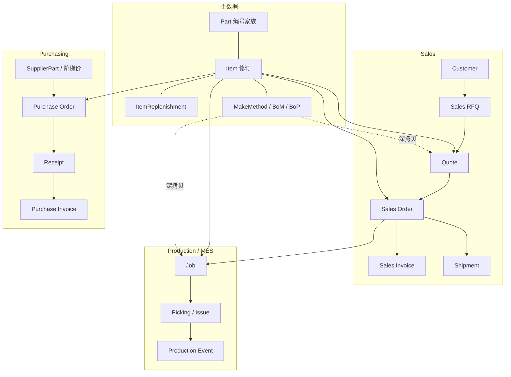

# 00 · Carbon 业务全景与关键身份模型

更新日期：2026-07-21
依据：代码、最新迁移、Part 详情页实测、跨域关系梳理

## 1. Carbon 是什么（写映射时的边界）

Carbon = **ERP（办公室）+ MES（车间）**，共用一套数据模型。
Academy 只是培训视频托管，**不是**第三产品支柱。本知识库覆盖 ERP/MES 业务语义，不写 Academy。

## 2. 必须先搞清的身份模型

### 2.1 Part 与 Item（最易误读）

```text
Part.id  = Item.readableId     （同公司内）
URL 中的 item_… = Item.id       （修订级 UUID）
页面显示编号（如 11113FDF）= readableId = Part.id
```

| 概念 | 模型 | 粒度 | 业务含义 |
|---|---|---|---|
| 零件编号家族 | `Part` | 跨修订共享 | 同一业务编号下的补充资料（customFields/tags 等） |
| 物料修订 | `Item` | 每一次 revision | 名称、补货策略、跟踪、默认取得方式、方法、成本的真正主档 |
| 制造方法版本 | `MakeMethod` | 某次 Item 修订下的 V1/V2… | BoM/BoP 模板；可 Draft/Active/Archived |

**基数（按业务，不是按过时外键）：**

```text
1 Part 编号家族  →  N Item 修订
1 Item 修订      →  1 ItemReplenishment
1 Item 修订      →  N MakeMethod 版本
1 MakeMethod     →  N MethodMaterial / MethodOperation
```

修订迁移证据：`20250519122022_revisions.sql` 删除了 `part.itemId`；`get_part_details` / `parts` 视图用 `item.readableId = part.id AND companyId` 连接。

### 2.2 模板 vs 单据快照

| 层 | 代表表 | 变更是否回写历史单据 |
|---|---|---|
| 主数据/模板 | `Item`、`MakeMethod`、`MethodMaterial`、`MethodOperation` | — |
| 报价快照 | `QuoteMakeMethod`、`QuoteMaterial`、`QuoteOperation` | 否（深拷贝） |
| 工单快照 | `JobMakeMethod`、`JobMaterial`、`JobOperation` | 否（深拷贝） |

主工艺改 Active 版本后，已存在的 Quote/Job **不会**自动跟随。

### 2.3 供应相关三字段（常一起出现）

| 字段 | 所在 | 回答的问题 |
|---|---|---|
| `Item.replenishmentSystem` | Item | Buy / Make / Buy and Make |
| `Item.defaultMethodType` | Item | Purchase to Order / Pull from Inventory / Make to Order |
| `Item.sourcingType` | Item | 仅 Buy and Make 时：Specified / Drop Ship / Ship from Inventory |

BoM 行上的 `methodType` / `sourcingType` 以**组件 Item** 为权威；`MethodMaterial` 多为镜像或保存时重读。

## 3. 端到端业务域地图



## 4. 跨域关系阅读原则

梳理 Part/Item 与其他模型关系时，按业务语义分类，避免“有外键 = 一对一业务”：

1. **家族关系**：`Part → Item`（编号共享，非 FK 父子）
2. **修订级 1:1 / 1:N**：补货、成本、方法版本、计划行
3. **单据多对一**：无数 QuoteLine/SOLine/Job/POLine 指向同一 `Item.id`
4. **条件关系**：仅某 `methodType` / `operationType` / 跟踪类型下成立
5. **镜像/派生**：BoM 上的 sourcing、生成列 `productionQuantity`
6. **快照**：Quote*/Job* 复制后与模板脱钩

已核实的高价值结论（摘要）：

- 交易单据统一挂 `Item.id`，**不**挂 `Part.id`
- `Job` 对根 `JobMakeMethod` 实际一对一；Make-to-Order 子件可再挂子方法
- `Item → ItemPlanning` / `PickMethod`：按 Location 一对多
- `Item ↔ Location`：通过计划、拣货方法、库存流水形成业务多对多
- Purchasing 与 Manufacturing 页面上的 `leadTime` 是**同一** `ItemReplenishment.leadTime` 字段

完整 150+ 条关系适合分域写入后续 `03`–`07` 专册；本库不在 overview 重复罗列。

## 5. 已知实现问题（跨模块）

| 问题 | 影响 | 详见 |
|---|---|---|
| `Pieces/Minute` 报价换算用 `1/(time/60)`，业务应为 `1/(time*60)` | 准备/工时成本放大约 3600 倍 | `01`、`02` Costing |
| Details 默认 `upsertPart` 可能用 `Item.id` 匹配 `Part.id`（=readableId） | `part.customFields` 更新路径风险 | `01` |
| `purchasingBlocked` / `manufacturingBlocked` 后端有效、页面开关注释 | 普通 UI 难维护 | `01` |
| `conversionFactor` validator 允许 `>=0` | 存 0 有除零/错换算风险 | `01` |

## 6. 本知识库扩展检查清单

新增一册前确认：

- [ ] 落在上表哪一个业务域？文件名是否已在 README 登记？
- [ ] 是否写清与 `Item.id` / 快照表的边界？
- [ ] 是否区分 UI 可见、后端强制、仅计划侧生效？
- [ ] 是否标注核对日期与关键代码路径？
