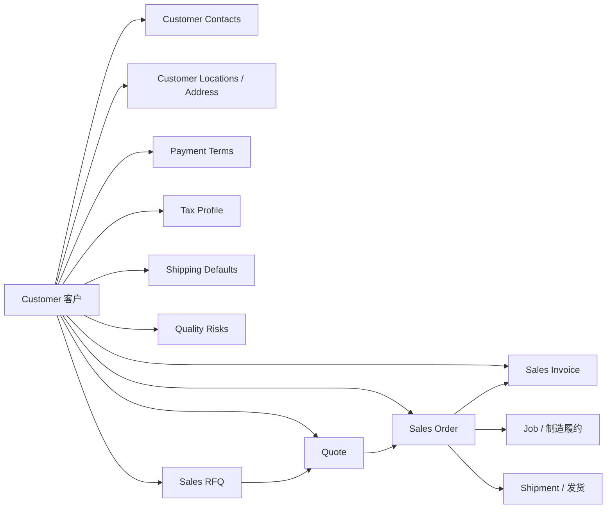
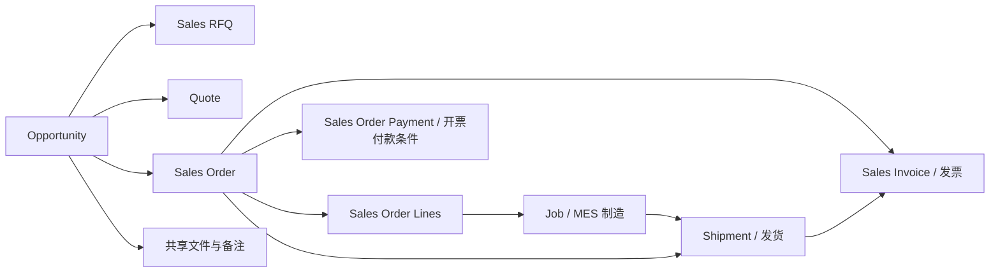
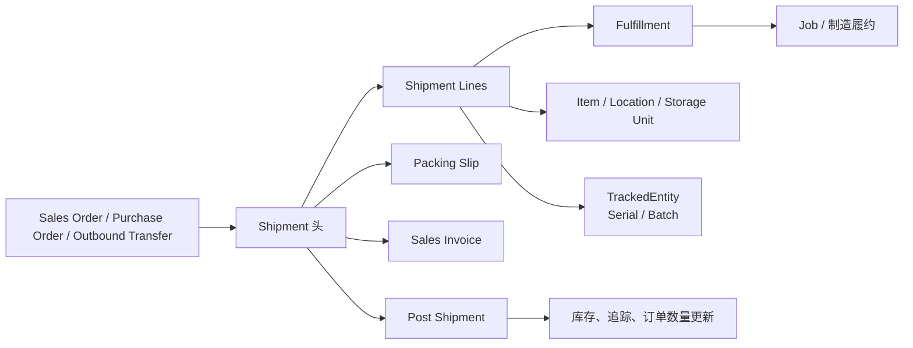

# 02 · Sales：报价到回款（Quote to Cash）

更新日期：2026-07-21（自 `.claude/scratch/tasks/carbon-business-model-mapping-master.md` 迁入并按业务链重排目录）
关联：物料与方法见 [`01-items-parts-methods.md`](./01-items-parts-methods.md) · 全景见 [`00-overview.md`](./00-overview.md)

## 本章在业务中的位置

```text
Customer
  → Sales RFQ
    → Quote（含 Line / Costing / Pricing / Markup / Payment Term）
      → Sales Order（含行、发运与付款属性）
        → Shipment
        → Sales Invoice
        →（履约）Job / MES   ← 方法快照来自 01 册 MakeMethod
```

报价 Costing 依赖组件的 `methodType`、供应商阶梯价与工序 `setupUnit` 等；这些主数据语义以 **01 册** 为准，本章保留页面级详述。

## 目录（按业务链路）

### 主数据与商务条款
1. [Customer Details](#section-01) — 客户详情功能与模型
2. [Payment Term](#section-03) — 付款条件选项与业务含义

### 询价
3. [Sales RFQ Overall](#section-15)
4. [Sales RFQ Line](#section-14)

### 报价
5. [Quote Overall](#section-08)
6. [Quote Line 全功能映射](#section-05)
7. [Quote Line 显示/控件映射](#section-06)
8. [Quote Line Costing](#section-04) — 含 Purchase to Order 阶梯价、`setupUnit`
9. [Quote Line Pricing](#section-07)
10. [Markup % Quick Action](#section-02)

### 销售订单
11. [Sales Order 全功能映射](#section-10)
12. [Sales Order Shipping & Payment](#section-11)
13. [Sales Order 业务总览（SO000003）](#section-12)
14. [Sales Order Line 映射](#section-13)

### 发运与开票
15. [Shipment ↔ Sales Order](#section-16)
16. [Shipment Details](#section-17)
17. [Sales Invoice Business Function](#section-09)

> 以下正文保留原专题笔记内容与章节编号锚点，便于对照历史讨论；阅读时请按上方业务链路跳转，不必按原 1→17 数字顺序。

---

<a id=section-01></a>

## 1. Customer Details Function, Business, and Model Mapping

Source file: `customer-cust_AMyZTSzyeeu7SVARMcVLwS-details-function-business-model-mapping.md`

### 客户详情页：完整功能、关联业务与 `models.py` 字段映射

- 页面：`http://localhost:3000/x/customer/cust_AMyZTSzyeeu7SVARMcVLwS/details`
- 客户内部 ID：`cust_AMyZTSzyeeu7SVARMcVLwS`
- 当前客户名称：`A客户`
- 核对日期：2026-07-16

本文说明 Carbon 客户详情页当前实际显示的界面、按钮、菜单、子页面、权限条件和关联业务，并把页面功能对应到 `packages/database/models.py` 的基础模型字段。客户详情是销售主数据入口，RFQ、Quote、Sales Order、Invoice、联系人、地址、付款、税务、运输和风险都从该客户向外展开。

#### 一、客户主数据在业务流程中的位置



客户记录本身保存“谁是客户、客户属于哪类、默认币种和税率、销售负责人、销售联系人”等主数据；付款、税务和收货配置拆到一对一扩展表；联系人和地点拆成一对多子实体；RFQ、Quote、Order、Invoice 通过 `customerId` 或发票客户字段回链。

#### 二、当前页面实测展示

| 页面区域 | 当前显示 | 业务含义 | 主要模型字段 |
|---|---|---|---|
| Header | `A客户`、More options | 客户标题、审计和删除入口 | `Customer.name/id` |
| Status | `ACTIVE` | 客户当前业务状态 | `Customer.customerStatusId → CustomerStatus` |
| Type | `A客户类型` | 客户分类 | `Customer.customerTypeId → CustomerType` |
| Account Manager | `T Test` | 客户负责人/账户经理 | `Customer.accountManagerId → User` |
| Tax Status | `Taxable` | 当前未勾选免税 | `CustomerTax.taxExempt = false` |
| Contacts | `Contacts 1` | 已有 1 个客户联系人 | `CustomerContact` 数量 |
| Locations | `Locations 1` | 已有 1 个客户地点 | `CustomerLocation` 数量 |
| Customer Overview | 名称 `A客户`、状态、类型、负责人、销售联系人、Chinese Yuan、税率 `0%`、网站字段、Save | 客户主数据编辑 | `Customer` |
| Add | 打开新建关联实体入口 | 当前页面的快捷创建入口 | 子路由/新建表单 |
| 业务导航 | Details、Contacts、Locations、Payment、Tax、Shipping、Risks、RFQs、Quotes、Orders、Invoices | 从客户向销售、财务、质量和物流展开 | 相关业务表外键 |

页面当前通过真实浏览器核对，未执行保存、删除或新建操作。非员工账号的侧栏会按角色隐藏多个入口；当前开发账号为员工，因此完整侧栏可见。

#### 三、路由装配与权限

##### 3.1 客户父路由

父路由 [`$customerId.tsx:17`](/C:/Users/45859/Desktop/桌面整理_2026-05-10/04_项目文件夹/cd/fq/carbon/apps/erp/app/routes/x+/customer+/$customerId.tsx:17) 要求 `view: sales`，并行加载：

- `getCustomer`：客户主表。
- `getCustomerContacts`：联系人及其 `Contact/User` 关系。
- `getCustomerLocations`：地点及其 `Address` 关系。
- `getTagsList(..., "customer")`：公司范围客户标签候选。
- `getCustomerTax`：客户税务扩展记录。

加载结果提供给 `CustomerHeader`、`CustomerSidebar` 和各个 Outlet 子路由。员工用户渲染完整 `CustomerSidebar`；非员工用户不渲染侧栏容器。

##### 3.2 Details action

详情 action [`$customerId.details.tsx:14`](/C:/Users/45859/Desktop/桌面整理_2026-05-10/04_项目文件夹/cd/fq/carbon/apps/erp/app/routes/x+/customer+/$customerId.details.tsx:14)：

1. 要求 `update: sales`。
2. 用 `customerValidator` 校验表单。
3. 按客户 ID 调用 `upsertCustomer`。
4. 写入 `customFields` 和 `updatedBy`。
5. 成功后 flash `Updated customer`。

客户表单保存不是只改前端状态，而是直接更新 `customer` 表记录。

#### 四、Header、状态和 More options

##### 4.1 Header 显示

| 控件 | 功能 | 字段/服务 |
|---|---|---|
| 客户名称 `A客户` | 显示当前客户标题 | `Customer.name` |
| `More options` | 打开 History/Delete 菜单 | `useAuditLog(entityType="customer")` |
| Status | 显示 CustomerStatus 名称 | `Customer.customerStatusId → CustomerStatus.name` |
| Type | 显示 CustomerType 名称 | `Customer.customerTypeId → CustomerType.name` |
| Account Manager | 显示员工头像/名称 | `Customer.accountManagerId → User` |
| Tax Status | `Exempt` 或 `Taxable` | `CustomerTax.taxExempt` |
| Tags | 选择/新增标签并保存 | `Customer.tags`，提交到 tags action |

Header 实现在 [`CustomerHeader.tsx:39`](/C:/Users/45859/Desktop/桌面整理_2026-05-10/04_项目文件夹/cd/fq/carbon/apps/erp/app/modules/sales/ui/Customer/CustomerHeader.tsx:39)。当前页面 Tax Status 为 `Taxable`，不是根据 `Customer.taxPercent` 推导，而是读取一对一 `CustomerTax` 记录。

##### 4.2 More options 菜单

当前实测菜单显示：

| 菜单项 | 功能 | 权限/结果 |
|---|---|---|
| `History` | 打开客户审计日志，查看创建、更新、删除和操作者 | 只读审计，不修改客户 |
| `Delete Customer` | 弹出确认并删除客户 | 需要 `delete: sales`；删除 action 成功后回客户列表 |

删除客户会受到数据库外键关系影响。客户联系人、地点、付款、Shipping、Tax 等扩展记录按各自外键级联或限制处理；已被订单等业务单据引用时，应先检查数据库约束和业务影响。

#### 五、Customer Overview 表单

组件 [`CustomerForm.tsx:44`](/C:/Users/45859/Desktop/桌面整理_2026-05-10/04_项目文件夹/cd/fq/carbon/apps/erp/app/modules/sales/ui/Customer/CustomerForm.tsx:44) 同时用于新建和编辑。当前是编辑模式：

| 界面字段 | 当前值/行为 | `models.py` 字段 |
|---|---|---|
| Customer ID | 只有 `companySettings.showCustomerReadableId=true` 才显示；编辑时只读 | `Customer.readableId` |
| Name | `A客户`，必填 | `Customer.name` |
| Customer Status | `ACTIVE` | `Customer.customerStatusId → CustomerStatus` |
| Customer Type | `A客户类型` | `Customer.customerTypeId → CustomerType` |
| Account Manager | `T Test` | `Customer.accountManagerId → User` |
| Sales Contact | `Ew ffe` | `Customer.salesContactId → CustomerContact` |
| Currency | `Chinese Yuan` | `Customer.currencyCode → CurrencyCode` |
| Tax Percent | `0%`；范围 0 到 1 | `Customer.taxPercent` |
| Website | 当前为空/可编辑 | `Customer.website` |
| Custom Fields | 由公司配置动态显示 | `Customer.customFields` JSON |
| Save | 提交客户主数据 | `upsertCustomer`，更新 `updatedBy` |

表单验证规则位于 [`sales.models.ts:66`](/C:/Users/45859/Desktop/桌面整理_2026-05-10/04_项目文件夹/cd/fq/carbon/apps/erp/app/modules/sales/sales.models.ts:66)：Name 必填，Tax Percent 必须在 `0..1`。编辑时 Save 需要 `update: sales`，新建时需要 `create: sales`。

##### 5.1 Customer 模型字段

当前 `Customer` 类位于 [`models.py:2687`](/C:/Users/45859/Desktop/桌面整理_2026-05-10/04_项目文件夹/cd/fq/carbon/packages/database/models.py:2687)：

| 字段 | 用途 |
|---|---|
| `id` | 客户内部 ID，例如 `cust_AMyZTSzyeeu7SVARMcVLwS` |
| `name` | 客户名称 |
| `customerTypeId` / `customerStatusId` | 客户类型、客户状态外键 |
| `accountManagerId` / `assignee` | 账户经理和客户负责人 |
| `logo` | 客户 Logo |
| `companyId` | 公司租户隔离 |
| `createdAt/createdBy/updatedAt/updatedBy` | 审计字段 |
| `customFields` | 客户自定义字段 |
| `currencyCode` | 客户默认交易币种 |
| `phone/fax/website` | 客户联系信息；当前主表表单只显示 Website |
| `taxPercent` | 默认客户税率 |
| `tags` | 客户标签数组 |
| `salesContactId` | 默认销售联系人 |
| `defaultCc` | 默认抄送地址数组；当前 UI 表单注释掉该输入 |
| `intercompanyCompanyId` | 集团内往来公司 |
| `readableId` | 可读客户编号，是否显示受公司设置控制 |

`customers` view 还可能提供订单计数、主联系人电话/传真、状态/类型显示等派生值，但这些不能误写成 `Customer` 基础表字段。

#### 六、侧栏与关联页面

侧栏由 [`useCustomerSidebar.tsx:26`](/C:/Users/45859/Desktop/桌面整理_2026-05-10/04_项目文件夹/cd/fq/carbon/apps/erp/app/modules/sales/ui/Customer/CustomerSidebar/useCustomerSidebar.tsx:26) 生成。当前员工页面显示以下入口：

| 入口 | 主要功能 | 业务/模型关系 | 角色 |
|---|---|---|---|
| `Details` | 客户主数据 | `Customer` | 所有可进入客户页面的用户 |
| `Contacts 1` | 联系人列表、创建、编辑、删除、创建账号 | `CustomerContact → Contact/User` | 员工 |
| `Locations 1` | 客户地点/地址列表、创建、编辑、删除 | `CustomerLocation → Address` | 员工/客户角色 |
| `Payment` | 发票客户、付款条件 | `CustomerPayment → Customer/Location/Contact/PaymentTerm` | 员工 |
| `Tax` | 税号、VAT、EORI、免税和证书 | `CustomerTax` | 员工 |
| `Shipping` | 收货客户、地点、联系人、运输方式、Incoterm | `CustomerShipping` | 员工 |
| `Risks` | 客户质量风险登记 | `RiskRegisterCard(source="Customer")` | 员工 |
| `RFQs` | 按 `customerId` 过滤 RFQ 列表 | `SalesRfq.customerId` | 员工 |
| `Quotes` | 按 `customerId` 过滤 Quote 列表 | `Quote.customerId` | 员工 |
| `Orders` | 按 `customerId` 过滤 Sales Order 列表 | `SalesOrder.customerId` | 员工 |
| `Invoices` | 按 `customerId` 过滤 Sales Invoice 列表 | `SalesInvoice.customerId` | 有权限用户 |

非员工用户不会渲染完整 CustomerSidebar；代码中的角色过滤仍保留 Locations 和 Invoices 的客户访问规则。

#### 七、Contacts 联系人

##### 7.1 页面功能

`Contacts` 卡片当前显示计数 `1`。联系人子页面支持：

- `New`：创建联系人，需要 `create: sales`。
- 联系人卡片：显示姓名、邮箱、电话、标题和关联地点。
- `Edit Contact`：有 `update: sales` 时编辑，否则显示 `View Contact`。
- `Delete Contact`：需要 `delete: sales`，二次确认后删除。
- `Create Account`：联系人没有 Carbon 用户账号、且有邮箱时，需要 `create: users`，可为联系人创建登录账号。

新建联系人服务先写 `Contact(isCustomer=true)`，再写 `CustomerContact(customerId, contactId, customerLocationId, ...)`。因此联系人不是直接把姓名字段塞进 Customer 表。

##### 7.2 联系人字段与模型

| UI 字段 | 模型字段 |
|---|---|
| Email | `Contact.email` |
| First Name / Last Name | `Contact.firstName/lastName` |
| Full Name | `Contact.fullName` 派生/存储 |
| Title | `Contact.title` |
| Mobile/Home/Work Phone | `Contact.mobilePhone/homePhone/workPhone` |
| Fax | `Contact.fax` |
| Notes | `Contact.notes` |
| Customer | `CustomerContact.customerId → Customer` |
| Customer Location | `CustomerContact.customerLocationId → CustomerLocation` |
| User Account | `CustomerContact.userId → User` |
| Custom Fields/Tags | `CustomerContact.customFields/tags` |

对应模型位于 `models.py:2783`（CustomerContact）和 `models.py:2373`（Contact）。

#### 八、Locations 客户地点

##### 8.1 页面功能

`Locations` 当前显示计数 `1`。地点卡片支持：

- `New`：创建客户地点，需要 `create: sales`。
- `Edit Location`：需要 `update: sales`。
- `Delete Location`：需要 `delete: sales`，若地点已被业务单据使用，数据库约束可能拒绝删除。
- 地址自动完成和自定义字段。

创建地点时先建立 `Address(companyId)`，再建立 `CustomerLocation(customerId, addressId, name, customFields)`。删除服务会先查地址 ID，再删除 Address，使 CustomerLocation 按级联关系被清理。

##### 8.2 地点字段与模型

| UI 字段 | 模型字段 |
|---|---|
| Location Name | `CustomerLocation.name` |
| Address Line 1/2 | `Address.addressLine1/addressLine2` |
| City / State | `Address.city/stateProvince` |
| Postal Code / Country | `Address.postalCode/countryCode` |
| Phone / Fax | `Address.phone/fax` |
| Customer | `CustomerLocation.customerId → Customer` |
| Custom Fields / Tags | `CustomerLocation.customFields/tags` |

`CustomerLocation` 位于 [`models.py:2895`](/C:/Users/45859/Desktop/桌面整理_2026-05-10/04_项目文件夹/cd/fq/carbon/packages/database/models.py:2895)，`Address` 位于 [`models.py:1506`](/C:/Users/45859/Desktop/桌面整理_2026-05-10/04_项目文件夹/cd/fq/carbon/packages/database/models.py:1506)。

#### 九、Payment 付款条件

Payment 子页是客户开票默认配置，不是某一张发票的收款流水。表单字段：

| UI 字段 | 模型字段/关系 |
|---|---|
| Invoice Customer | `CustomerPayment.invoiceCustomerId → Customer` |
| Invoice Location | `invoiceCustomerLocationId → CustomerLocation` |
| Invoice Contact | `invoiceCustomerContactId → CustomerContact` |
| Payment Term | `paymentTermId → PaymentTerm` |
| Custom Fields | `customerPayment.customFields` 配置字段 |
| Save | `updateCustomerPayment`，写 `updatedBy/updatedAt` |

`CustomerPayment` 以 `customerId` 为主键，模型位于 [`models.py:2950`](/C:/Users/45859/Desktop/桌面整理_2026-05-10/04_项目文件夹/cd/fq/carbon/packages/database/models.py:2950)。客户创建拦截器会自动创建 CustomerPayment/CustomerShipping 基础记录，详情页再维护字段。

这些默认值会被销售订单和发票流程读取，用于确定发票客户、收票地点、联系人和付款条款；它不直接代表 `Paid` 状态或已收款金额。

#### 十、Tax 税务信息

Tax 子页支持：

| UI 字段/动作 | 模型字段/业务 |
|---|---|
| Tax ID | `CustomerTax.taxId` |
| VAT Number | `CustomerTax.vatNumber` |
| EORI | `CustomerTax.eori`，仅 EORI 国家显示 |
| Tax Exempt | `CustomerTax.taxExempt` |
| Exemption Reason | `taxExemptionReason`；勾选免税时必须填写 |
| Certificate Number | `taxExemptionCertificateNumber` |
| Upload Certificate | 上传 PDF/PNG/JPG 到 private storage 的 `tax-certificates` 路径 |
| View Certificate | 预览 `taxExemptionCertificatePath` |
| Save | `updateCustomerTax`，写 `updatedBy/updatedAt` |

模型 `CustomerTax` 位于 [`models.py:3057`](/C:/Users/45859/Desktop/桌面整理_2026-05-10/04_项目文件夹/cd/fq/carbon/packages/database/models.py:3057)，以 `customerId` 为一对一主键。税务免税状态会影响销售订单行税额和发票税务处理；客户 Header 的 `Taxable/Exempt` 标签直接读取 `CustomerTax.taxExempt`。

#### 十一、Shipping 收货设置

Shipping 子页保存客户默认收货配置：

| UI 字段 | 模型字段 |
|---|---|
| Shipping Customer | `CustomerShipping.shippingCustomerId → Customer` |
| Shipping Location | `shippingCustomerLocationId → CustomerLocation` |
| Shipping Contact | `shippingCustomerContactId → CustomerContact` |
| Shipping Method | `shippingMethodId → ShippingMethod` |
| Incoterm | `incoterm` |
| Incoterm Location | 选择 Incoterm 后条件显示，写 `incotermLocation` |
| Custom Fields | `customerShipping.customFields` |
| Save | `updateCustomerShipping`，写 `updatedBy/updatedAt` |

模型 `CustomerShipping` 位于 [`models.py:2983`](/C:/Users/45859/Desktop/桌面整理_2026-05-10/04_项目文件夹/cd/fq/carbon/packages/database/models.py:2983)。销售订单的 Shipping 配置可从客户默认值开始，再在订单级别覆盖；最终 Shipment 会使用订单/来源单据上的地点、运输方式和追踪信息。

#### 十二、Risks 客户风险

`Risks` 路由要求 `view: sales`，渲染 Quality 模块的 `RiskRegisterCard`，参数为 `source="Customer"` 和当前客户 ID。风险记录不是 Customer 基础字段，而是以来源实体类型 + 来源 ID 关联客户的质量风险业务。

风险页用于登记客户相关质量/交付风险、跟踪风险状态和后续处理责任。客户详情页只提供入口，具体风险记录操作由 Quality 模块组件和权限控制。

#### 十三、RFQ、Quote、Order、Invoice 业务关联

客户侧四个列表入口都通过 URL filter 按 `customerId:eq:{当前客户 ID}` 过滤：

| 业务单据 | 客户关系 | 后续业务 |
|---|---|---|
| Sales RFQ | `SalesRfq.customerId`，可继续关联联系人/地点 | RFQ → Quote |
| Quote | `Quote.customerId/customerLocationId/customerContactId` | Quote → Sales Order |
| Sales Order | `SalesOrder.customerId/customerLocationId/customerContactId` | Order → Job/Shipment/Invoice |
| Sales Invoice | `SalesInvoice.customerId/invoiceCustomerId`，可关联 Shipment | 发票、余额和付款状态 |

订单创建时会读取客户默认币种、税率、联系人、付款和 Shipping 配置；Shipment 过账后更新销售订单行已发数量；Invoice 汇总按客户和订单回链。客户页面因此是销售主数据和订单履约链的入口，不是只用于通讯录维护。

#### 十四、权限与可编辑性

| 功能 | 读取 | 新建 | 更新 | 删除 |
|---|---|---|---|---|
| 客户详情 | `view: sales` | — | `update: sales` | `delete: sales` |
| Contacts | `view: sales` | `create: sales` | `update: sales` | `delete: sales` |
| Locations | `view: sales` | `create: sales` | `update: sales` | `delete: sales` |
| Payment/Tax/Shipping | `view: sales` | — | `update: sales` | — |
| Risks | `view: sales` | 由 Quality 模块决定 | 由 Quality 模块决定 | 由 Quality 模块决定 |
| Create Contact Account | — | `create: users` | — | — |

表单按钮会在前端按权限禁用，路由 action 仍在服务端重新校验。客户、联系人和地点删除都通过确认对话框触发；删除前应考虑订单、发票和地址外键引用。

#### 十五、相关模型索引

| 模型 | `db_table` | 页面职责 |
|---|---|---|
| `Customer` | `customer` | 客户名称、分类、状态、币种、税率、负责人、联系人、标签 |
| `CustomerStatus` | `customerStatus` | ACTIVE 等客户生命周期状态 |
| `CustomerType` | `customerType` | A客户类型等客户分类 |
| `CustomerContact` | `customerContact` | 客户与 Contact 的关联、客户地点和用户账号 |
| `Contact` | `contact` | 姓名、邮箱、电话、职位和备注 |
| `CustomerLocation` | `customerLocation` | 客户地点名称、Address 关联和标签 |
| `Address` | `address` | 地址行、城市、省州、邮编、国家和电话 |
| `CustomerPayment` | `customerPayment` | 开票客户、开票地点、联系人、付款条件 |
| `CustomerTax` | `customerTax` | 税号、VAT、EORI、免税及证书 |
| `CustomerShipping` | `customerShipping` | 收货客户、地点、联系人、运输方式、Incoterm |
| `PaymentTerm` | `paymentTerm` | 付款期限 |
| `ShippingMethod` | `shippingMethod` | 承运方式和运输配置 |
| `SalesRfq` | `salesRfq` | 客户 RFQ 列表和报价起点 |
| `Quote` | `quote` | 客户报价 |
| `SalesOrder` | `salesOrder` | 客户销售订单、制造、发货和开票起点 |
| `SalesInvoice` | `salesInvoice` | 客户发票、金额、状态和付款链 |
| `User` | `user` | Account Manager、联系人账号、审计人 |
| Quality Risk 模型 | Quality 模块表 | 以 Customer 作为风险来源 |

#### 十六、客户页面的典型操作顺序

1. 建立或维护客户名称、状态、类型、币种、税率和 Account Manager。
2. 创建客户联系人，并在需要时为有邮箱的联系人创建用户账号。
3. 创建账单/收货地点，维护地址和客户地点名称。
4. 设置 Payment、Tax、Shipping 默认值。
5. 在 Risks 中登记客户质量或交付风险。
6. 从 RFQs、Quotes、Orders、Invoices 查看该客户的全部销售业务。
7. 在 Sales Order 中使用客户默认联系人、税率、付款和 Shipping 设置，再推进 Job、Shipment 和 Invoice。
8. 通过 History 检查客户主数据变化；删除客户前确认没有不可删除的业务引用。

#### 十七、源码索引

- 客户父路由与 Loader：[`$customerId.tsx:17`](/C:/Users/45859/Desktop/桌面整理_2026-05-10/04_项目文件夹/cd/fq/carbon/apps/erp/app/routes/x+/customer+/$customerId.tsx:17)
- 客户详情保存：[`$customerId.details.tsx:14`](/C:/Users/45859/Desktop/桌面整理_2026-05-10/04_项目文件夹/cd/fq/carbon/apps/erp/app/routes/x+/customer+/$customerId.details.tsx:14)
- Header、History、Delete、Tags：[`CustomerHeader.tsx:39`](/C:/Users/45859/Desktop/桌面整理_2026-05-10/04_项目文件夹/cd/fq/carbon/apps/erp/app/modules/sales/ui/Customer/CustomerHeader.tsx:39)
- Overview 表单：[`CustomerForm.tsx:44`](/C:/Users/45859/Desktop/桌面整理_2026-05-10/04_项目文件夹/cd/fq/carbon/apps/erp/app/modules/sales/ui/Customer/CustomerForm.tsx:44)
- 侧栏入口：[`useCustomerSidebar.tsx:26`](/C:/Users/45859/Desktop/桌面整理_2026-05-10/04_项目文件夹/cd/fq/carbon/apps/erp/app/modules/sales/ui/Customer/CustomerSidebar/useCustomerSidebar.tsx:26)
- Contacts：[`CustomerContacts.tsx:26`](/C:/Users/45859/Desktop/桌面整理_2026-05-10/04_项目文件夹/cd/fq/carbon/apps/erp/app/modules/sales/ui/Customer/CustomerContacts.tsx:26)
- Locations：[`CustomerLocations.tsx:25`](/C:/Users/45859/Desktop/桌面整理_2026-05-10/04_项目文件夹/cd/fq/carbon/apps/erp/app/modules/sales/ui/Customer/CustomerLocations.tsx:25)
- Payment：[`$customerId.payments.tsx:1`](/C:/Users/45859/Desktop/桌面整理_2026-05-10/04_项目文件夹/cd/fq/carbon/apps/erp/app/routes/x+/customer+/$customerId.payments.tsx:1)
- Tax：[`$customerId.tax.tsx:1`](/C:/Users/45859/Desktop/桌面整理_2026-05-10/04_项目文件夹/cd/fq/carbon/apps/erp/app/routes/x+/customer+/$customerId.tax.tsx:1)
- Shipping：[`$customerId.shipping.tsx:1`](/C:/Users/45859/Desktop/桌面整理_2026-05-10/04_项目文件夹/cd/fq/carbon/apps/erp/app/routes/x+/customer+/$customerId.shipping.tsx:1)
- Customer 基础模型：[`models.py:2687`](/C:/Users/45859/Desktop/桌面整理_2026-05-10/04_项目文件夹/cd/fq/carbon/packages/database/models.py:2687)

---

<a id=section-02></a>

## 2. Markup Percent Quick Action

Source file: `markup-percent-quick-action.md`

### Quote Line Pricing - Markup % 快捷按钮详细说明

本文说明报价行详情页 Pricing 区域顶部 `Markup %` 快捷按钮的完整功能、计算方式、提交载荷、数据库落点，以及它和 Pricing 表格内其它字段的关系。

#### 1. 功能结论

`Markup %` 是一个批量重算单价的快捷动作。

用户选择一个加价百分比后，系统会把同一个百分比应用到当前报价行的所有数量档位、所有成本类别，然后重新计算每个数量档位的 `Unit Price`，并保存到 `quoteLinePrice.unitPrice` 与 `quoteLinePrice.categoryMarkups`。

它不是只更新屏幕上的 `Markup Percent` 显示值；实际持久化的是每个数量档位的价格行，以及该价格行里的成本类别加价 JSON。

#### 2. 前端显示与操作

所在界面：

- 页面：`/x/quote/{quoteId}/{lineId}/details`
- 区域：`Pricing`
- 按钮显示名：`Markup %`
- 按钮位置：`Pricing` 卡片标题右侧，和 `Precision` 按钮并列

可见/可用条件：

- 报价行没有处于 `No Quote` 状态时，Pricing 区域才会显示。
- 顶部 `Markup %` 操作只在报价单状态为 `Draft`、当前用户是 employee、并且有 sales update 权限时显示。
- 提交重算期间按钮会进入 loading/disabled 状态，避免重复点击。

下拉菜单内容：

- 自定义输入框：`Custom %`
- 自定义应用按钮：`Apply`
- 预设项：`0% Markup`、`10% Markup`、`15% Markup`、`20% Markup`、`30% Markup`、`40% Markup`、`50% Markup`、`60% Markup`、`70% Markup`、`80% Markup`、`90% Markup`、`100% Markup`

自定义输入规则：

- 必须是有效数字。
- 不能小于 0。
- 输入显示最多 2 位小数。
- 当前实现没有设置硬性上限，所以自定义值可以超过 100。
- 无效值不会提交。

#### 3. 百分比单位约定

这里有一个很重要的单位差异：

- `Markup %` 快捷按钮传入的是“整百分比”：`20` 表示 20%。
- `quoteLinePrice.categoryMarkups` 保存的也是“整百分比”：`{"materialCost": 20}` 表示材料成本加价 20%。
- `companySettings.quoteLineCategoryMarkups` 的默认值以小数保存：`0.2` 表示 20%；界面读取后会转换成 `20`。
- Pricing 表格里的普通百分比输入控件通常以小数参与计算：`0.2` 表示 20%。这也是 `Markup %` 快捷按钮和表格行 `Markup Percent` 容易混淆的地方。

#### 4. 计算逻辑

当前报价行的数量来自：

- `QuoteLine.quantity`

每个数量档位会先计算一组“每件成本类别成本”：

```text
每件类别成本 = getLineCosts(quantity) 返回的该类别总成本 / quantity
```

成本类别固定为这些 JSON key：

| 界面/业务类别 | `categoryMarkups` key |
| --- | --- |
| Material | `materialCost` |
| Part | `partCost` |
| Tool | `toolCost` |
| Consumable | `consumableCost` |
| Service | `serviceCost` |
| Labor | `laborCost` |
| Machine | `machineCost` |
| Overhead | `overheadCost` |
| Outside | `outsideCost` |

用户点击 `20% Markup` 时，系统会构造：

```json
{
  "materialCost": 20,
  "partCost": 20,
  "toolCost": 20,
  "consumableCost": 20,
  "serviceCost": 20,
  "laborCost": 20,
  "machineCost": 20,
  "overheadCost": 20,
  "outsideCost": 20
}
```

然后对每个数量档位计算：

```text
unitPrice =
  Σ(每件类别成本 * (1 + 该类别加价百分比 / 100))
```

因为 `Markup %` 快捷按钮把所有类别都设为同一个百分比，所以在数学上也等价于：

```text
unitPrice = 每件总成本 * (1 + 选择的 Markup % / 100)
```

但代码实际按类别逐项累加，这样可以和 `Markup by Category` 的逐类别加价保持同一套数据结构。

示例：

```text
数量档位：10
Material 每件成本：5
Labor 每件成本：3
选择：20% Markup

Unit Price = 5 * 1.2 + 3 * 1.2 = 9.6
```

如果某个类别成本为 0，该类别的加价率仍可能被写入 `categoryMarkups`，但不会影响价格。

#### 5. 成本来源

`Markup %` 本身不改成本，它只读取当前报价行的成本计算结果。

主要成本来源关系：

| 成本类别 | 主要来源模型/字段 |
| --- | --- |
| Material / Part / Tool / Consumable / Service | `QuoteMaterial.itemType`、`QuoteMaterial.methodType`、`QuoteMaterial.quantity`、`QuoteMaterial.unitCost` |
| Purchase to Order 采购成本 | `SupplierPart.itemId`、`SupplierPart.unitPrice`、`SupplierPartPrice.quantity`、`SupplierPartPrice.unitPrice`，用于供应商价格阶梯匹配 |
| Pull from Inventory / 静态单位成本 | `ItemCost.itemId`、`ItemCost.unitCost`；界面中的 Unit Cost 编辑也会更新 `ItemCost.unitCost` |
| Labor | `QuoteOperation.laborTime`、`QuoteOperation.laborUnit`、`QuoteOperation.laborRate`、`QuoteOperation.setupTime`、`QuoteOperation.setupUnit` |
| Machine | `QuoteOperation.machineTime`、`QuoteOperation.machineUnit`、`QuoteOperation.machineRate` |
| Overhead | `QuoteOperation.overheadRate`，结合 setup/labor/machine 时间计算 |
| Outside | `QuoteOperation.operationType`、`QuoteOperation.operationUnitCost`、`QuoteOperation.operationMinimumCost` |

自制件 `Make to Order` 会沿报价制造方法树汇总物料和工序成本。采购件 `Purchase to Order` 会优先使用供应商价格阶梯。库存拉取 `Pull from Inventory` 主要使用物料单位成本。

注意：`Pull from Inventory` 的 `Unit Cost` 行可以在 Pricing 表格里编辑并写入 `ItemCost.unitCost`；当前 `Markup %` 的重算依据仍来自报价行传入的成本计算结果，而不是直接读取表格本地输入框的临时值。

#### 6. 提交载荷

点击预设项或自定义 `Apply` 后，前端提交到：

```text
POST /x/quote/{quoteId}/{lineId}/recalculate-price
```

表单字段是 3 个 JSON 字符串：

| 字段名 | 含义 |
| --- | --- |
| `unitPricesByQuantity` | 按 `quantities` 顺序排列的新单价数组 |
| `quantities` | 当前报价行的数量档位数组 |
| `categoryMarkupsByQuantity` | 每个数量档位对应的成本类别加价 JSON |

示例：

```json
{
  "unitPricesByQuantity": [9.6, 8.4],
  "quantities": [10, 50],
  "categoryMarkupsByQuantity": {
    "10": {
      "materialCost": 20,
      "partCost": 20,
      "toolCost": 20,
      "consumableCost": 20,
      "serviceCost": 20,
      "laborCost": 20,
      "machineCost": 20,
      "overheadCost": 20,
      "outsideCost": 20
    },
    "50": {
      "materialCost": 20,
      "partCost": 20,
      "toolCost": 20,
      "consumableCost": 20,
      "serviceCost": 20,
      "laborCost": 20,
      "machineCost": 20,
      "overheadCost": 20,
      "outsideCost": 20
    }
  }
}
```

后端校验：

- `unitPricesByQuantity` 必须是数字数组。
- `quantities` 必须是数字数组。
- `categoryMarkupsByQuantity` 必须是对象，里面每个类别值必须是大于等于 0 的数字。
- `unitPricesByQuantity.length` 必须等于 `quantities.length`。

#### 7. 后端保存流程

后端会把数组按 index 对齐：

```text
unitPricesByQuantity[i] 对应 quantities[i]
```

然后为每个数量档位构造一条价格记录，传给报价行价格保存服务。

当前保存服务的实际行为很关键：

1. 查询当前 `quoteLineId` 下已有的 `quoteLinePrice` 行。
2. 删除当前 `quoteLineId` 下所有已有 `quoteLinePrice` 行。
3. 读取当前报价单的 `Quote.exchangeRate`。
4. 读取当前报价行的 `QuoteLine.unitPricePrecision`。
5. 按数量档位重插 `quoteLinePrice` 行。
6. 对新 `unitPrice` 按 `QuoteLine.unitPricePrecision` 四舍五入。
7. 对同一数量档位保留已有 `discountPercent` 和 `leadTime`。
8. 写入新的 `categoryMarkups`。
9. 写入当前报价单的 `exchangeRate`。

因此，虽然服务函数名是 upsert，但这条路径本质上是“删除后重插”。

#### 8. `models.py` 表和字段关系

##### `QuoteLine` / `public.quoteLine`

与 `Markup %` 相关但通常不被按钮直接修改：

| 字段 | 作用 |
| --- | --- |
| `id` | 当前报价行标识，对应提交路径里的 `{lineId}` |
| `quoteId` | 所属报价单，对应提交路径里的 `{quoteId}`，也用于写入价格行 |
| `status` | 报价行状态；`No Quote` 时不显示 Pricing 区域 |
| `methodType` | 决定成本来源方式，例如 `Make to Order`、`Purchase to Order`、`Pull from Inventory` |
| `itemId` | 报价行物料，用于成本、供应商价格、历史价格等关联 |
| `quantity` | 数量档位数组；按钮会为数组中的每个数量重算价格 |
| `additionalCharges` | 附加费用；按钮不直接修改 |
| `taxPercent` | 税率；按钮不直接修改 |
| `unitPricePrecision` | 单价精度；重算后的 `unitPrice` 会按此字段四舍五入 |

##### `QuoteLinePrice` / `public.quoteLinePrice`

这是 `Markup %` 直接落库的核心表。

| 字段 | 按钮影响 |
| --- | --- |
| `quoteId` | 重插价格行时写入当前报价单 id |
| `quoteLineId` | 重插价格行时写入当前报价行 id |
| `quantity` | 每个数量档位一条价格行，和 `quoteLineId` 组成真实复合主键 |
| `unitPrice` | 按 Markup % 重算并保存；会按 `QuoteLine.unitPricePrecision` 四舍五入 |
| `categoryMarkups` | 保存每个成本类别的加价百分比 JSON；`20` 表示 20% |
| `discountPercent` | 同一数量已有值会被保留；新数量默认 0 |
| `leadTime` | 同一数量已有值会被保留；新数量默认 0 |
| `exchangeRate` | 重插时写入当前 `Quote.exchangeRate` |
| `shippingCost` | 当前快捷按钮路径没有携带已有值；由于删除后重插，已有 shipping cost 会回到数据库默认 0 |
| `convertedUnitPrice` | 数据库生成字段，随 `unitPrice * exchangeRate` 自动重算 |
| `netUnitPrice` | 数据库生成字段，随 `unitPrice` 和 `discountPercent` 自动重算 |
| `netExtendedPrice` | 数据库生成字段，随 `unitPrice`、`discountPercent`、`quantity` 自动重算 |
| `convertedNetUnitPrice` | 数据库生成字段，随 `unitPrice`、`exchangeRate`、`discountPercent` 自动重算 |
| `convertedNetExtendedPrice` | 数据库生成字段，随 `unitPrice`、`exchangeRate`、`discountPercent`、`quantity` 自动重算 |
| `convertedShippingCost` | 数据库生成字段；因为 `shippingCost` 会回默认 0，所以这里也会随之为 0 |
| `createdBy` | 重插行时写入当前用户 |
| `createdAt` | 重插后由数据库生成新的创建时间 |
| `updatedBy` / `updatedAt` | 当前快捷按钮路径没有显式写入 |

##### `CompanySettings` / `public.companySettings`

| 字段 | 作用 |
| --- | --- |
| `quoteLineCategoryMarkups` | 公司级默认成本类别加价 JSON。它不是 `Markup %` 快捷按钮的预设来源；只是在某个 `quoteLinePrice.categoryMarkups` 为空时，Pricing 的类别明细显示会用它作为默认值。这里的值按小数保存，例如 `0.2` 表示 20%。 |

##### `QuoteMaterial` / `public.quoteMaterial`

与成本计算相关，不被 `Markup %` 直接修改：

| 字段 | 作用 |
| --- | --- |
| `quoteId` | 所属报价单 |
| `quoteLineId` | 所属报价行 |
| `quoteMakeMethodId` | 所属报价制造方法 |
| `quoteOperationId` | 可关联到具体报价工序 |
| `itemId` | 物料 |
| `itemType` | 决定落入 Material / Part / Tool / Consumable / Service 哪类成本 |
| `methodType` | 决定采购、库存拉取、自制等成本处理方式 |
| `quantity` | 用量 |
| `scrapQuantity` / `productionQuantity` | 影响生产需求数量 |
| `unitCost` | 成本单价 |

##### `QuoteOperation` / `public.quoteOperation`

与人工、设备、制造费用、外协成本计算相关，不被 `Markup %` 直接修改：

| 字段 | 作用 |
| --- | --- |
| `quoteId` | 所属报价单 |
| `quoteLineId` | 所属报价行 |
| `quoteMakeMethodId` | 所属报价制造方法 |
| `setupTime` / `setupUnit` | 准备时间，参与人工/制造费用计算 |
| `laborTime` / `laborUnit` / `laborRate` | 人工成本 |
| `machineTime` / `machineUnit` / `machineRate` | 设备成本 |
| `overheadRate` | 制造费用 |
| `operationType` | `Inside` 走内部人工/设备/制造费用；`Outside` 走外协成本 |
| `operationUnitCost` | 外协单位成本 |
| `operationMinimumCost` | 外协最低费用 |
| `operationLeadTime` | 外协提前期；影响工序信息，不是本按钮直接保存的价格字段 |

##### `SupplierPart` / `public.supplierPart`

用于采购件成本匹配，不被 `Markup %` 直接修改：

| 字段 | 作用 |
| --- | --- |
| `itemId` | 供应商物料对应的系统物料 |
| `supplierId` | 供应商 |
| `minimumOrderQuantity` | 最小订购数量 |
| `conversionFactor` | 供应商单位换算 |
| `unitPrice` | 供应商物料默认价格 |
| `active` | 是否启用 |
| `orderMultiple` | 订购倍量 |

##### `SupplierPartPrice` / `public.supplierPartPrice`

用于采购件价格阶梯，不被 `Markup %` 直接修改：

| 字段 | 作用 |
| --- | --- |
| `supplierPartId` | 供应商物料 |
| `quantity` | 阶梯数量 |
| `unitPrice` | 阶梯单价 |
| `leadTime` | 供应商价格对应交期 |
| `sourceType` / `sourceDocumentId` | 价格来源 |

##### `ItemCost` / `public.itemCost`

用于物料单位成本，尤其是库存拉取或成本默认值场景：

| 字段 | 作用 |
| --- | --- |
| `itemId` | 物料 |
| `unitCost` | 物料单位成本；Pricing 表格里的 Unit Cost 编辑会更新它 |
| `standardCost` | 标准成本 |
| `costingMethod` | 成本方法 |
| `costIsAdjusted` | Unit Cost 被手动调整时会被置为 true |

#### 9. 和 Pricing 表格其它功能的区别

##### `Markup %` 快捷按钮

- 批量动作。
- 一次作用于所有数量档位。
- 一次作用于所有成本类别。
- 写入 `quoteLinePrice.unitPrice`。
- 写入 `quoteLinePrice.categoryMarkups`。
- 当前保存路径会删除并重插当前报价行所有价格行。

##### `Markup Percent` 表格行

- 每个数量档位单独显示。
- 显示公式是：

```text
(Price - Cost) / Cost
```

- 手动编辑时只按该数量档位更新 `quoteLinePrice.unitPrice`。
- 不会写入 `quoteLinePrice.categoryMarkups`。
- 输入控件使用小数百分比语义：`0.2` 表示 20%。

##### `Markup by Category`

- 是按成本类别逐项编辑的明细。
- 只显示有成本的类别。
- 每个数量档位、每个成本类别可以不同。
- 修改一个类别时，会重算该数量档位的 `unitPrice`，并更新该数量档位的 `categoryMarkups`。
- `Markup %` 快捷按钮相当于把所有类别一次性填成同一个百分比。

##### `Precision`

- 改的是 `QuoteLine.unitPricePrecision`。
- 它不改变成本来源。
- `Markup %` 重算保存时会按这个精度四舍五入 `unitPrice`。

#### 10. 影响范围与边界行为

会改变：

- `QuoteLinePrice.unitPrice`
- `QuoteLinePrice.categoryMarkups`
- `QuoteLinePrice.exchangeRate`
- `QuoteLinePrice.createdBy` / `createdAt`，因为价格行会被重插
- 由数据库生成的价格字段，例如 `netUnitPrice`、`netExtendedPrice`、`convertedUnitPrice` 等

会保留：

- 同一数量档位已有的 `QuoteLinePrice.discountPercent`
- 同一数量档位已有的 `QuoteLinePrice.leadTime`

不会直接改变：

- `QuoteLine.quantity`
- `QuoteLine.methodType`
- `QuoteLine.additionalCharges`
- `QuoteLine.taxPercent`
- `QuoteMaterial` 成本行
- `QuoteOperation` 工序行
- `SupplierPart` / `SupplierPartPrice`
- `ItemCost.unitCost`

当前实现的特殊注意：

- `QuoteLinePrice.shippingCost` 不会被这条快捷按钮路径保留；如果该报价行价格档位已有 shipping cost，点击 `Markup %` 后会因为删除重插而回到默认 0。
- 后端路由校验了 POST 和 sales update 权限；界面的 Draft 限制主要在前端可见性里实现。
- 如果重算前某个数量没有价格行，重插时会创建该数量的价格行，并把 `discountPercent`、`leadTime` 设为 0。
- 如果重算前某个数量有价格行，`discountPercent` 和 `leadTime` 会按数量保留。

#### 11. 核验来源

以下只是本说明的源码核验来源，不是前端代码对应关系表：

- `apps/erp/app/modules/sales/ui/Quotes/QuoteLinePricing.tsx`
- `apps/erp/app/modules/sales/ui/Quotes/useLineCosts.tsx`
- `apps/erp/app/routes/x+/quote+/$quoteId.$lineId.recalculate-price.tsx`
- `apps/erp/app/modules/sales/sales.service.ts`
- `apps/erp/app/modules/sales/sales.models.ts`
- `apps/erp/app/utils/path.ts`
- `packages/database/models.py`
- `packages/database/supabase/migrations/20260307000000_quote-line-category-markups.sql`
- `packages/database/supabase/migrations/20241105002325_quote-taxes-and-shipping.sql`

---

<a id=section-03></a>

## 3. Payment Term Options and Business Meaning

Source file: `payment-term-options-and-business-meaning.md`

### Payment Term（付款条件）选项与业务含义

#### 1. Payment Term 是什么

Payment Term 是公司级的付款条件主数据。它把“什么时候到期付款”和“是否提供现金折扣”保存成一个可复用记录，供客户、供应商、报价、订单和发票引用。

需要区分两类“选项”：

1. **Payment Term 下拉选项**是数据库中的付款条件记录，例如 `Net 30`、`2% 10 Net 30`。记录名称由公司维护，并不局限于下面的种子数据。
2. **After / Calculation Method 选项**是每条付款条件记录里的计算方式枚举，目前只有 `Net`、`End of Month`、`Day of Month` 三项。

付款条件选择器由 `apps/erp/app/components/Form/PaymentTerm.tsx:25-107` 实现，从 `path.to.api.paymentTerms` 加载当前公司、`active=true` 的记录，并按名称排序。具有 `accounting:create` 权限的用户可以在下拉框中直接创建新记录；新建默认值为 `Net`、到期 0 天、折扣 0 天、折扣 0%。

#### 2. Calculation Method 的全部选项

源码唯一允许的值来自 `apps/erp/app/modules/accounting/accounting.models.ts:350-382`，数据库枚举定义在 `packages/database/supabase/migrations/20230510035345_purchasing.sql:1-4`。

| 选项 | 业务含义 | 示例（按设计意图理解） | 当前代码状态 |
| --- | --- | --- | --- |
| `Net` | 以单据的付款计算基准日为起点，经过 `daysDue` 天后到期。它是默认方式，也是普通“Net 30 / Net 60”最适合的方式。 | 基准日 2026-07-16，`daysDue=30`，到期日通常为 2026-08-15。 | 发票更新代码只实现了“基准日期 + `daysDue` 天”的加法路径；见 `apps/erp/app/routes/x+/sales-invoice+/update.tsx:80-108` 和采购发票对应路由。 |
| `End of Month` | 先把基准日归入所在月份，再以该月月末作为计算锚点，之后按 `daysDue` 推算到期日。 | 2026-07-16、`daysDue=10`，通常表达“7 月月末后第 10 天”，即 2026-08-10。种子名称 `Net EOM 10th` 正是这一业务表达。 | 当前仓库没有发现真正的月末归一或跨月算法；数据库只保存枚举和天数。不要把该语义当成当前运行时已完整执行的规则。 |
| `Day of Month` | 按月份中的指定日作为付款计算锚点，`daysDue` 承载表单中的“Due Days after Day of Month”数值。该方式适用于每月固定日期结算的客户约定。 | 例如每月 15 日结算，具体应以业务约定确认 `daysDue` 的解释和跨月规则。 | 当前仓库没有发现指定日算法，也没有该方式的内置种子记录；目前不能仅凭选择该值就保证发票自动落到指定月日。 |

`PaymentTermForm.tsx:109-138` 会把选择的方式显示在字段标签中：`Due Days after {calculationMethod}` 和 `Discount Days after {calculationMethod}`。这说明字段设计意图是“相对于所选计算方式的天数”，但后端当前未实现 `End of Month` 与 `Day of Month` 的特殊日历计算。

#### 3. Payment Term 表单字段

| UI 字段 | 数据库字段 | 类型/约束 | 含义 |
| --- | --- | --- | --- |
| `Name` | `name` | `text`，必填 | 业务人员识别付款条件的名称，如 `Net 30`、`2% 10 Net 30`。 |
| `After` | `calculationMethod` | PostgreSQL enum，必填 | 到期日和折扣期的计算基准，只能是 `Net`、`End of Month`、`Day of Month`。默认 `Net`。 |
| `Due Days after ...` | `daysDue` | `integer`，`>=0`，默认 0 | 从付款计算基准日起，到应付或应收款到期的天数。0 通常表示即期或当天到期。 |
| `Discount Days after ...` | `daysDiscount` | `integer`，`>=0`，默认 0 | 从同一计算基准日起，现金折扣可用的天数。0 表示没有折扣窗口。 |
| `Discount Percent` | `discountPercentage` | `numeric(10,5)`，0–100，默认 0 | 在折扣窗口内付款可享受的现金折扣百分比。0 表示无折扣。 |
| `CustomFormFields` | `customFields` | `jsonb`，可空 | 公司自定义字段；表单通过 `CustomFormFields(table="paymentTerm")` 渲染。 |
| （无直接表单字段） | `active` | `boolean`，默认 `true` | 是否仍出现在选择器中。删除付款条件实际是更新为 `active=false` 的软删除。 |

模型还包含审计和租户字段：`id`、`companyId`、`createdAt`、`createdBy`、`updatedAt`、`updatedBy`，以及 `tags`（`text[]`）。完整 Django 映射见 `packages/database/models.py:8180-8221`；枚举 choices 见 `packages/database/models.py:699-704`。

#### 4. 内置 Payment Term 记录

初始种子数据位于 `packages/database/supabase/functions/lib/seed.data.ts:38-103`，开发种子插入逻辑位于 `packages/database/src/seed-dev.ts:293-307`。这些是“可选的下拉记录”，不是 Calculation Method 的全部枚举。

| 名称 | Calculation Method | 到期 | 折扣窗口 | 业务解释 |
| --- | --- | ---: | ---: | --- |
| `Net 15` | `Net` | 15 天 | 0 天 / 0% | 基准日后 15 天全额到期。 |
| `Net 30` | `Net` | 30 天 | 0 天 / 0% | 基准日后 30 天全额到期。 |
| `Net 60` | `Net` | 60 天 | 0 天 / 0% | 基准日后 60 天全额到期。 |
| `1% 10 Net 30` | `Net` | 30 天 | 10 天 / 1% | 10 天内付款可享 1% 现金折扣，最迟第 30 天净额到期。 |
| `2% 10 Net 30` | `Net` | 30 天 | 10 天 / 2% | 10 天内付款可享 2% 现金折扣，最迟第 30 天净额到期。 |
| `COD` | `Net` | 0 天 | 0 天 / 0% | Cash on Delivery，货到付款或即期付款。 |
| `Prepaid/ Pro forma` | `Net` | 0 天 | 0 天 / 0% | 预付或形式发票场景；名称表达业务要求，系统字段仍是 0 天、无折扣。 |
| `Net EOM 10th` | `End of Month` | 10 天 | 0 天 / 0% | 设计意图为月末后第 10 天到期；当前代码未执行月末算法。 |

`Day of Month` 当前没有内置示例。用户可以通过“New Payment Term”创建自定义记录，但名称、跨月行为和固定日期约定应由公司财务规则先确定。

#### 5. 业务关联和继承关系

Payment Term 通过 `paymentTermId` 外键被多个付款资料和单据模型引用：

| 业务对象 | `models.py` 字段 | 用途 |
| --- | --- | --- |
| 客户付款资料 | `CustomerPayment.paymentTermId`，`packages/database/models.py:2964-2966` | 保存客户默认的发票付款条件；客户页面的 `Payment Terms` 卡片由 `CustomerPaymentForm.tsx:44-71` 编辑。 |
| 供应商付款资料 | `SupplierPayment.paymentTermId`，`:12585-12587` | 保存供应商默认采购付款条件。 |
| 报价付款 | `QuotePayment.paymentTermId`，`:10409-10411` | 报价上的付款条件，可在报价转订单时继续带入。 |
| 销售订单付款 | `SalesOrderPayment.paymentTermId`，`:11162-11164` | 销售订单约定的客户付款条件；创建销售订单时可从客户付款资料复制。 |
| 采购订单付款 | `PurchaseOrderPayment.paymentTermId`，`:9435-9437` | 采购订单约定的供应商付款条件；创建采购订单时可从供应商付款资料复制。 |
| 销售发票 | `SalesInvoice.paymentTermId`，`:10728-10730` | 发票显示/编辑付款条件，并与 `dateIssued`、`dateDue`、`datePaid` 同时存在。 |
| 采购发票 | `PurchaseInvoice.paymentTermId`，`:8861-8863` | 采购发票的付款条件和到期日期关联。 |

销售订单从客户默认付款资料复制付款条件的逻辑在 `apps/erp/app/modules/sales/sales.service.ts:4971-4987,5058-5065`；采购订单对应逻辑在 `apps/erp/app/modules/purchasing/purchasing.service.ts:1426-1446,1507-1514`。因此典型流程是：

`CustomerPayment / SupplierPayment 默认值 → Quote / Sales Order / Purchase Order → Sales Invoice / Purchase Invoice`

付款条件名称还会被订单、报价、发票的 PDF/邮件模板读取，用于对外展示。它不是库存、发运或收款流水本身，不会替代 `dateDue`、`datePaid` 等实际单据日期字段。

#### 6. 权限、公司隔离和删除行为

- Payment Term 记录按 `companyId` 隔离。选择器只查询当前公司且 `active=true` 的记录。
- 初始迁移中的查看策略要求员工身份以及 `accounting_view`、`parts_view`、`resources_view`、`sales_view` 或 `purchasing_view` 之一，见 `20230510035345_purchasing.sql:31-45`。当前最新 RLS 重构已替换为按 `get_companies_with_employee_permission(...)` 返回公司集合隔离，查看使用 `accounting_view`、`sales_view` 或 `purchasing_view`，见 `20260228000000_rls-refactor-3.sql:734-761`。
- 新建、编辑、删除分别需要 `accounting_create`、`accounting_update`、`accounting_delete`；当前策略定义见 `20260228000000_rls-refactor-3.sql:763-788`（初始策略见 `20230510035345_purchasing.sql:47-66`）。
- `(name, companyId, active)` 唯一约束阻止同一公司出现重复的同名活动记录；因为删除是软删除，之后可以用相同名称重新创建活动记录。
- 删除由 `apps/erp/app/modules/accounting/accounting.service.ts:209-217` 把 `active` 设为 `false`，不是立即删除数据库行。旧单据仍可能保留原 `paymentTermId`，但该记录不会再出现在新选择器中。

#### 7. 当前实现的重要限制

从代码事实看，Payment Term 的主数据、校验、下拉选择、复制和展示已经存在，但到期日算法并未完整覆盖三个 Calculation Method：

1. `sales-invoice+/update.tsx:80-108` 和 `purchase-invoice+/update.tsx:81-109` 中可见的日期计算只做 `parseDate(...).add({ days: paymentTerms.data.daysDue })`。
2. 该路径没有读取 `calculationMethod`、`daysDiscount` 或 `discountPercentage` 来执行月末、指定日或折扣日计算。
3. 这两个更新路由的 `dateIssued` 分支用日期值去查询 `paymentTerm.id`（而不是先取当前发票的 `paymentTermId`），因此某些情况下可能查不到付款条件，导致只保存发票日期而不自动重算到期日。

所以，本文对 `End of Month` 与 `Day of Month` 的说明是**字段和产品设计语义**；在当前版本中，若业务需要严格的月末/固定日到期或自动现金折扣计算，应在上线前通过实际发票数据验证，不能只依据下拉选项名称判断已经生效。

#### 8. 相关源码索引

- 计算方式和校验：`apps/erp/app/modules/accounting/accounting.models.ts:350-382`
- Payment Term 选择器：`apps/erp/app/components/Form/PaymentTerm.tsx:25-107`
- Payment Term 表单：`apps/erp/app/modules/accounting/ui/PaymentTerms/PaymentTermForm.tsx:72-145`
- Payment Term 列表：`apps/erp/app/modules/accounting/ui/PaymentTerms/PaymentTermsTable.tsx:34-133`
- 数据库 enum、表、RLS：`packages/database/supabase/migrations/20230510035345_purchasing.sql:1-66`
- 当前 RLS 重构：`packages/database/supabase/migrations/20260228000000_rls-refactor-3.sql:734-788`
- Django 模型：`packages/database/models.py:699-704,8180-8221`
- 内置种子记录：`packages/database/supabase/functions/lib/seed.data.ts:38-103`
- 发票日期更新：`apps/erp/app/routes/x+/sales-invoice+/update.tsx:80-108`、`apps/erp/app/routes/x+/purchase-invoice+/update.tsx:81-109`

---

<a id=section-04></a>

## 4. Quote Line Costing Block Details

Source file: `quote-line-costing-block-details.md`

### Quote Line Details - Costing 成本区块完整功能说明

目标页面：

```text
http://localhost:3000/x/quote/quote_9bB41oBhJFNUyReFQ7g1iS/SbephGpbSHjVARxtmhcoFc/details
```

本文说明该报价行详情页中 `Costing` 成本区块的完整功能、显示条件、界面显示项、计算公式、成本来源，以及 `models.py` 中相关表字段关系。本文不做 `.tsx` 前端源码对应表，只说明界面显示名、业务功能和数据库模型字段。

#### 1. 功能结论

`Costing` 是报价行的只读估算成本分解表。

它按报价行的数量档位横向展开，每个数量列中显示两层数字：

- 第一行大字：该数量档位的总成本。
- 第二行小字：该数量档位的每件成本，即 `总成本 / quantity`。

`Costing` 不直接保存数据，也没有新增、编辑、删除成本的动作。它读取报价行的制造方法树、报价物料、报价工序和供应商价格阶梯，按当前数量档位实时计算成本。这些结果会被 `Pricing` 定价区块复用，例如 `Unit Cost`、`Markup Percent`、`Markup by Category` 和 `Markup %` 的重算都依赖同一套成本结果。

#### 2. 显示条件

`Costing` 区块只在以下条件同时满足时显示：

| 条件 | 来源字段/权限 |
| --- | --- |
| 报价行取得方式是自制 | `QuoteLine.methodType = "Make to Order"` |
| 报价行没有被标记为不报价 | `QuoteLine.status != "No Quote"` |
| 当前用户是员工 | `permissions.is("employee")` |

因此：

- `Purchase to Order` 报价行不会显示该 `Costing` 区块。
- `Pull from Inventory` 报价行不会显示该 `Costing` 区块。
- 非员工用户不会看到该成本区块。

#### 3. 区块结构

顶部显示：

| 显示名 | 功能 |
| --- | --- |
| `Costing` | 成本区块标题 |
| `Show Details` | 展开/收起成本明细 |

表格列：

| 位置 | 含义 | 来源 |
| --- | --- | --- |
| 左侧第一列 | 成本项目名称 | 固定显示 |
| 右侧数量列 | 当前报价行的数量档位 | `QuoteLine.quantity` |

每个数量列的展示规则：

```text
上方金额 = 当前数量档位下的总成本
下方小字 = 当前数量档位下的每件成本 = 总成本 / quantity
```

每件成本的小数位使用：

| 模型 | 字段 |
| --- | --- |
| `QuoteLine` | `unitPricePrecision` |

#### 4. 默认显示行

未打开 `Show Details` 时，默认显示这些汇总行：

| Costing 显示名 | 成本分组 | 公式 |
| --- | --- | --- |
| `Total Material Cost` | Material | `materialCost + partCost + toolCost + consumableCost + serviceCost` |
| `Total Direct Cost` | Direct | `laborCost + machineCost` |
| `Total Indirect Cost` | Indirect | `overheadCost` |
| `Total Outside Cost` | Outside | `outsideCost` |
| `Total Estimated Cost` | 总估算成本 | `consumableCost + laborCost + machineCost + materialCost + outsideCost + overheadCost + partCost + serviceCost + toolCost` |

这些行全部是只读计算结果，不直接落库。

#### 5. `Show Details` 展开后的明细

打开 `Show Details` 后，会在汇总行下面显示更细的成本行。

##### Material 组明细

| Costing 显示名 | 对应成本字段 | 说明 |
| --- | --- | --- |
| `Part Cost` | `partCost` | Part 类型的买入件或库存拉取件成本；界面 tooltip 显示 `Includes bought and picked parts` |
| `Material Cost` | `materialCost` | Material 类型物料成本 |
| `Tooling Cost` | `toolCost` | Tool 类型物料成本 |
| `Consumable Cost` | `consumableCost` | Consumable 类型物料成本 |

注意：成本计算类型中存在 `serviceCost`，并且它会计入 `Total Material Cost` 和 `Total Estimated Cost`。但当前 `Costing` 明细中的 `Service Cost` 行被注释掉，所以 `Show Details` 下不会单独显示 `Service Cost` 行。

##### Direct 组明细

| Costing 显示名 | 对应成本字段 | 说明 |
| --- | --- | --- |
| `Labor Costs` | `laborCost` | 内部工序的人工成本 |
| `Labor Hours` | `laborHours + setupHours` | 人工时间加准备时间，以小时格式显示 |
| `Machine Costs` | `machineCost` | 内部工序的设备成本 |
| `Machine Hours` | `machineHours` | 设备时间，以小时格式显示 |

##### Indirect / Outside

`Total Indirect Cost` 和 `Total Outside Cost` 没有额外展开明细行：

| Costing 显示名 | 对应成本字段 | 说明 |
| --- | --- | --- |
| `Total Indirect Cost` | `overheadCost` | 制造费用/间接费用 |
| `Total Outside Cost` | `outsideCost` | 外协工序成本 |

#### 6. 成本数据结构

成本计算函数返回的结构包括：

| 成本字段 | 含义 |
| --- | --- |
| `materialCost` | Material 类型物料成本 |
| `partCost` | Part 类型物料成本 |
| `toolCost` | Tool 类型物料成本 |
| `consumableCost` | Consumable 类型物料成本 |
| `serviceCost` | Service 类型物料成本 |
| `laborCost` | 人工成本 |
| `laborHours` | 人工时间 |
| `setupHours` | 准备时间 |
| `machineCost` | 设备成本 |
| `machineHours` | 设备时间 |
| `overheadCost` | 制造费用 |
| `outsideCost` | 外协成本 |

`Costing` 表格每个数量列都会调用：

```text
getLineCosts(quantity)
```

得到该数量档位下的一整组成本，再展示汇总和明细。

#### 7. 成本来源和计算逻辑

##### 方法树和数量展开

自制报价行的成本从报价制造方法树开始。

相关模型：

| 模型 | 关键字段 | 作用 |
| --- | --- | --- |
| `QuoteLine` | `id`、`quoteId`、`itemId`、`methodType`、`quantity`、`unitPricePrecision` | 当前报价行和数量档位；页面读取的是 `quoteLines` view，其中会合并物料成本字段 |
| `QuoteMakeMethod` | `id`、`quoteId`、`quoteLineId`、`parentMaterialId`、`itemId`、`quantityPerParent`、`version` | 报价制造方法树节点 |
| `QuoteMaterial` | `id`、`quoteLineId`、`quoteMakeMethodId`、`quoteOperationId`、`itemId`、`itemType`、`methodType`、`quantity`、`unitCost` | 方法树中的物料行 |
| `QuoteOperation` | `quoteLineId`、`quoteMakeMethodId`、`operationType`、人工/设备/外协字段 | 方法树中的工序行 |

页面会先取得当前报价行的制造方法树。成本计算时会复制这棵树，并把子节点数量乘以上级数量：

```text
子节点实际用量 = 子节点自身 quantity * 父节点展开后的 quantity
```

工序按 `QuoteOperation.quoteMakeMethodId` 归到对应制造方法节点上，再随着方法树一起计算。

##### 物料成本

物料成本根据 `methodType` 和 `itemType` 处理。

###### `Purchase to Order`

采购到单的物料会通过供应商价格阶梯解析单位成本。

相关模型：

| 模型 | 字段 | 作用 |
| --- | --- | --- |
| `QuoteMaterial` | `itemId` | 要采购的物料 |
| `QuoteMaterial` | `itemType` | 决定落入 material/part/tool/consumable/service 哪个成本桶 |
| `QuoteMaterial` | `quantity` | 方法树中的用量 |
| `QuoteMaterial` | `unitCost` | 没有供应商价格时的 fallback 成本 |
| `SupplierPart` | `itemId`、`unitPrice` | 供应商物料默认价 |
| `SupplierPartPrice` | `supplierPartId`、`quantity`、`unitPrice` | 供应商价格阶梯 |

计算逻辑：

```text
requestedQty = 物料用量 * 报价数量
resolvedUnitCost = 供应商价格阶梯中 quantity <= requestedQty 且数量门槛最大的那一级单价
如果没有合格阶梯，则使用 SupplierPart.unitPrice 或 QuoteMaterial.unitCost
采购物料总成本 = resolvedUnitCost * requestedQty
```

其中，`物料用量` 是方法树完成父子数量展开后的用量，`报价数量` 是当前报价档位中的成品数量，二者相乘得到完成整批报价所需采购的物料总量 `requestedQty`。例如，每件成品需要 2.5 kg 钢材、报价数量为 120 件时：

```text
requestedQty = 2.5 * 120 = 300 kg
```

嵌套方法树会先逐层展开数量。例如，每件成品需要 3 个组件，每个组件需要 2 个零件，则该零件相对于一件成品的展开用量为 `3 * 2 = 6`；报价 100 件时，`requestedQty` 为 600 个。

供应商阶梯价表示达到某个采购数量后，整批采购可以采用对应单价。假设价格阶梯为：

| 数量门槛 | 单价 |
| ---: | ---: |
| 1 | 12.00 |
| 100 | 10.50 |
| 250 | 9.80 |
| 500 | 9.00 |

当 `requestedQty = 300` 时，数量门槛为 1、100、250 的阶梯都满足 `quantity <= requestedQty`。系统选择其中数量门槛最大的 250 阶梯，因此 `resolvedUnitCost = 9.80`。这里选择的是“合格阶梯中数量门槛最高的那一级”的单价，并不是选择数值最高的单价，也不是在所有合格阶梯中寻找最低单价。

阶梯价格按整批数量应用，不采用累进分段计价。上述 300 kg 全部按 9.80 计价，而不是把不同数量区间分别按 12.00、10.50 和 9.80 计价。

如果没有满足条件的阶梯，例如没有配置阶梯价，或者需求量低于最小数量门槛，则进入后备价格逻辑：

1. 如果存在可用的 `SupplierPart.unitPrice`，使用供应商物料默认价；同一物料存在多个供应商默认价时，当前实现取最低的非空价格。
2. 如果没有可用的供应商默认价，则使用 `QuoteMaterial.unitCost`。

最终成本是该物料覆盖整个报价数量的总采购成本。例如：

```text
resolvedUnitCost = 9.80 元/kg
requestedQty = 300 kg
采购物料总成本 = 9.80 * 300 = 2,940 元
```

这里的 2,940 元是整批报价中该物料的总成本，而不是单件成品的物料成本。

然后根据 `QuoteMaterial.itemType` 放入对应成本桶：

| `itemType` | 成本字段 |
| --- | --- |
| `Material` | `materialCost` |
| `Part` | `partCost` |
| `Tool` | `toolCost` |
| `Consumable` | `consumableCost` |
| `Service` | `serviceCost` |

###### `Pull from Inventory`

库存拉取的物料使用静态单位成本。

相关字段：

| 模型 | 字段 | 作用 |
| --- | --- | --- |
| `QuoteMaterial` | `unitCost` | 成本单价 |
| `QuoteMaterial` | `quantity` | 方法树中的用量 |
| `QuoteMaterial` | `itemType` | 决定成本桶 |

计算逻辑：

```text
库存拉取物料总成本 = QuoteMaterial.unitCost * 方法树用量 * 报价数量
```

##### 内部工序成本

当 `QuoteOperation.operationType = "Inside"` 时，工序会产生人工、设备和制造费用。

###### 时间单位归一

`setupTime`、`laborTime`、`machineTime` 会先按单位换算为小时。支持的单位包括：

- `Total Hours`
- `Total Minutes`
- `Hours/Piece`
- `Hours/100 Pieces`
- `Hours/1000 Pieces`
- `Minutes/Piece`
- `Minutes/100 Pieces`
- `Minutes/1000 Pieces`
- `Pieces/Hour`
- `Pieces/Minute`
- `Seconds/Piece`

###### Setup 准备时间

相关字段：

| 模型 | 字段 |
| --- | --- |
| `QuoteOperation` | `setupTime` |
| `QuoteOperation` | `setupUnit` |
| `QuoteOperation` | `laborRate` |
| `QuoteOperation` | `overheadRate` |

`setupUnit` 是 `setupTime` 的计量方式，决定准备时间是整批固定时间，还是随生产数量变化的时间。对于 `Inside` 工序，该字段是必填字段。

固定准备时间包括：

- `Total Hours`：`setupTime` 表示整批固定小时数。
- `Total Minutes`：`setupTime` 表示整批固定分钟数，计算时除以 60 换算为小时。

固定准备时间按每条工序记录计入一次，不乘报价数量或方法树节点数量。例如：

```text
setupTime = 30
setupUnit = Total Minutes
setupFixedHours = 30 / 60 = 0.5 小时
```

无论报价数量是 10 件还是 1000 件，该工序记录的固定准备时间都是 0.5 小时。

其他 `setupUnit` 表示随产量变化的准备时间，并统一换算成 `setupHoursPerUnit`：

- `Hours/Piece`：每件所需小时数。
- `Hours/100 Pieces`：每 100 件所需小时数，除以 100 得到每件小时数。
- `Hours/1000 Pieces`：每 1000 件所需小时数，除以 1000 得到每件小时数。
- `Minutes/Piece`：每件所需分钟数，再除以 60 换算为每件小时数。
- `Minutes/100 Pieces`：每 100 件所需分钟数，再除以 100 和 60。
- `Minutes/1000 Pieces`：每 1000 件所需分钟数，再除以 1000 和 60。
- `Pieces/Hour`：每小时可处理的件数，理论上的每件小时数为 `1 / setupTime`。
- `Pieces/Minute`：每分钟可处理的件数，理论上的每件小时数为 `1 / (setupTime * 60)`。
- `Seconds/Piece`：每件所需秒数，除以 3600 得到每件小时数。

例如，每 100 件需要 10 分钟准备时间，报价数量为 500，且该工序所在方法树节点相对于每件成品的展开数量为 2：

```text
setupTime = 10
setupUnit = Minutes/100 Pieces
setupHoursPerUnit = 10 / 100 / 60
setupHours = 10 / 100 / 60 * 500 * 2
           = 1.6667 小时
```

计算逻辑：

```text
setupHours = setupHoursPerUnit * 报价数量 * 方法树节点数量 + setupFixedHours
setup 对应 laborCost = setupHours * laborRate
setup 对应 overheadCost = setupHours * overheadRate
```

准备时间会按照 `laborRate` 产生人工成本，并按照 `overheadRate` 产生制造费用。它不会直接乘以 `machineRate`；设备运行成本由 `machineTime` 和 `machineUnit` 单独计算。

> **实现注意：** 按 `Pieces/Minute` 的业务含义，每件小时数应为 `1 / (setupTime * 60)`。当前报价成本计算实现使用 `1 / (setupTime / 60)`，会使换算结果放大 3600 倍。这是当前实现中的计算缺陷，不是 `setupUnit` 的业务定义。

##### Labor 人工成本

相关字段：

| 模型 | 字段 |
| --- | --- |
| `QuoteOperation` | `laborTime` |
| `QuoteOperation` | `laborUnit` |
| `QuoteOperation` | `laborRate` |

计算逻辑：

```text
laborHours = laborHoursPerUnit * 报价数量 * 方法树节点数量 + laborFixedHours
laborCost = laborHoursPerUnit * 报价数量 * 方法树节点数量 * laborRate
          + laborFixedHours * laborRate
```

##### Machine 设备成本

相关字段：

| 模型 | 字段 |
| --- | --- |
| `QuoteOperation` | `machineTime` |
| `QuoteOperation` | `machineUnit` |
| `QuoteOperation` | `machineRate` |

计算逻辑：

```text
machineHours = machineHoursPerUnit * 报价数量 * 方法树节点数量 + machineFixedHours
machineCost = machineHoursPerUnit * 报价数量 * 方法树节点数量 * machineRate
            + machineFixedHours * machineRate
```

##### Overhead 制造费用

相关字段：

| 模型 | 字段 |
| --- | --- |
| `QuoteOperation` | `overheadRate` |
| `QuoteOperation` | `setupTime` / `setupUnit` |
| `QuoteOperation` | `laborTime` / `laborUnit` |
| `QuoteOperation` | `machineTime` / `machineUnit` |

制造费用有两部分来源：

1. `setupTime` 会直接按 `overheadRate` 产生 overheadCost。
2. labor/machine 工时会取两者中较大的标准来计算 overhead。

第二部分逻辑：

```text
hoursPerUnit = max(laborHoursPerUnit, machineHoursPerUnit)
fixedHours = max(laborFixedHours, machineFixedHours)

如果 hoursPerUnit * 报价数量 * 方法树节点数量 > fixedHours:
  overheadCost = hoursPerUnit * 报价数量 * 方法树节点数量 * overheadRate
否则:
  overheadCost = fixedHours * overheadRate
```

##### Outside 外协成本

当 `QuoteOperation.operationType = "Outside"` 时，工序产生外协成本。

相关字段：

| 模型 | 字段 |
| --- | --- |
| `QuoteOperation` | `operationType` |
| `QuoteOperation` | `operationUnitCost` |
| `QuoteOperation` | `operationMinimumCost` |

计算逻辑：

```text
unitBasedOutsideCost = operationUnitCost * 方法树节点数量 * 报价数量
outsideCost = max(operationMinimumCost, unitBasedOutsideCost)
```

`operationLeadTime` 和 `operationSupplierProcessId` 是外协工序业务字段，但当前 `Costing` 表格的金额计算主要使用 `operationUnitCost` 和 `operationMinimumCost`。

#### 8. 界面行公式汇总

##### 每格显示规则

```text
显示总额 = 当前行成本
显示每件成本 = 当前行成本 / quantity
```

##### 汇总行

```text
Total Material Cost =
  materialCost
  + partCost
  + toolCost
  + consumableCost
  + serviceCost
```

```text
Total Direct Cost =
  laborCost
  + machineCost
```

```text
Total Indirect Cost =
  overheadCost
```

```text
Total Outside Cost =
  outsideCost
```

```text
Total Estimated Cost =
  consumableCost
  + laborCost
  + machineCost
  + materialCost
  + outsideCost
  + overheadCost
  + partCost
  + serviceCost
  + toolCost
```

##### 展开明细行

```text
Part Cost = partCost
Material Cost = materialCost
Tooling Cost = toolCost
Consumable Cost = consumableCost
Labor Costs = laborCost
Labor Hours = laborHours + setupHours
Machine Costs = machineCost
Machine Hours = machineHours
```

#### 9. 和 Pricing 定价区块的关系

`Costing` 是成本来源，`Pricing` 是价格维护。

主要关联：

| Pricing 显示名/动作 | 如何使用 Costing 结果 |
| --- | --- |
| `Unit Cost` | 对 `Costing` 各类别成本求和后除以数量，得到每件单位成本 |
| `Markup Percent` | 用 `Unit Price` 和 `Unit Cost` 计算 `(Price - Cost) / Cost` |
| `Profit Percent` | 用 `Net Unit Price` 和 `Unit Cost` 计算利润率 |
| `Total Profit` | 用 `Net Unit Price`、`Unit Cost`、`quantity` 计算总利润 |
| `Markup by Category` | 使用 `materialCost`、`partCost`、`laborCost` 等分类成本计算分类加价后的单价 |
| `Markup %` | 把统一加价率套到每个成本类别后重算 `QuoteLinePrice.unitPrice` |

注意：`Costing` 不会写入 `QuoteLinePrice`。它只是为定价区块提供成本依据。

#### 10. `models.py` 相关模型字段

##### `QuoteLine` / `public.quoteLine`

| 字段 | 在 Costing 中的作用 |
| --- | --- |
| `id` | 当前报价行 id |
| `quoteId` | 当前报价单 id |
| `itemId` | 当前报价行物料 |
| `status` | `No Quote` 时不显示 Costing |
| `methodType` | 必须是 `Make to Order` 才显示 Costing |
| `quantity` | Costing 表格的数量列 |
| `unitPricePrecision` | 每件成本显示的小数精度 |

##### `QuoteMakeMethod` / `public.quoteMakeMethod`

| 字段 | 在 Costing 中的作用 |
| --- | --- |
| `id` | 制造方法节点 id |
| `quoteId` | 所属报价单 |
| `quoteLineId` | 所属报价行 |
| `parentMaterialId` | 方法树父级物料，用于形成层级结构 |
| `itemId` | 方法节点对应物料 |
| `quantityPerParent` | 每父级数量 |
| `version` | 方法版本 |

##### `QuoteMaterial` / `public.quoteMaterial`

| 字段 | 在 Costing 中的作用 |
| --- | --- |
| `id` | 物料行 id，也是方法树中 material 节点的重要标识 |
| `quoteId` | 所属报价单 |
| `quoteLineId` | 所属报价行 |
| `quoteMakeMethodId` | 所属制造方法 |
| `quoteOperationId` | 可关联到具体工序 |
| `itemId` | 物料 |
| `itemType` | 决定进入 Material / Part / Tool / Consumable / Service 成本桶 |
| `methodType` | 决定采购、库存拉取或自制处理方式 |
| `quantity` | 用量 |
| `unitCost` | 成本单价或供应商价格 fallback |
| `scrapQuantity` | 报废补偿数量；当前 `Costing` hook 不直接使用 |
| `productionQuantity` | 生产需求数量，数据库生成字段；当前 `Costing` hook 不直接使用 |
| `kit` | 是否套件发料 |

##### `QuoteOperation` / `public.quoteOperation`

| 字段 | 在 Costing 中的作用 |
| --- | --- |
| `id` | 工序 id |
| `quoteId` | 所属报价单 |
| `quoteLineId` | 所属报价行 |
| `quoteMakeMethodId` | 所属制造方法 |
| `order` | 工序顺序 |
| `operationType` | `Inside` 产生人工/设备/制造费用；`Outside` 产生外协成本 |
| `setupTime` / `setupUnit` | 准备时间和单位 |
| `laborTime` / `laborUnit` / `laborRate` | 人工时间、单位、费率 |
| `machineTime` / `machineUnit` / `machineRate` | 设备时间、单位、费率 |
| `overheadRate` | 制造费用费率 |
| `operationUnitCost` | 外协单位成本 |
| `operationMinimumCost` | 外协最低费用 |
| `operationLeadTime` | 外协提前期，Costing 金额不直接使用 |
| `operationSupplierProcessId` | 外协供应商工艺能力，Costing 金额不直接使用 |

##### `SupplierPart` / `public.supplierPart`

| 字段 | 在 Costing 中的作用 |
| --- | --- |
| `id` | 供应商物料 id |
| `itemId` | 对应系统物料 |
| `supplierId` | 供应商；当前 Costing 金额不按供应商单独展示 |
| `unitPrice` | 供应商物料默认价 |
| `minimumOrderQuantity` | 最小订购数量；当前价格阶梯解析不直接使用 |
| `orderMultiple` | 订购倍量；当前价格阶梯解析不直接使用 |
| `active` | 是否启用；当前供应商价格 map 查询没有按该字段过滤 |

##### `SupplierPartPrice` / `public.supplierPartPrice`

| 字段 | 在 Costing 中的作用 |
| --- | --- |
| `supplierPartId` | 供应商物料 |
| `quantity` | 价格阶梯数量 |
| `unitPrice` | 阶梯单价 |
| `leadTime` | 阶梯交期，Costing 金额不直接使用 |
| `sourceType` / `sourceDocumentId` | 价格来源 |

##### `ItemCost` / `public.itemCost`

| 字段 | 在 Costing 中的作用 |
| --- | --- |
| `itemId` | 物料 |
| `unitCost` | 物料单位成本；会并入 `quoteLines` view 的行数据，当前可见的 Make-to-Order Costing 主要使用方法树中的 `QuoteMaterial.unitCost` |
| `standardCost` | 标准成本；当前 `Costing` hook 不直接使用 |
| `costingMethod` | 成本方法；当前 `Costing` hook 不直接使用 |
| `costIsAdjusted` | 单位成本是否被调整；当前 `Costing` hook 不直接使用 |

#### 11. 当前实现中特别容易误解的点

1. `Costing` 是只读估算，不是成本维护入口。
   - 修改物料用量、工序时间、费率、外协价格等，需要到 BOM/BOP 或相关工序/物料编辑界面。

2. `Costing` 只显示 `Make to Order` 报价行。
   - `Purchase to Order` 和 `Pull from Inventory` 的成本仍可能被 `Pricing` 使用，但不会显示这个 Costing 区块。

3. 每个数量列的上方数字是总成本，下方小字是每件成本。
   - 下方小字不是另一种费用，也不是折扣后价格。

4. `Total Material Cost` 包含 `serviceCost`。
   - 但 `Show Details` 下当前没有单独显示 `Service Cost` 行。

5. `Labor Hours` 显示的是 `laborHours + setupHours`。
   - 准备时间的小时数会并入 Labor Hours 显示。

6. `Total Direct Cost` 不包含 setupHours 本身。
   - setup 时间通过 laborRate 形成 laborCost，通过 overheadRate 形成 overheadCost。

7. 外协成本取最低费用和按数量计算费用的较大值。
   - 小数量档位下，`operationMinimumCost` 可能主导 `Total Outside Cost`。

8. 供应商价格阶梯按“最高合格阶梯”取价。
   - 不是简单取最低单价，而是在 `SupplierPartPrice.quantity <= requestedQty` 的阶梯中选择数量最大的那一档。

9. `scrapQuantity`、`productionQuantity`、`standardCost`、`costingMethod` 等字段虽然属于相关模型，但当前 Costing 计算函数不直接使用它们。
   - 当前金额计算主要使用方法树数量、`QuoteMaterial.unitCost`、供应商价格阶梯、工序时间/费率和外协字段。

#### 12. 核验来源

以下为本说明使用的源码和模型来源：

- `apps/erp/app/modules/sales/ui/Quotes/QuoteLineCosting.tsx`
- `apps/erp/app/modules/sales/ui/Quotes/useLineCosts.tsx`
- `apps/erp/app/routes/x+/quote+/$quoteId.$lineId.details.tsx`
- `apps/erp/app/modules/sales/types.ts`
- `apps/erp/app/modules/sales/sales.service.ts`
- `apps/erp/app/modules/shared/shared.service.ts`
- `apps/erp/app/modules/items/items.service.ts`
- `packages/database/models.py`
- `packages/database/supabase/migrations/20260513120000_line-item-sort-order.sql`
- `packages/database/supabase/migrations/20260417000300_storage-unit-recreate-dependents.sql`

---

<a id=section-05></a>

## 5. Quote Line Details Full Function and Model Mapping

Source file: `quote-line-details-full-function-model-mapping.md`

### Quote Line Details 页面功能详解与 models.py 字段映射

目标页面：

```text
http://localhost:3000/x/quote/quote_9bB41oBhJFNUyReFQ7g1iS/SbephGpbSHjVARxtmhcoFc/details
```

本文只说明“前端界面显示名/功能”与 `packages/database/models.py` 中模型、表、字段的关系，不给出 `.tsx` 前端代码对应关系。

#### 1. 页面定位

这个 URL 是 Quote Line 详情页。它不是只编辑一个报价行字段，而是把当前报价行放在父级 Quote 下，同屏展示：

- Quote 顶部操作：预览、Finalize、Won、Lost、Cancel、Reopen、Copy、Create Revision、Delete。
- Quote 右侧属性：客户、联系人、日期、地点、币种、汇率、销售人员等。
- Quote Explorer：同一报价下的所有行和制造方法树。
- 当前 Quote Line 主表单：物料、描述、取得方式、行状态、客户料号、税率、数量阶梯、配置。
- Notes：当前报价行的内部/外部备注。
- Method 工具：Get Method、Save Method、Configure、Item Master。
- BOM / BOP：报价制造方法下的物料清单与工艺路线。
- Costing：自制报价行的估算成本分解。
- History：同物料/修订的历史订单价格和历史报价价格。
- Pricing：数量阶梯定价、折扣、利润、运费、附加费用、税、汇率换算。
- Files：当前行文件、物料文件、模型文件。
- CAD Model：当前行或物料关联的 3D/CAD 模型。
- Risks：绑定当前报价行的风险登记。

URL 中两个核心参数：

| URL 片段 | 对应模型字段 | 含义 |
| --- | --- | --- |
| `quote_9bB41oBhJFNUyReFQ7g1iS` | `Quote.id` | 报价记录主键。界面显示的业务报价号来自 `Quote.quoteId`，不是这个主键。 |
| `SbephGpbSHjVARxtmhcoFc` | `QuoteLine.id` | 当前报价行主键。页面主体围绕这条 Quote Line 加载。 |

核心关系：

```text
Quote(quote)
  -> QuoteLine(quoteLine)
       -> QuoteLinePrice(quoteLinePrice)
       -> QuoteMakeMethod(quoteMakeMethod)
            -> QuoteMaterial(quoteMaterial)
            -> QuoteOperation(quoteOperation)
                 -> QuoteOperationParameter / QuoteOperationStep / QuoteOperationTool
       -> Document 元数据 + private storage 文件
       -> ModelUpload(modelUpload)
       -> RiskRegister(source="Quote Line", sourceId=QuoteLine.id)
```

#### 2. 页面数据加载和保存总览

页面打开时会读取当前 `QuoteLine`、报价行工序、报价行价格、root `QuoteMakeMethod`、BOM、BOP、配置参数、CAD 模型、文件列表、历史报价/订单价格。

父级 Quote 路由同时加载 Quote、Customer、Quote Shipment、Quote Payment、Quote Lines、Quote Line Prices、Opportunity、制造方法树、Opportunity 文件、Company Settings、供应商价格阶梯。

需要注意：详情页读取当前行时使用的是 `quoteLines` view，能带出物料显示名、模型路径等聚合字段；保存时写回的是 `quoteLine` table。

主要区块显示条件：

| 页面区块 | 显示条件 |
| --- | --- |
| `QuoteMakeMethodTools` | 总是显示。 |
| `QuoteLineForm` | 总是显示；报价锁定或权限不足时不可编辑。 |
| `Notes` | 总是显示。员工可处理 Internal/External，非员工主要面向 External。 |
| `Bill of Material` / `Bill of Process` | 仅当当前 Quote Line 有 root `QuoteMakeMethod` 时显示。 |
| `Costing` | `QuoteLine.methodType = "Make to Order"`、`QuoteLine.status != "No Quote"`、当前用户是员工。 |
| `History` | `QuoteLine.status != "No Quote"` 且查到相关订单或历史报价价格。 |
| `Pricing` | `QuoteLine.status != "No Quote"`。编辑还要求员工、`update:sales` 权限、Quote 为 `Draft`。 |
| `Files` | 总是显示。 |
| `CAD Model` | 总是显示；有模型时预览，没有模型时显示上传/空状态。 |
| `Risks` | 总是显示，按当前 `QuoteLine.id` 过滤风险。 |

主要保存点：

| 用户操作 | 主要写入模型/字段 |
| --- | --- |
| 修改右侧 Properties | `Quote.customerId/customerReference/customerLocationId/customerContactId/customerEngineeringContactId/expirationDate/dueDate/locationId/salesPersonId/estimatorId/currencyCode/customFields/assignee` |
| 修改 Quote Line 主表单并 Save | `QuoteLine.itemId/description/methodType/status/customerPartId/customerPartRevision/taxPercent/quantity/noQuoteReason/customFields/configuration/modelUploadId/unitOfMeasureCode/updatedBy` |
| 主表单新增数量阶梯 | 更新 `QuoteLine.quantity`，并按 `methodType` 创建或计算新增数量对应的 `QuoteLinePrice` |
| Get Method / Save Method | `QuoteMakeMethod`、`QuoteMaterial`、`QuoteOperation`，以及物料主档方法相关表 |
| 修改 BOM | `QuoteMaterial`，必要时影响子级 `QuoteMakeMethod` 树 |
| 修改 BOP | `QuoteOperation`、`QuoteOperationParameter`、`QuoteOperationStep`、`QuoteOperationTool` |
| 修改 Pricing | `QuoteLinePrice.leadTime/unitPrice/discountPercent/shippingCost/categoryMarkups/exchangeRate`，以及 `QuoteLine.additionalCharges/unitPricePrecision` |
| 上传普通文件 | private storage 文件 + `Document.path/name/size/sourceDocument/sourceDocumentId/readGroups/writeGroups/companyId/createdBy` |
| 上传 CAD | private storage 文件 + `ModelUpload`，再更新 `QuoteLine.modelUploadId` 或 `Item.modelUploadId` |
| 新增 Risk | `RiskRegister.source/sourceId/itemId/title/description/severity/likelihood/status/assignee/notes/type/companyId/createdBy` |

#### 3. Header 顶部区域

位置：页面顶部横条，显示报价号、状态徽标、预览/成交/关闭类动作。

| 前端显示名/功能 | 对应模型与字段 | 说明 |
| --- | --- | --- |
| 报价号，例如 `Q000002` | `Quote.quoteId` | 用户可读业务报价号。真实主键是 `Quote.id`。 |
| 修订号后缀，例如 `-1` | `Quote.revisionId` | 当修订号大于 0 时拼在业务报价号后。唯一约束是 `(quoteId, revisionId, companyId)`。 |
| 状态徽标，例如 `DRAFT` | `Quote.status` | Header 按报价状态控制按钮可用性。 |
| `Preview > PDF` | `Quote.id`，并读取 `QuoteLine`、`QuoteLinePrice`、`QuoteShipment`、`QuotePayment` 等 | 打开报价 PDF 预览。PDF 是汇总结果，不是单一字段。 |
| `Preview > Digital Quote` | `Quote.externalLinkId -> ExternalLink.id` | 已存在数字报价链接时可打开外部报价页面。 |
| `Share` | `Quote.externalLinkId`，`ExternalLink` | 当 Quote 已 Sent 且有外部链接时显示，用于分享数字报价。 |
| `Finalize` | `Quote.status`、`Quote.completedDate`、`Quote.externalLinkId`、`Document`、`QuoteLine.status` | Draft 状态下把报价发送/定稿。会生成或复用 `ExternalLink`，生成 PDF 文档，并把可报价行推进到完成类状态。 |
| `Won` | `Quote`、`QuoteLine`、`QuoteLinePrice` -> `SalesOrder`、`SalesOrderLine` | Sent 状态下把报价转换为销售订单。 |
| `Lost` | `Quote.status`、`Quote.updatedBy` | Sent 状态下将报价标记为 Lost。 |
| `Cancel` | `Quote.status`、`Quote.updatedBy` | Draft 状态下取消报价。 |
| `Reopen` | `Quote.status`、`Quote.assignee`、`Quote.updatedBy` | 非 Draft 状态下重新打开。若已有 Sales Order，按钮会被禁用。 |
| `Copy Quote` | `Quote` 及其关联行/价格/方法 | 复制成新的报价记录。 |
| `Create Quote Revision` | `Quote.quoteId`、`Quote.revisionId` | 创建同一业务报价号下的新修订版本。 |
| `Delete Quote` | `Quote.id` | 删除报价。关联子表按数据库外键和服务逻辑处理。按钮要求 employee、删除权限且报价未锁定。 |
| 右侧面板开关 | 无业务字段 | 只控制界面布局，不写业务表。 |

#### 4. 右侧 Properties 面板

位置：页面右侧面板。它编辑父级 `Quote`，不是当前 `QuoteLine`。

| 前端显示名 | 对应模型与字段 | 功能说明 |
| --- | --- | --- |
| `Properties` 标题下的报价号 | `Quote.quoteId` | 显示业务报价号，并提供复制报价号/复制链接。 |
| `Assignee` | `Quote.assignee -> User.id/fullName/avatarUrl` | 报价负责人。 |
| `Customer` | `Quote.customerId -> Customer.id/name/readableId` | 报价客户。切换客户会影响联系人、地点等可选项。 |
| `Customer RFQ` | `Quote.customerReference` | 客户的 RFQ 或参考号。 |
| `Customer Location` | `Quote.customerLocationId -> CustomerLocation.id/name/addressId` | 客户地点。地址明细继续关联 `Address`。 |
| `Purchasing Contact` | `Quote.customerContactId -> CustomerContact.id/contactId -> Contact.fullName/email` | 客户采购联系人。 |
| `Engineering Contact` | `Quote.customerEngineeringContactId -> CustomerContact.id/contactId -> Contact.fullName/email` | 客户工程联系人。 |
| `Expiration Date` | `Quote.expirationDate` | 报价有效期。 |
| `Due Date` | `Quote.dueDate` | 客户期望/内部到期日期。 |
| `Quote Location` | `Quote.locationId -> Location.id/name` | 报价所属公司地点/库位。 |
| `Sales Person` | `Quote.salesPersonId -> User.id/fullName` | 销售人员。 |
| `Estimator` | `Quote.estimatorId -> User.id/fullName` | 估价人员。 |
| `Currency` | `Quote.currencyCode -> CurrencyCode.code` | 报价展示币种。 |
| `Exchange Rate` | `Quote.exchangeRate`、`Quote.exchangeRateUpdatedAt` | 当 Quote 币种不同于公司本位币时显示；刷新动作更新汇率和更新时间。 |
| `Created By` | `Quote.createdBy -> User.id/fullName/avatarUrl` | 报价创建人。 |
| 自定义字段 | `Quote.customFields` | JSONB。显示名来自自定义字段配置，值存入 `Quote.customFields`。 |

#### 5. 左侧 Quote Explorer

位置：左侧可折叠 Explorer。它显示同一 Quote 下的报价行和制造方法树。

| 前端显示名/功能 | 对应模型与字段 | 说明 |
| --- | --- | --- |
| 报价行列表 | `QuoteLine.quoteId`、`QuoteLine.id`、`QuoteLine.itemId`、`QuoteLine.customerPartId`、`QuoteLine.customerPartRevision`、`QuoteLine.sortOrder` | 列出当前 Quote 的所有行。 |
| 行物料号/名称 | `QuoteLine.itemId -> Item.readableId/readableIdWithRevision/name` | Explorer 中显示可读物料信息。 |
| BOM 树层级 | `QuoteMakeMethod.parentMaterialId`、`QuoteMaterial.order` | 形成 `1 / 1.1 / 1.2` 这种制造方法树结构。 |
| `Add Line Item` | 新增 `QuoteLine` | 在当前 Quote 下新增一行。 |
| 拖拽排序 / Reorder | `QuoteLine.sortOrder` | 调整报价行顺序。 |
| 拖拽文件到行 | private storage + `Document` | 父级 Opportunity 文件可拖放到某条 Quote Line。 |

#### 6. Quote Line 主表单

位置：页面主内容顶部卡片。这个表单编辑当前 `QuoteLine`。

| 前端显示名/字段位置 | 对应模型与字段 | 功能说明 |
| --- | --- | --- |
| `Part` | `QuoteLine.itemId -> Item.id/readableId/readableIdWithRevision/name/type` | 当前报价行物料。选择物料时会带出名称、默认取得方式、单位、模型外键、客户料号映射等。 |
| `Short Description` | `QuoteLine.description` | 报价行短描述。默认可来自 `Item.name`。 |
| `Method` | `QuoteLine.methodType` | 取值如 `Make to Order`、`Purchase to Order`、`Pull from Inventory`。决定是否显示 BOM/BOP/Costing，以及新增数量时如何生成价格。 |
| `Line Status` | `QuoteLine.status` | 行状态。`No Quote` 会隐藏 Pricing/Costing，并显示 No Quote Reason。 |
| `Customer Part Number` | `QuoteLine.customerPartId` | 客户料号。输入后会按客户、客户料号、版本查 `CustomerPartToItem`，可能自动带出物料。 |
| `Customer Part Revision` | `QuoteLine.customerPartRevision` | 客户料号版本。 |
| `Tax Percent` | `QuoteLine.taxPercent` | 主表单保存时会持久化到报价行；Pricing 区块中的 Tax Percent 行另有本地编辑限制，见 Pricing 章节。 |
| Quote Line 自定义字段 | `QuoteLine.customFields` | JSONB。显示名来自 quoteLine 自定义字段配置。 |
| `No Quote Reason` | `QuoteLine.noQuoteReason` | 仅当初始行状态是 `No Quote` 时显示，用于记录不报价原因。 |
| `Quantity` | `QuoteLine.quantity` | 数量阶梯数组，例如 `[10, 25, 50]`。Pricing 和 Costing 的列头来自这里。 |
| `Configure` | `QuoteLine.configuration`，定义来自 `ConfigurationParameter`、`ConfigurationParameterGroup`、`ConfigurationRule` | 仅需要配置的物料显示。保存配置 JSON 到当前报价行。 |
| `Save` | `QuoteLine` 多字段 | 保存主表单。若新增数量阶梯，会按 `methodType` 为新增数量创建/计算 `QuoteLinePrice`。 |
| `View Item Master` / `Item Master` | `QuoteLine.itemId -> Item.id` | 跳转到物料主档，不直接修改 Quote Line。 |
| 删除当前行 | `QuoteLine.id` | 删除当前报价行，受报价锁定状态和销售权限控制。 |

主表单需要特别区分：

- 主表单的 `Tax Percent` 会通过 Quote Line 保存动作写入 `QuoteLine.taxPercent`。
- Pricing 表格里的 `Tax Percent` 行当前只更新页面本地状态，尚未完成即时写回。

#### 7. Notes 区块

位置：主表单下方的 Notes 卡片。

| 前端显示名/功能 | 对应模型与字段 | 说明 |
| --- | --- | --- |
| `Notes` | `QuoteLine.internalNotes`、`QuoteLine.externalNotes` | 当前页面传入的是 `table="quoteLine"` 和当前 `QuoteLine.id`。 |
| `Internal` | `QuoteLine.internalNotes` | 内部备注，JSON/富文本内容。 |
| `External` | `QuoteLine.externalNotes` | 对外备注，JSON/富文本内容。 |

父级 `Quote` 也有 `internalNotes/externalNotes`，但此页面 Notes 区块绑定的是当前报价行。

#### 8. Method 工具区

位置：Quote Line 主表单上方/附近的工具按钮区。

| 前端显示名/功能 | 对应模型与字段 | 说明 |
| --- | --- | --- |
| `Get Method` | `QuoteMakeMethod`、`QuoteMaterial`、`QuoteOperation` | 从物料主档或现有方法复制制造方法到当前 Quote Line。 |
| `Source Method` | 物料主档方法版本，复制后落入 `QuoteMakeMethod/QuoteMaterial/QuoteOperation` | 选择要导入的方法来源。 |
| `Save Method` | 当前 `QuoteMakeMethod/QuoteMaterial/QuoteOperation` -> 物料主档方法 | 把报价行上的临时/报价方法保存成可复用方法。 |
| `Target Method` / `Version` | 物料主档方法目标 | 选择保存回哪个物料方法版本。 |
| `Configure` / `Configure Item` | `QuoteLine.configuration` | 选择可配置物料并打开配置器。 |
| `Item Master` | `QuoteLine.itemId -> Item.id` | 跳转到当前物料主档。 |
| `Bill of Material` / `Bill of Process` 高级选项 | `QuoteMaterial`、`QuoteOperation` | Get/Save Method 时可控制是否包括 BOM/BOP。 |

#### 9. Bill of Material (BOM)

位置：`Bill of Material` 卡片。只在当前报价行存在 root `QuoteMakeMethod` 时显示。

BOM 行是可编辑的 `QuoteMaterial`。卡片上层展示物料摘要；展开后是行表单。

| 前端显示名/字段位置 | 对应模型与字段 | 功能说明 |
| --- | --- | --- |
| `Bill of Material` | `QuoteMaterial` | 当前报价行制造方法下的物料清单。 |
| 行物料号/名称 | `QuoteMaterial.itemId -> Item.readableIdWithRevision/name/type` | 显示 BOM 物料。 |
| 行数量徽标 | `QuoteMaterial.quantity` | 单层用量。 |
| 物料类型图标/标签 | `QuoteMaterial.itemType` | `Part`、`Material`、`Consumable` 等。 |
| 方法图标/标签 | `QuoteMaterial.methodType` | `Make to Order`、`Purchase to Order`、`Pull from Inventory`。 |
| `Add Item` | 新增 `QuoteMaterial` | 在当前 root `QuoteMakeMethod` 下新增物料。 |
| 表单 `Part/Material/Consumable` 选择器 | `QuoteMaterial.itemId`、`QuoteMaterial.itemType` | 选择 BOM 物料和物料类型。 |
| 表单 `Quantity` | `QuoteMaterial.quantity` | 物料用量。 |
| 表单单位 | `QuoteMaterial.unitOfMeasureCode` | BOM 行单位。 |
| 表单 `Description` | `QuoteMaterial.description` | BOM 行说明。 |
| 表单 `Unit Cost` | `QuoteMaterial.unitCost` | 非 `Make to Order` 物料可编辑单位成本；采购件可能由供应商价格覆盖计算成本。 |
| `Finish To` / `Pull From` | `QuoteMaterial.methodType`、`QuoteMaterial.storageUnitId` | 控制该物料是继续自制、采购、还是从库存拉取，以及来源/目标存储单位。 |
| `Method Type` | `QuoteMaterial.methodType` | 物料行取得方式。 |
| `Storage Unit` | `QuoteMaterial.storageUnitId` | 库存/在制来源或目标存储单位。 |
| `Operation` / `Backflush` | `QuoteMaterial.quoteOperationId -> QuoteOperation.id` | 指定物料挂在哪个报价工序下，影响发料/回冲语义。 |
| `Kit` / `Subassembly` | `QuoteMaterial.kit` | `Make to Order` 子件可切换为 kit 或 subassembly。 |
| 排序 | `QuoteMaterial.order` | BOM 行顺序。 |
| 报废/生产数量 | `QuoteMaterial.scrapQuantity`、`QuoteMaterial.productionQuantity` | 模型字段存在；当前 Costing hook 金额计算不直接使用这两个字段。 |
| 标签/自定义字段 | `QuoteMaterial.tags/customFields` | BOM 行扩展信息。 |

#### 10. Quote Make Method 工艺树

`QuoteMakeMethod` 是 Quote Line 的制造方法节点。root method 代表当前报价行物料；子 method 通过 BOM 中自制物料继续向下展开。

| 模型字段 | 功能 |
| --- | --- |
| `QuoteMakeMethod.id` | 方法节点主键。 |
| `QuoteMakeMethod.quoteId` | 所属 Quote。 |
| `QuoteMakeMethod.quoteLineId` | 所属 Quote Line。 |
| `QuoteMakeMethod.parentMaterialId` | 父级 BOM 物料；为空表示 root method。 |
| `QuoteMakeMethod.itemId` | 方法节点对应物料。 |
| `QuoteMakeMethod.quantityPerParent` | 相对父级的数量。 |
| `QuoteMakeMethod.version` | 方法版本。 |
| `QuoteMakeMethod.customFields/tags` | 方法扩展字段和标签。 |

#### 11. Bill of Process (BOP)

位置：`Bill of Process` 卡片。只在当前报价行存在 root `QuoteMakeMethod` 时显示。

BOP 行是可编辑的 `QuoteOperation`。内部工序和外协工序显示不同字段。

| 前端显示名/字段位置 | 对应模型与字段 | 功能说明 |
| --- | --- | --- |
| `Bill of Process` | `QuoteOperation` | 当前报价制造方法下的工序列表。 |
| 工序卡片名称 | `QuoteOperation.processId -> Process.name`，`QuoteOperation.description` | 显示工序主档和描述。 |
| `Add Operation` | 新增 `QuoteOperation` | 在当前 `QuoteMakeMethod` 下新增工序。 |
| `Process` | `QuoteOperation.processId -> Process.id/name` | 工序主档。选择后会带出默认标准、工序类型、可用工作中心/供应商工艺。 |
| `Operation Order` | `QuoteOperation.operationOrder` | 工序衔接方式，例如 After Previous。 |
| `Operation Type` | `QuoteOperation.operationType` | `Inside` 或 `Outside`。决定后续字段和成本公式。 |
| `Description` | `QuoteOperation.description` | 工序说明。 |
| `Work Center` | `QuoteOperation.workCenterId -> WorkCenter.id/name` | Inside 工序使用；可带出 labor/machine/overhead rate。 |
| `Setup` 折叠区 | `QuoteOperation.setupTime/setupUnit` | 准备时间和时间单位。 |
| `Labor` 折叠区 | `QuoteOperation.laborTime/laborUnit` | 人工时间和单位。 |
| `Machine` 折叠区 | `QuoteOperation.machineTime/machineUnit` | 设备时间和单位。 |
| `Costing` 折叠区 | `QuoteOperation.laborRate/machineRate/overheadRate` | Inside 工序成本费率。 |
| `Supplier` | `QuoteOperation.operationSupplierProcessId -> SupplierProcess.id` | Outside 工序供应商能力。 |
| `Minimum Cost` | `QuoteOperation.operationMinimumCost` | 外协最低费用。 |
| `Unit Cost` | `QuoteOperation.operationUnitCost` | 外协单位成本。 |
| `Lead Time` | `QuoteOperation.operationLeadTime` | 外协提前期。 |
| `Procedure` | `QuoteOperation.procedureId -> Procedure.id` | 关联作业程序。 |
| `Work Instruction` | `QuoteOperation.workInstruction` | 作业指导书 JSON 内容。 |
| Tags | `QuoteOperation.tags` | 工序标签。 |
| 排序 | `QuoteOperation.order` | 工序顺序。 |
| 自定义字段 | `QuoteOperation.customFields` | 工序扩展字段。 |

BOP 子表：

| 前端功能 | 对应模型与字段 | 说明 |
| --- | --- | --- |
| 工序参数 | `QuoteOperationParameter.operationId/key/value` | 工序参数键值。 |
| 工序步骤 | `QuoteOperationStep.operationId/name/type/required/sortOrder/unitOfMeasureCode/minValue/maxValue/listValues/fileTypes/description` | 作业步骤、检查项或数据采集项。 |
| 工序工具 | `QuoteOperationTool.operationId/toolId/quantity` | 工序所需工具；`toolId` 关联 `Item`。 |

BOP 保存行为补充：

- `Work Instruction` 会自动保存到 `QuoteOperation.workInstruction`，不是必须等 Operation 表单的 `Save` 按钮。
- `Procedure` 关联后，或工序是 `Outside` 类型时，Instructions、Parameters、Steps、Tools 的部分编辑能力会被禁用或改变。
- 新增但未保存的 Operation/Material 先存在于客户端临时状态，保存后才成为 `QuoteOperation` / `QuoteMaterial` 记录。

#### 12. Costing 成本区块

位置：BOM/BOP 下方。显示条件非常重要：

| 显示条件 | 来源 |
| --- | --- |
| 报价行是自制 | `QuoteLine.methodType = "Make to Order"` |
| 行没有标记为不报价 | `QuoteLine.status != "No Quote"` |
| 当前用户是员工 | 权限判断，非数据库字段 |

Costing 是只读估算，不直接保存任何成本字段。它按 `QuoteLine.quantity` 的数量阶梯横向展示，每格上方是总成本，下方是每件成本。

默认显示行：

| Costing 显示名 | 计算来源 | 公式/说明 |
| --- | --- | --- |
| `Total Material Cost` | `QuoteMaterial`、`SupplierPart`、`SupplierPartPrice` | `materialCost + partCost + toolCost + consumableCost + serviceCost` |
| `Total Direct Cost` | `QuoteOperation.labor*`、`machine*` | `laborCost + machineCost` |
| `Total Indirect Cost` | `QuoteOperation.overheadRate` | `overheadCost` |
| `Total Outside Cost` | `QuoteOperation.operationType/operationUnitCost/operationMinimumCost` | `outsideCost` |
| `Total Estimated Cost` | 所有成本桶 | 全部材料、人工、设备、制造费用、外协成本之和。 |

`Show Details` 展开后：

| Costing 显示名 | 对应成本桶 | 主要字段来源 |
| --- | --- | --- |
| `Part Cost` | `partCost` | `QuoteMaterial.itemType="Part"`，采购件还可能用供应商价格阶梯。 |
| `Material Cost` | `materialCost` | `QuoteMaterial.itemType="Material"`。 |
| `Tooling Cost` | `toolCost` | `QuoteMaterial.itemType="Tool"`。 |
| `Consumable Cost` | `consumableCost` | `QuoteMaterial.itemType="Consumable"`。 |
| `Labor Costs` | `laborCost` | `QuoteOperation.setupTime/setupUnit/laborTime/laborUnit/laborRate`。 |
| `Labor Hours` | `laborHours + setupHours` | 计算小时，不是单一数据库字段。 |
| `Machine Costs` | `machineCost` | `QuoteOperation.machineTime/machineUnit/machineRate`。 |
| `Machine Hours` | `machineHours` | 计算小时，不是单一数据库字段。 |

成本计算要点：

```text
采购物料请求数量 = BOM 用量 * 报价数量
采购单价 = SupplierPartPrice 中 quantity <= 请求数量的最高合格阶梯
没有合格阶梯时回退到 SupplierPart.unitPrice 或 QuoteMaterial.unitCost
```

```text
Inside 工序人工成本 = 折算人工小时 * laborRate
Inside 工序设备成本 = 折算设备小时 * machineRate
Inside 工序制造费用 = setup overhead + max(labor/machine 标准小时) * overheadRate
Outside 工序成本 = max(operationMinimumCost, operationUnitCost * 数量)
```

容易误解点：

- `Costing` 不是维护入口。要改成本，需要改 BOM/BOP、供应商价格、物料成本或工序费率。
- `Service Cost` 会参与 `Total Material Cost` 和 `Total Estimated Cost`，但当前明细行没有单独显示。
- `scrapQuantity`、`productionQuantity`、`ItemCost.standardCost`、`ItemCost.costingMethod` 在相关模型中存在，但当前 Costing hook 金额计算不直接使用。

#### 13. History 历史价格区块

位置：Costing 和 Pricing 之间。只有找到同物料/修订的历史订单或历史报价价格时显示。

匹配逻辑：先用当前 `QuoteLine.itemId` 查物料修订集合，再查这些 item id 的历史销售订单行和历史报价行价格。

| 前端显示名/功能 | 对应模型与字段 | 说明 |
| --- | --- | --- |
| `History` | `SalesOrderLine` + `QuoteLinePrice` | 历史价格卡片。 |
| 描述，例如 `2 orders and 2 quotes` | 查询结果数量 | 不是数据库字段。 |
| `Orders` tab | `SalesOrder`、`SalesOrderLine` | 历史销售订单行。 |
| 销售订单号 | `SalesOrder.salesOrderId`，视图中也可有 `salesOrderReadableId` | 链接到对应销售订单行。 |
| 订单客户 | `SalesOrder.customerId -> Customer.name` | 卡片客户名。 |
| 订单日期 | `SalesOrder.orderDate` | 历史订单日期。 |
| 订单物料 | `SalesOrderLine.itemId -> Item.readableIdWithRevision` | 卡片右侧物料号。 |
| `Quantity` | `SalesOrderLine.saleQuantity` | 历史订单数量。 |
| `Price` | `SalesOrderLine.unitPrice` | 历史订单单价。 |
| `Quotes` tab | `Quote`、`QuoteLine`、`QuoteLinePrice` | 历史报价行价格。 |
| 历史报价号 | `Quote.quoteId`，视图中也可有 `quoteReadableId` | 链接到历史 Quote Line。 |
| 历史报价日期 | `Quote.createdAt` | 报价创建时间。 |
| 历史报价数量 | `QuoteLinePrice.quantity` | 历史价格阶梯。 |
| 历史报价价格 | `QuoteLinePrice.unitPrice` | 历史报价单价。 |

#### 14. Pricing 定价区块

位置：History 后方。只要 `QuoteLine.status != "No Quote"` 就显示。

Pricing 按 `QuoteLine.quantity` 横向生成数量列，每个数量列应该有一条 `QuoteLinePrice` 价格行。真实主键关系是 `quoteLineId + quantity`。

顶部动作：

| 前端显示名/功能 | 对应模型与字段 | 说明 |
| --- | --- | --- |
| `Precision` | `QuoteLine.unitPricePrecision`，并重写 `QuoteLinePrice.unitPrice` | 设置单价小数位 `.00/.000/.0000`。会按新精度四舍五入现有单价。 |
| `Markup %` | `QuoteLinePrice.unitPrice`、`QuoteLinePrice.categoryMarkups` | 对所有数量阶梯批量套统一加价率，重算 Unit Price，并写类别加价 JSON。 |

Pricing 表格行：

| 前端显示名 | 可编辑 | 对应模型与字段 | 计算/功能 |
| --- | --- | --- | --- |
| 数量列头 | 否 | `QuoteLine.quantity`、`QuoteLinePrice.quantity` | 表格列来自报价行数量阶梯。 |
| `Lead Time` | 是 | `QuoteLinePrice.leadTime` | 每个数量阶梯的交期。 |
| `Unit Cost` | 部分场景 | Make to Order 来自 Costing 计算；Pull from Inventory 可更新 `ItemCost.unitCost` | 员工可见。`QuoteLine` 表本身没有 `unitCost` 字段。 |
| `Markup Percent` | 是 | 间接更新 `QuoteLinePrice.unitPrice` | 显示 `(Unit Price - Unit Cost) / Unit Cost`；编辑时反推单价。 |
| `Markup by Category` | 是 | `QuoteLinePrice.categoryMarkups`、`QuoteLinePrice.unitPrice`，默认可来自 `CompanySettings.quoteLineCategoryMarkups` | 按 Material/Part/Tool/Consumable/Service/Labor/Machine/Overhead/Outside 分类别加价。 |
| `Unit Price` | 是 | `QuoteLinePrice.unitPrice` | 报价基础单价，按 `QuoteLine.unitPricePrecision` 显示/保存。 |
| `Discount Percent` | 是 | `QuoteLinePrice.discountPercent` | 数据库存小数，`0.1` 表示 10%。 |
| `Net Unit Price` | 否 | `QuoteLinePrice.netUnitPrice` 或页面计算 | `Unit Price * (1 - Discount Percent)`。 |
| `Profit Percent` | 否 | 无直接落库字段 | `(Net Unit Price - Unit Cost) / Net Unit Price * 100`。 |
| `Total Profit` | 否 | 无直接落库字段 | `(Net Unit Price - Unit Cost) * Quantity`。 |
| `Shipping Cost` | 是 | `QuoteLinePrice.shippingCost`、生成字段 `convertedShippingCost` | 运费参与小计和税基。 |
| 动态附加费用行 | 是 | `QuoteLine.additionalCharges` | JSONB，保存描述、各数量金额、是否 taxable。 |
| `Add` | 是 | `QuoteLine.additionalCharges` | 新增一条附加费用。 |
| `Subtotal` | 否 | 页面计算 | `Net Unit Price * Quantity + Shipping Cost + 全部 Additional Charges`。 |
| `Tax Percent` | 当前 Pricing 行只本地更新 | 来源字段是 `QuoteLine.taxPercent` | 参与 Total Price 计算；Pricing 行的即时保存仍是 TODO。 |
| `Total Price` | 否 | 页面计算 | `Subtotal + Tax`。 |
| `Exchange Rate` | 否 | `QuoteLinePrice.exchangeRate`，默认来自 `Quote.exchangeRate` | 报价币种不同于公司本币时显示。 |
| `Converted Total Price` | 否 | 页面计算；相关生成字段在 `QuoteLinePrice` | `Total Price * Exchange Rate`。 |

集中公式：

```text
Net Unit Price = Unit Price * (1 - Discount Percent)
Markup Percent = (Unit Price - Unit Cost) / Unit Cost
Profit Percent = (Net Unit Price - Unit Cost) / Net Unit Price * 100
Total Profit = (Net Unit Price - Unit Cost) * Quantity
Subtotal = Net Unit Price * Quantity + Shipping Cost + 全部 Additional Charges
Tax = (Net Unit Price * Quantity + Shipping Cost + taxable Additional Charges) * Tax Percent
Total Price = Subtotal + Tax
Converted Total Price = Total Price * Exchange Rate
Category Markup Unit Price = Σ(每件类别成本 * (1 + 类别加价率 / 100))
```

`additionalCharges` JSON 结构：

```json
{
  "chargeId": {
    "description": "Additional Charges",
    "amounts": {
      "10": 100,
      "25": 180
    },
    "taxable": true
  }
}
```

Pricing 容易误解点：

- `Markup Percent` 行只代表该数量阶梯的总加价率，编辑后只改 `QuoteLinePrice.unitPrice`。
- 顶部 `Markup %` 是批量动作，会写入 `QuoteLinePrice.categoryMarkups` 并重算所有数量的 `unitPrice`。
- `discountPercent` 数据库存小数；`categoryMarkups` 保存整百分比，例如 `20` 表示 20%。
- `Precision` 和顶部 `Markup %` 会走删除并重插价格行的保存路径；会保留已有 `discountPercent` 和 `leadTime`，但当前 payload 没带 `shippingCost`，已有运费可能回到默认 0。
- `Subtotal`、`Tax`、`Total Price`、`Profit Percent`、`Total Profit`、`Converted Total Price` 都是显示计算值，不是单独编辑字段。

#### 15. Files 文件区块

位置：Pricing 后方的 `Files` 卡片。

文件列表来源不是单纯查询 `Document` 表。页面实际列出 private storage 中两个路径下的文件：

```text
{companyId}/opportunity-line/{QuoteLine.id}
{companyId}/parts/{QuoteLine.itemId}
```

同时，如果当前行或物料有关联模型，会额外显示一条 `Model` 文件行。

| 前端显示名/功能 | 对应模型与字段 | 说明 |
| --- | --- | --- |
| `Files` | private storage + `Document` + `ModelUpload` | 表格汇总当前行文件、物料文件、模型文件。 |
| `New` | private storage + `Document` | 上传到 `opportunity-line` 路径，并创建文档元数据。 |
| `Name` | storage `FileObject.name`；上传记录对应 `Document.name`；模型行来自 `ModelUpload.name` | 文件名。 |
| `Size` | storage `metadata.size`；上传记录对应 `Document.size`；模型行来自 `ModelUpload.size` | 界面格式化为 KB/MB。 |
| `Bucket = Opportunity` | storage 路径 `opportunity-line`；`Document.path` | 当前报价行文件。 |
| `Bucket = Item` | storage 路径 `parts`；`Document.path` | 当前物料文件。 |
| `Bucket = Model` | `ModelUpload` | CAD 模型文件行。 |
| `Created` | storage `created_at`；`Document.createdAt` | storage 列表里的创建时间。模型行显示 `--`。 |
| `Download` | storage path 或 `ModelUpload.modelPath` | 下载普通文件或模型文件。 |
| `View` | `ModelUpload` 的模型查看路径 | 模型行可以打开查看。 |
| 点击 PDF/Image 文件名 | storage path | PDF/Image 可预览。其他文件点击会下载。 |
| `Move to > Opportunity/Item` | storage 路径迁移 | 在 `opportunity-line` 和 `parts` 路径之间移动文件。 |
| `Delete` 普通文件 | storage remove | 删除 storage 对象；当前页面删除路径不明显同步删除既有 `Document` 行。 |
| `Delete` 模型文件 | `QuoteLine.modelUploadId = null`，也会尝试清空同 id 的其他销售行模型外键 | 移除模型关联，不等同于删除 `ModelUpload` 记录本身。 |

`Document(document)` 在本页相关字段：

| 字段 | 本页作用 |
| --- | --- |
| `id` | 文档主键。 |
| `path` | private storage 路径。 |
| `name` | 文件名。 |
| `size` | 文件大小，上传时按 KB 存入。 |
| `extension` / `type` | 文件类型识别。 |
| `readGroups` / `writeGroups` | 权限组。 |
| `sourceDocument` | 本页上传时为 `Quote`。 |
| `sourceDocumentId` | 当前 `Quote.id`。注意不是 `QuoteLine.id`。 |
| `companyId` / `createdBy` / `createdAt` / `updatedBy` / `updatedAt` | 租户与审计字段。 |

文件权限补充：文件区组件按销售更新/删除权限控制上传、移动、删除按钮；文件实体本身还依赖 private storage 路径和 `Document.readGroups/writeGroups`。

#### 16. CAD Model 区块

位置：`CAD Model` 卡片。

CAD 可能来自两个地方：

1. 当前 `QuoteLine.modelUploadId`。
2. 当前 `QuoteLine.itemId -> Item.modelUploadId`。

当存在 root method 时，页面更偏向通过当前报价行的 `itemId` 查 `Item.modelUploadId`，再读取 `ModelUpload`。

| 前端显示名/功能 | 对应模型与字段 | 说明 |
| --- | --- | --- |
| `CAD Model` | `ModelUpload` + `QuoteLine.modelUploadId` 或 `Item.modelUploadId` | 3D/CAD 预览区。 |
| 模型文件名 | `ModelUpload.name`；视图里可能别名为 `modelName` | 文件列表中模型行显示的名称。 |
| 模型大小 | `ModelUpload.size`；视图里可能别名为 `modelSize` | 文件大小。 |
| 模型存储路径 | `ModelUpload.modelPath` | private storage 中的模型文件路径。 |
| Autodesk URN | `ModelUpload.autodeskUrn` | 模型转换/查看器使用。 |
| 缩略图 | `ModelUpload.thumbnailPath` | 模型缩略图。 |
| 上传模型 | 新增 `ModelUpload`，再更新 `QuoteLine.modelUploadId` 或 `Item.modelUploadId` | 具体挂到哪张表取决于传入 metadata。 |
| 删除模型关联 | `QuoteLine.modelUploadId = null` 或 `Item.modelUploadId = null` | 删除关联，不一定删除模型记录。 |
| `Dimensions` / `Properties` | 查看器/模型 metadata | 宽高长、属性等不是 `models.py` 中的固定业务字段。 |

权限和删除行为补充：CAD 组件的只读状态按 `update:sales` 控制，但模型上传 API 还要求 `update:parts` 权限。删除模型主要是清空相关行或物料上的 `modelUploadId`，不等同于删除 `ModelUpload` 记录或 storage 文件。

#### 17. Risks 风险区块

位置：页面底部 `Risks` 卡片。

此页风险登记的关键绑定是：

```text
RiskRegister.source = "Quote Line"
RiskRegister.sourceId = QuoteLine.id
RiskRegister.itemId = QuoteLine.itemId
```

| 前端显示名/功能 | 对应模型与字段 | 说明 |
| --- | --- | --- |
| `Risks` | `RiskRegister` | 当前报价行的风险登记列表。 |
| `Add Risk` | 新增 `RiskRegister` | 新建时带入当前 `quoteLineId` 和 `itemId`。 |
| 绑定当前报价行 | `RiskRegister.source`、`RiskRegister.sourceId` | `source="Quote Line"`，`sourceId=QuoteLine.id`。 |
| 绑定物料 | `RiskRegister.itemId -> Item.id` | 风险与当前报价行物料相关联。 |
| 风险标题 | `RiskRegister.title` | 风险卡片标题。 |
| 风险描述 | `RiskRegister.description` | 风险说明。 |
| 严重度 | `RiskRegister.severity` | 风险严重度分值。 |
| 可能性 | `RiskRegister.likelihood` | 风险发生可能性分值。 |
| 状态 | `RiskRegister.status` | 风险状态。 |
| 负责人 | `RiskRegister.assignee -> User.id/fullName` | 风险负责人。 |
| 备注 | `RiskRegister.notes` | JSON 备注。 |
| 类型 | `RiskRegister.type` | 风险/机会等登记类型。 |
| 审计字段 | `RiskRegister.companyId/createdBy/createdAt/updatedBy/updatedAt` | 租户与审计信息。 |

#### 18. 关键关联基础模型

这些模型不是当前页面的主编辑对象，但提供显示名、外键、历史数据或默认值。

| 模型 | 关键字段 | 当前页作用 |
| --- | --- | --- |
| `Item(item)` | `id/readableId/readableIdWithRevision/name/description/type/defaultMethodType/unitOfMeasureCode/modelUploadId/thumbnailPath/revision` | Quote Line Part、BOM 物料、历史卡片物料、CAD 关联。 |
| `ItemCost(itemCost)` | `itemId/unitCost/standardCost/costingMethod/costIsAdjusted` | Pull from Inventory 的 Unit Cost 可编辑来源；Make to Order 的 Costing 主要使用方法树成本。 |
| `Customer(customer)` | `id/name/readableId/currencyCode/taxPercent/defaultCc/salesContactId` | Quote 客户、历史订单/报价客户、默认邮件抄送/币种/税率来源。 |
| `CustomerLocation(customerLocation)` | `id/customerId/addressId/name` | 右侧 Customer Location。 |
| `CustomerContact(customerContact)` | `id/customerId/contactId/customerLocationId/userId` | Purchasing/Engineering Contact 中间表。 |
| `Contact(contact)` | `id/firstName/lastName/fullName/email/title/mobilePhone/workPhone` | 联系人显示名、邮箱、电话。 |
| `Address(address)` | `id/addressLine1/addressLine2/city/stateProvince/postalCode/countryCode/phone/fax` | 客户地点地址。 |
| `User(user)` | `id/fullName/email/avatarUrl` | Assignee、Sales Person、Estimator、Created By、风险负责人。 |
| `Process(process)` | `id/name/defaultStandardFactor/processType/active` | BOP 工序。 |
| `WorkCenter(workCenter)` | `id/name/laborRate/machineRate/overheadRate/defaultStandardFactor/locationId/active` | BOP 内部工序工作中心与费率来源。 |
| `SupplierPart(supplierPart)` | `id/itemId/supplierId/unitPrice/minimumOrderQuantity/orderMultiple/active` | 采购件默认供应商价格来源。 |
| `SupplierPartPrice(supplierPartPrice)` | `supplierPartId/quantity/unitPrice/leadTime/sourceType/sourceDocumentId` | 采购件价格阶梯。 |
| `CompanySettings(companySettings)` | `quoteLineCategoryMarkups` | Pricing 的类别加价默认值。 |
| `ExternalLink(externalLink)` | `id/documentType/documentId/customerId/expiresAt/companyId` | Digital Quote/Share 链接。 |
| `SalesOrder(salesOrder)` | `id/salesOrderId/orderDate/customerId/status/currencyCode/exchangeRate` | History 的订单来源和 Won 转单目标。 |
| `SalesOrderLine(salesOrderLine)` | `id/salesOrderId/itemId/saleQuantity/unitPrice/shippingCost/taxPercent/methodType/pricingRuleId/priceTrace` | History 的订单行价格，以及报价 Won 后生成的订单行。 |

#### 19. models.py 字段结构速查

##### Quote / `public.quote`

`id`、`quoteId`、`revisionId`、`dueDate`、`expirationDate`、`status`、`salesPersonId`、`estimatorId`、`customerId`、`customerLocationId`、`customerContactId`、`customerReference`、`locationId`、`assignee`、`customFields`、`companyId`、`createdAt`、`createdBy`、`updatedAt`、`updatedBy`、`externalNotes`、`internalNotes`、`currencyCode`、`exchangeRate`、`exchangeRateUpdatedAt`、`externalLinkId`、`digitalQuoteAcceptedBy`、`digitalQuoteAcceptedByEmail`、`tags`、`digitalQuoteRejectedBy`、`digitalQuoteRejectedByEmail`、`opportunityId`、`completedDate`、`customerEngineeringContactId`

##### QuoteLine / `public.quoteLine`

`id`、`quoteId`、`quoteRevisionId`、`status`、`estimatorId`、`itemId`、`itemType`、`description`、`customerPartId`、`customerPartRevision`、`methodType`、`unitOfMeasureCode`、`internalNotes`、`companyId`、`createdBy`、`updatedAt`、`updatedBy`、`customFields`、`modelUploadId`、`quantity`、`additionalCharges`、`locationId`、`noQuoteReason`、`taxPercent`、`tags`、`unitPricePrecision`、`externalNotes`、`configuration`、`pricingRuleId`、`priceTrace`、`sortOrder`

##### QuoteLinePrice / `public.quoteLinePrice`

`quoteId`、`quoteLineId`、`quantity`、`leadTime`、`discountPercent`、`createdAt`、`createdBy`、`updatedAt`、`updatedBy`、`unitPrice`、`exchangeRate`、`shippingCost`、`convertedUnitPrice`、`netUnitPrice`、`netExtendedPrice`、`convertedNetUnitPrice`、`convertedNetExtendedPrice`、`convertedShippingCost`、`categoryMarkups`

##### QuoteMakeMethod / `public.quoteMakeMethod`

`id`、`quoteId`、`quoteLineId`、`parentMaterialId`、`itemId`、`quantityPerParent`、`companyId`、`createdAt`、`createdBy`、`updatedAt`、`updatedBy`、`customFields`、`tags`、`version`

##### QuoteMaterial / `public.quoteMaterial`

`id`、`quoteId`、`quoteLineId`、`itemId`、`itemType`、`methodType`、`order`、`description`、`quantity`、`unitOfMeasureCode`、`unitCost`、`companyId`、`createdAt`、`createdBy`、`updatedAt`、`updatedBy`、`customFields`、`quoteMakeMethodId`、`quoteOperationId`、`scrapQuantity`、`tags`、`productionQuantity`、`kit`、`storageUnitId`

##### QuoteOperation / `public.quoteOperation`

`id`、`quoteId`、`quoteLineId`、`quoteMakeMethodId`、`order`、`description`、`operationOrder`、`laborRate`、`overheadRate`、`companyId`、`createdAt`、`createdBy`、`updatedAt`、`updatedBy`、`customFields`、`processId`、`workCenterId`、`setupTime`、`setupUnit`、`laborTime`、`laborUnit`、`machineTime`、`machineUnit`、`machineRate`、`operationType`、`operationMinimumCost`、`operationLeadTime`、`operationUnitCost`、`operationSupplierProcessId`、`workInstruction`、`tags`、`procedureId`

##### QuoteOperation 子表

| 模型 | 字段 |
| --- | --- |
| `QuoteOperationParameter` | `id/key/value/operationId/companyId/createdAt/createdBy/updatedAt/updatedBy` |
| `QuoteOperationStep` | `id/name/required/sortOrder/type/unitOfMeasureCode/minValue/maxValue/listValues/fileTypes/operationId/companyId/createdAt/createdBy/updatedAt/updatedBy/description` |
| `QuoteOperationTool` | `id/operationId/toolId/quantity/companyId/createdAt/createdBy/updatedAt/updatedBy` |

##### 文件、模型、风险

| 模型 | 字段 |
| --- | --- |
| `Document` | `id/path/name/description/size/extension/type/readGroups/writeGroups/active/companyId/createdBy/createdAt/updatedBy/updatedAt/sourceDocument/sourceDocumentId` |
| `ModelUpload` | `id/name/size/modelPath/autodeskUrn/companyId/createdAt/createdBy/updatedAt/updatedBy/thumbnailPath` |
| `RiskRegister` | `id/companyId/title/description/source/sourceId/severity/likelihood/itemId/status/assignee/createdBy/createdAt/updatedAt/notes/type/updatedBy` |

#### 20. 页面最容易混淆的点

1. URL 里的 `quote_...` 是 `Quote.id`，不是界面显示的 `Quote.quoteId`。
2. 右侧 Properties 改的是父级 `Quote`；主表单改的是当前 `QuoteLine`。
3. 当前行加载用 `quoteLines` view，保存写 `quoteLine` table。
4. `No Quote Reason` 只在初始已保存状态为 `No Quote` 时显示；在表单里刚切换 `Line Status` 不一定立即出现。
5. Costing 是只读估算。它为 Pricing 提供 Unit Cost、Markup、Profit 等计算基础，但不写价格表。
6. Pricing 的 `Tax Percent` 行当前只影响本地 Total Price 计算；主表单的 `Tax Percent` 才会通过 Quote Line Save 持久化。
7. Pricing 里的 `Total Profit` 不是字段，公式是 `(Net Unit Price - Unit Cost) * Quantity`。
8. `QuoteLinePrice.netUnitPrice` 等是生成/计算类字段；页面总价还会叠加运费、附加费用、税，因此 `Total Price` 不是单一数据库字段。
9. BOP 的 `Work Instruction` 会自动保存到 `QuoteOperation.workInstruction`，不是等 Operation 表单 Save 才写入。
10. Files 表格展示的是 storage 文件列表，并辅以 `Document` 元数据；不是直接把 `Document` 表所有记录列出来。删除普通文件主要删除 storage object。
11. CAD 的 `Dimensions/Properties` 来自模型查看器 metadata，不是 `models.py` 中的固定列。删除模型主要清空 `modelUploadId`，不等于删除模型记录/文件。
12. History 使用 `quoteLinePrices`、`salesOrderLines` 等视图/查询结果展示；可回溯到 `Quote/QuoteLine/QuoteLinePrice` 和 `SalesOrder/SalesOrderLine`。
13. `discountPercent`、`taxPercent` 都按小数存储，例如 `0.2 = 20%`。
14. `Precision` 和顶部 `Markup %` 可能重插价格行，当前实现存在 `shippingCost` 被重置为默认 0 的风险。

#### 21. 核验来源

本说明以当前源码和 `packages/database/models.py` 为准，重点核验了：

- Quote Line details 路由的数据加载、保存、显示条件。
- Quote Header、Quote Properties、Quote Explorer、Quote Line 主表单。
- Quote Make Method 工具、BOM、BOP、Costing、History、Pricing。
- Opportunity Line Documents、CAD Model、Quote Line Risk Register。
- `packages/database/models.py` 中 Quote、QuoteLine、QuoteLinePrice、QuoteMakeMethod、QuoteMaterial、QuoteOperation、Document、ModelUpload、RiskRegister、Item、Customer、Supplier、SalesOrder 等模型字段。

---

<a id=section-06></a>

## 6. Quote Line Details Model Mapping

Source file: `quote-line-details-model-mapping.md`

### Quote Line Details 页面显示/功能与 models.py 字段映射

目标页面：
`http://localhost:3000/x/quote/quote_9bB41oBhJFNUyReFQ7g1iS/SbephGpbSHjVARxtmhcoFc/details`

核对对象：
- Quote 路由参数：`quote_9bB41oBhJFNUyReFQ7g1iS`，对应 `Quote.id`
- Quote Line 路由参数：`SbephGpbSHjVARxtmhcoFc`，对应 `QuoteLine.id`
- 页面当前显示：报价号 `Q000002`，状态 `DRAFT`，当前行 `P-PART`

说明：
- 本文只给出“前端界面显示名/功能”和 `packages/database/models.py` 中模型、表、字段的关系，不列 `.tsx` 前端源码对应关系。
- 一些页面数据来自数据库视图或 Supabase Storage。遇到这种情况，本文会说明它最终关联到哪些 `models.py` 表字段，或明确标注“不是单一数据库字段”。
- `models.py` 中模型名使用 Django class 名，括号中给出真实 `db_table`。

#### 1. 页面整体数据关系

当前页面是一个 Quote Line 详情页，但同屏展示了父级 Quote、当前 Quote Line、工艺/BOM/BOP、成本、定价、历史、文件、CAD、风险等信息。

核心关系如下：

```text
Quote (quote)
  -> QuoteLine (quoteLine)
       -> QuoteLinePrice (quoteLinePrice)
       -> QuoteMakeMethod (quoteMakeMethod)
            -> QuoteMaterial (quoteMaterial)
            -> QuoteOperation (quoteOperation)
                 -> QuoteOperationParameter / QuoteOperationStep / QuoteOperationTool
       -> Document / Supabase Storage 文件
       -> ModelUpload / Item.modelUploadId / QuoteLine.modelUploadId
       -> RiskRegister(source="Quote Line", sourceId=QuoteLine.id)
```

#### 2. 顶部 Header 与报价动作

| 前端显示名/功能 | models.py 模型与字段 | 说明 |
|---|---|---|
| `Q000002` | `Quote(quote).quoteId` | 页面顶部和右侧属性面板显示的业务报价号。真实主键是 `Quote.id`，不是 `quoteId`。 |
| 修订后缀，例如 `-1` | `Quote.revisionId` | 当前页面未显示后缀，因为 `revisionId` 不是大于 0 的可见状态。 |
| `DRAFT` 状态徽标 | `Quote.status` | 页面按钮可用性主要由 `Quote.status` 判断。当前值为 `Draft`，界面大写显示为 `DRAFT`。 |
| `Preview > PDF` | `Quote.id`，`QuoteLine`，`QuoteLinePrice`，`QuoteShipment` 等 | 生成预览 PDF 时会读取报价头、报价行、价格、交付等数据；PDF 本身不是 `Quote` 单一字段。 |
| `Preview > Digital Quote` | `Quote.externalLinkId -> ExternalLink(externalLink).id` | 当有外部链接时可打开数字报价。`ExternalLink.documentType="Quote"`，`ExternalLink.documentId=Quote.id`。 |
| `Finalize` | `Quote.status`，`Quote.completedDate`，`Quote.externalLinkId`，`Document`，`QuoteLine.status` | Finalize 会创建或复用 `ExternalLink`，生成 Quote PDF 并写入 `Document(document)`，然后把 `Quote.status` 更新为 `Sent`，非 `No Quote` 行更新为 `Complete`。 |
| `Won` | `Quote`，`QuoteLine`，`QuoteLinePrice` -> `SalesOrder`，`SalesOrderLine` | Quote 状态为 `Sent` 时才可用，用于把报价转为销售订单。会读取报价行和价格生成销售订单/订单行。 |
| `Lost` | `Quote.status`，`Quote.updatedBy` | 提交后把报价状态更新为 `Lost`。 |
| `Cancel` | `Quote.status`，`Quote.updatedBy` | Draft 状态可取消，提交后把报价状态更新为 `Cancelled`。 |
| `Reopen` | `Quote.status`，`Quote.assignee`，`Quote.updatedBy` | 从非 Draft 状态重新打开时把状态改回 `Draft`。关闭类状态可能清空 `assignee`。 |
| `Copy Quote` | `Quote` 及相关子表 | 复制报价，生成新的 `Quote.quoteId`，并复制相关行、价格、工艺等业务数据。 |
| `Create Quote Revision` | `Quote.quoteId`，`Quote.revisionId` | 创建同一业务报价号的新修订版本。`Quote` 唯一约束为 `(quoteId, revisionId, companyId)`。 |
| 左右面板开关 | 无直接业务表字段 | 只控制界面布局，不写入 `models.py` 中业务字段。 |

#### 3. 右侧 Properties 面板

| 前端显示名 | models.py 模型与字段 | 显示/保存逻辑 |
|---|---|---|
| `PROPERTIES` / `Q000002` | `Quote.quoteId` | 属性面板标题下显示业务报价号。 |
| `Assignee` | `Quote.assignee -> User(user).id/fullName` | 保存负责人外键；界面显示用户头像/姓名。 |
| `Customer` | `Quote.customerId -> Customer(customer).id/name/readableId` | 保存客户外键，显示客户名称，例如当前 `A客户`。 |
| `Customer RFQ` | `Quote.customerReference` | 客户给出的 RFQ/参考号；当前页面显示 `1122113`。 |
| `Customer Location` | `Quote.customerLocationId -> CustomerLocation(customerLocation).id/name/addressId` | 客户地点外键；地点名称来自 `CustomerLocation.name`，地址明细可继续关联 `Address(address)`。 |
| `Purchasing Contact` | `Quote.customerContactId -> CustomerContact(customerContact).id/contactId -> Contact(contact).fullName/email` | 采购联系人外键；联系人姓名、邮箱来自 `Contact`。 |
| `Engineering Contact` | `Quote.customerEngineeringContactId -> CustomerContact.id/contactId -> Contact.fullName/email` | 工程联系人外键，和采购联系人使用同一类客户联系人关系。 |
| 自定义字段，例如 `Ef`、`Ew ffe` | `Quote.customFields` | JSONB 字段。界面标签来自自定义字段配置；具体值保存在 `Quote.customFields` 对象中。 |
| `Expiration Date` | `Quote.expirationDate` | 报价有效期；当前显示 `2026年8月14日`。 |
| `Due Date` | `Quote.dueDate` | 客户期望/内部到期日期，可为空。 |
| `Quote Location` | `Quote.locationId -> Location(location).id/name` | 报价所属公司库位/站点；当前显示 `HEADQUARTERS`。 |
| `Sales Person` | `Quote.salesPersonId -> User.id/fullName` | 销售人员；当前显示 `T Test`。 |
| `Estimator` | `Quote.estimatorId -> User.id/fullName` | 估价人员，可为空。 |
| `Currency` | `Quote.currencyCode -> CurrencyCode(code)` | 报价展示币种；当前有 `Chinese Yuan` 选项/显示。 |
| `Exchange Rate` | `Quote.exchangeRate`，`Quote.exchangeRateUpdatedAt` | 报价级汇率；刷新动作更新这两个字段。 |
| `Created By` | `Quote.createdBy -> User.id/fullName/avatarUrl` | 创建人显示为用户头像/姓名；当前显示 `T Test`。 |

#### 4. 左侧 Quote Explorer 与行树

| 前端显示名/功能 | models.py 模型与字段 | 说明 |
|---|---|---|
| Quote line 列表，例如 `P-PART AA！！A-1`、`PART A 2dd-211` | `QuoteLine.id`，`QuoteLine.quoteId`，`QuoteLine.itemId`，`QuoteLine.customerPartId`，`QuoteLine.customerPartRevision`，`QuoteLine.sortOrder` | 左侧列表展示属于同一 Quote 的行，并按 `sortOrder` 和物料显示名排序。 |
| 行物料号，例如 `P-PART` | `QuoteLine.itemId -> Item(item).readableId/readableIdWithRevision/name` | `quoteLine.itemId` 是外键；界面显示可读物料编号/名称。 |
| BOM 树编号，例如 `1`、`1.1`、`1.2` | `QuoteMakeMethod.parentMaterialId`，`QuoteMaterial.order` | 树结构来自报价制造工艺和子物料的父子关系。 |
| `Add Line Item` | 新增 `QuoteLine` | 新增当前 Quote 下的报价行。 |
| `Reorder lines` | `QuoteLine.sortOrder` | 调整行排序。 |

#### 5. Quote Line 主表单

当前主表单可见值：`Part=P-PART`，`Short Description=THIS IS P-PART`，`Method=Make to Order`，`Line Status=Not Started`，`Customer Part Number=AA！！A`，`Customer Part Revision=1`，`Tax Percent=0%`，`Quantity=10,25,50`。

| 前端显示名/功能 | models.py 模型与字段 | 说明 |
|---|---|---|
| `Part` | `QuoteLine.itemId -> Item.id/readableId/name/type` | 保存物料外键。当前显示 `P-PART`。 |
| `Short Description` | `QuoteLine.description` | 报价行短描述，当前为 `THIS IS P-PART`。 |
| `Method` | `QuoteLine.methodType` | 取值如 `Purchase to Order`、`Pull from Inventory`、`Make to Order`。影响是否显示 BOM/BOP/Costing，以及新增数量后的价格种子逻辑。 |
| `Line Status` | `QuoteLine.status` | 取值如 `Not Started`、`In Progress`、`Complete`、`No Quote`。状态为 `No Quote` 时隐藏/跳过部分定价区域。 |
| `Customer Part Number` | `QuoteLine.customerPartId` | 客户料号。当前为 `AA！！A`。 |
| `Customer Part Revision` | `QuoteLine.customerPartRevision` | 客户料号版本。当前为 `1`。 |
| `Tax Percent` | `QuoteLine.taxPercent` | 报价行税率。定价区 Total Price 计算会使用它。 |
| `Quantity` | `QuoteLine.quantity` | 数组字段，存储多个报价数量阶梯，例如 `[10,25,50]`。 |
| `No Quote Reason` | `QuoteLine.noQuoteReason` | 仅当行状态为 `No Quote` 时显示/保存。 |
| Quote Line 自定义字段 | `QuoteLine.customFields` | JSONB 字段；当前快照未看到行级自定义字段。 |
| `Configure` | `QuoteLine.configuration`；定义来自 `ConfigurationParameter`、`ConfigurationParameterGroup`、`ConfigurationRule` | 保存当前行的配置值。配置参数按 `ConfigurationParameter.itemId/key/label/dataType/listOptions` 定义。 |
| `Save` | 主要更新 `QuoteLine` 字段 | 保存表单字段，同时对新增数量按 `methodType` 创建或计算 `QuoteLinePrice`。 |
| `Item Master` | `QuoteLine.itemId -> Item.id` | 打开物料主档；不直接修改 Quote Line 字段。 |

#### 6. Notes 区块

| 前端显示名/功能 | models.py 模型与字段 | 说明 |
|---|---|---|
| `Notes` | `QuoteLine.internalNotes`，`QuoteLine.externalNotes` | 当前页面标题显示 `P-PART - Internal Notes`。 |
| `Internal` tab | `QuoteLine.internalNotes` | 内部备注，JSON/富文本内容。 |
| `External` tab | `QuoteLine.externalNotes` | 对外备注，JSONB/富文本内容。 |

父级 Quote 也有 `Quote.internalNotes` 和 `Quote.externalNotes`，但当前详情页的 Notes 组件传入的是当前 `QuoteLine.id` 和 `table="quoteLine"`，所以这里对应行级备注。

#### 7. Method 工具按钮

| 前端显示名/功能 | models.py 模型与字段 | 说明 |
|---|---|---|
| `Get Method` | `QuoteMakeMethod`，`QuoteMaterial`，`QuoteOperation` | 从物料主档/标准工艺取制造方法并写入当前 Quote Line 的报价工艺。 |
| `Save Method` | `QuoteMakeMethod`，`QuoteMaterial`，`QuoteOperation`，以及物料主档相关工艺表 | 把当前报价方法保存回可复用方法。 |
| `Configure` | `QuoteLine.configuration` | 打开/保存行配置。 |
| `Item Master` | `QuoteLine.itemId -> Item.id` | 跳转到当前物料主档。 |

#### 8. Bill of Material (BOM)

当前可见 BOM 行：
- `C-PART THIS IS C-PART 1`
- `C145-CU-ING-5 oz-Mirror C145 Copper Ingot 5 oz Mirror 1`

| 前端显示名/功能 | models.py 模型与字段 | 说明 |
|---|---|---|
| `Bill of Material` | `QuoteMaterial(quoteMaterial)` | 当前 Quote Line 的报价 BOM。 |
| BOM 行物料号/名称 | `QuoteMaterial.itemId -> Item.id/readableId/name/readableIdWithRevision` | 界面显示物料可读编号和名称。 |
| BOM 行描述 | `QuoteMaterial.description` | 例如 `THIS IS C-PART 1`。 |
| BOM 行顺序 | `QuoteMaterial.order` | 控制 BOM 显示顺序。 |
| BOM 行数量 | `QuoteMaterial.quantity` | 单层用量。 |
| BOM 行单位 | `QuoteMaterial.unitOfMeasureCode` | 计量单位代码。 |
| BOM 行取法 | `QuoteMaterial.methodType` | 决定物料成本来源：采购、库存拉取或继续制造。 |
| BOM 行物料类型 | `QuoteMaterial.itemType` | 如 `Part`、`Material`、`Tool`、`Consumable`、`Service`。 |
| BOM 行单位成本 | `QuoteMaterial.unitCost` | 成本计算使用；采购时还可能被供应商价格阶梯覆盖。 |
| 报废/生产需求 | `QuoteMaterial.scrapQuantity`，`QuoteMaterial.productionQuantity` | `productionQuantity` 可由 `quantity + scrapQuantity` 得到，用于成本和需求。 |
| 套件发料 | `QuoteMaterial.kit` | 是否作为 kit 发料。 |
| 存储单位 | `QuoteMaterial.storageUnitId` | 可关联库存存储单位。 |
| 分配到工序 | `QuoteMaterial.quoteOperationId -> QuoteOperation.id` | 表示该物料挂在哪个报价工序下。 |
| 所属报价工艺 | `QuoteMaterial.quoteMakeMethodId -> QuoteMakeMethod.id` | BOM 行挂在某个工艺节点下。 |
| `Add Item` | 新增 `QuoteMaterial` | 在当前 root `QuoteMakeMethod` 下新增 BOM 行。 |

#### 9. Quote Make Method 工艺树结构

| 模型字段 | 功能 |
|---|---|
| `QuoteMakeMethod.id` | 报价工艺节点主键。 |
| `QuoteMakeMethod.quoteId` | 所属 Quote。 |
| `QuoteMakeMethod.quoteLineId` | 所属 Quote Line。 |
| `QuoteMakeMethod.parentMaterialId` | 父物料节点；为空表示当前 Quote Line 的 root method。 |
| `QuoteMakeMethod.itemId` | 该工艺节点对应物料。 |
| `QuoteMakeMethod.quantityPerParent` | 相对父级的数量。 |
| `QuoteMakeMethod.version` | 方法版本。 |
| `QuoteMakeMethod.customFields/tags` | 方法自定义字段和标签。 |

#### 10. Bill of Process (BOP)

当前可见 BOP 行：`Proces1`，并显示类似 `1 TOTAL MINUTES`、`1 MINUTES/PIECE`、`1 MINUTES/PIECE` 的时间摘要。

| 前端显示名/功能 | models.py 模型与字段 | 说明 |
|---|---|---|
| `Bill of Process` | `QuoteOperation(quoteOperation)` | 当前 Quote Line 的报价工序列表。 |
| 工序名称，例如 `Proces1` | `QuoteOperation.processId -> Process(process).id/name` | 工序主档名称来自 `Process.name`。 |
| 工序描述 | `QuoteOperation.description` | 可为空，用于工序说明。 |
| 工序顺序 | `QuoteOperation.order` | 控制显示和计算顺序。 |
| 工序衔接方式 | `QuoteOperation.operationOrder` | 如 After Previous 等。 |
| 工作中心 | `QuoteOperation.workCenterId -> WorkCenter(workCenter).id/name` | 可带出工作中心费率和能力。 |
| 准备时间摘要 | `QuoteOperation.setupTime`，`QuoteOperation.setupUnit` | 例如 Total Minutes/Hours/Piece 等标准。 |
| 人工时间摘要 | `QuoteOperation.laborTime`，`QuoteOperation.laborUnit` | 成本计算会折算为人工小时。 |
| 设备时间摘要 | `QuoteOperation.machineTime`，`QuoteOperation.machineUnit` | 成本计算会折算为设备小时。 |
| 人工费率 | `QuoteOperation.laborRate` | 计算 `Labor Costs`。 |
| 设备费率 | `QuoteOperation.machineRate` | 计算 `Machine Costs`。 |
| overhead 费率 | `QuoteOperation.overheadRate` | 计算 `Total Indirect Cost`。 |
| 工序类型 | `QuoteOperation.operationType` | `Inside` 或 `Outside`，决定成本公式。 |
| 外协最低费用 | `QuoteOperation.operationMinimumCost` | 外协工序成本下限。 |
| 外协提前期 | `QuoteOperation.operationLeadTime` | 外协提前期。 |
| 外协单价 | `QuoteOperation.operationUnitCost` | 外协工序单位成本。 |
| 外协供应商工艺 | `QuoteOperation.operationSupplierProcessId` | 外协工艺供应商能力。 |
| 作业指导书 | `QuoteOperation.workInstruction` | JSON 内容。 |
| 作业程序 | `QuoteOperation.procedureId` | 可关联作业程序。 |
| `Add Operation` | 新增 `QuoteOperation` | 在当前报价工艺下新增工序。 |

##### BOP 子表

| 前端功能 | models.py 模型与字段 | 说明 |
|---|---|---|
| 工序参数 | `QuoteOperationParameter(quoteOperationParameter).operationId/key/value` | 工序配置参数键值。 |
| 工序步骤 | `QuoteOperationStep(quoteOperationStep).operationId/name/type/required/sortOrder/unitOfMeasureCode/minValue/maxValue/listValues/fileTypes/description` | 作业步骤、检查项或数据采集项。 |
| 工序工具 | `QuoteOperationTool(quoteOperationTool).operationId/toolId/quantity` | 工序所需工具，`toolId` 关联 `Item`。 |

#### 11. Costing 成本区块

Costing 只在 `QuoteLine.methodType = "Make to Order"` 且行不是 `No Quote` 时显示。该区块多数是计算结果，不是单一字段。

| 前端显示名 | 主要来源字段 | 说明 |
|---|---|---|
| 数量列 `10 / 25 / 50` | `QuoteLine.quantity` | 成本按每个数量阶梯计算。 |
| `Show Details` | 无业务字段 | 只控制前端展开/收起。 |
| `Total Material Cost` | `QuoteMaterial.itemType`，`QuoteMaterial.methodType`，`QuoteMaterial.quantity`，`QuoteMaterial.unitCost`，`SupplierPart.unitPrice`，`SupplierPartPrice.quantity/unitPrice` | 等于 Part/Material/Tool/Consumable/Service 成本之和。采购件会优先按供应商价格阶梯匹配成本。 |
| `Part Cost` | `QuoteMaterial.itemType="Part"`，`QuoteMaterial.unitCost/quantity`，`SupplierPartPrice` | 详细模式显示。采购件还可能按供应商价格阶梯取价。 |
| `Material Cost` | `QuoteMaterial.itemType="Material"`，`QuoteMaterial.unitCost/quantity` | 详细模式显示。 |
| `Tooling Cost` | `QuoteMaterial.itemType="Tool"`，`QuoteMaterial.unitCost/quantity` | 详细模式显示。 |
| `Consumable Cost` | `QuoteMaterial.itemType="Consumable"`，`QuoteMaterial.unitCost/quantity` | 详细模式显示。 |
| `Total Direct Cost` | `QuoteOperation.laborTime/laborUnit/laborRate`，`QuoteOperation.machineTime/machineUnit/machineRate` | 人工成本 + 设备成本。 |
| `Labor Costs` | `QuoteOperation.setupTime/setupUnit/laborTime/laborUnit/laborRate` | 按时间标准折算为小时后乘人工费率。 |
| `Labor Hours` | `QuoteOperation.setupTime/setupUnit/laborTime/laborUnit` | 仅是计算小时，不直接存储在 `QuoteOperation`。 |
| `Machine Costs` | `QuoteOperation.machineTime/machineUnit/machineRate` | 设备时间折算后乘设备费率。 |
| `Machine Hours` | `QuoteOperation.machineTime/machineUnit` | 仅是计算小时。 |
| `Total Indirect Cost` | `QuoteOperation.overheadRate`，工序折算小时 | overhead 成本。 |
| `Total Outside Cost` | `QuoteOperation.operationType="Outside"`，`operationUnitCost`，`operationMinimumCost` | 外协成本取单位成本计算值与最低费用的较大者。 |
| `Total Estimated Cost` | 上述所有成本项 | 当前数量下的总估算成本。 |

#### 12. History 历史价格区块

当前显示：`2 orders and 2 quotes`，有 `Orders` 与 `Quotes` tab。

| 前端显示名/功能 | models.py 模型与字段 | 说明 |
|---|---|---|
| 历史匹配条件 | 当前 `QuoteLine.itemId`，以及物料修订集合 | 页面会取当前物料及其修订的历史报价/销售订单。 |
| `Orders` tab | `SalesOrder(salesOrder)` + `SalesOrderLine(salesOrderLine)` | 展示相关销售订单行。 |
| 销售订单号，例如 `SO000003` | `SalesOrder.salesOrderId`，`SalesOrderLine.salesOrderId` | UI 卡片链接到对应销售订单行。 |
| 订单客户，例如 `A客户` | `SalesOrder.customerId -> Customer.name` | 客户显示名来自客户表。 |
| 订单日期 | `SalesOrder.orderDate` | 当前显示如 `2026年7月14日`。 |
| 订单物料 | `SalesOrderLine.itemId -> Item.readableIdWithRevision` | 卡片右侧显示物料编号。 |
| `Quantity` | `SalesOrderLine.saleQuantity` | 销售订单行数量。 |
| `Price` | `SalesOrderLine.unitPrice` | 销售订单行单价。 |
| `Quotes` tab | `Quote(quote)` + `QuoteLine(quoteLine)` + `QuoteLinePrice(quoteLinePrice)` | 展示历史报价行价格。 |
| 历史报价号 | `Quote.quoteId`，`QuoteLine.quoteId` | UI 链接到历史报价行。 |
| 历史报价日期 | `Quote.createdAt` | 历史报价创建时间。 |
| 历史报价数量 | `QuoteLinePrice.quantity` | 历史价格阶梯数量。 |
| 历史报价价格 | `QuoteLinePrice.unitPrice` | 历史报价单价。 |

#### 13. Pricing 定价区块

定价区按 `QuoteLine.quantity` 生成列，按 `QuoteLinePrice.quantity` 保存每个数量阶梯的价格行。真实主键是 `(quoteLineId, quantity)`。

| 前端显示名/功能 | models.py 模型与字段 | 说明 |
|---|---|---|
| 数量列 `10 / 25 / 50` | `QuoteLine.quantity`，`QuoteLinePrice.quantity` | `QuoteLine.quantity` 决定界面列；每列应有一条 `QuoteLinePrice`。 |
| `Precision` | `QuoteLine.unitPricePrecision` | 控制 Unit Price 显示/输入小数位。 |
| `Markup %` 快捷按钮 | `QuoteLinePrice.unitPrice`，`QuoteLinePrice.categoryMarkups` | 选择 markup 后会重新计算并写回单价；按类别 markup 写入 `categoryMarkups`。 |
| `Lead Time` | `QuoteLinePrice.leadTime` | 每个数量阶梯的提前期。 |
| `Unit Cost` | Costing 计算结果，或报价行查询视图中的成本字段 | `QuoteLine` 表本身在 `models.py` 中没有 `unitCost` 字段；Make to Order 时通常来自成本计算。 |
| `Markup Percent` | 计算值：`(Unit Price - Unit Cost) / Unit Cost` | 不是单一数据库字段；编辑时会反算 `QuoteLinePrice.unitPrice`。 |
| `Markup by Category` | `QuoteLinePrice.categoryMarkups` + Costing 各类别成本 | JSONB，按 `materialCost/partCost/toolCost/consumableCost/serviceCost/laborCost/machineCost/overheadCost/outsideCost` 存百分比。 |
| `Unit Price` | `QuoteLinePrice.unitPrice` | 每个数量阶梯的基础单价。 |
| `Discount Percent` | `QuoteLinePrice.discountPercent` | 折扣百分比。 |
| `Net Unit Price` | `QuoteLinePrice.netUnitPrice`，也可由 `unitPrice * (1 - discountPercent)` 得到 | `models.py` 中是可为空/生成类字段；界面也会按公式显示。 |
| `Profit Percent` | 计算值：`(Net Unit Price - Unit Cost) / Net Unit Price` | 不直接存储。 |
| `Total Profit` | 计算值：`(Net Unit Price - Unit Cost) * quantity` | 不直接存储。 |
| `Shipping Cost` | `QuoteLinePrice.shippingCost` | 每个数量阶梯的运费。 |
| `Additional Charges` / `Add` | `QuoteLine.additionalCharges` | JSONB，按 charge id 存描述、各数量金额、是否 taxable。 |
| `Subtotal` | 计算值：`netUnitPrice * quantity + shippingCost + additionalCharges` | 不直接对应单一字段。 |
| `Tax Percent` | `QuoteLine.taxPercent` | 定价总价计算使用行级税率。 |
| `Total Price` | 计算值：`Subtotal + taxableSubtotal * taxPercent` | 不直接对应单一字段。 |
| `Exchange Rate` | `QuoteLinePrice.exchangeRate`；默认/报价级来源为 `Quote.exchangeRate` | 当报价币种与公司本位币不一致时显示。 |
| `Converted Total Price` | 计算值；相关存储字段有 `QuoteLinePrice.convertedUnitPrice`、`convertedNetUnitPrice`、`convertedNetExtendedPrice`、`convertedShippingCost` | 当前显示的换算总价还会包含税和附加费用，因此不是单一字段。 |
| 定价过程/规则 | `QuoteLine.pricingRuleId`，`QuoteLine.priceTrace` | 自动定价规则和价格追踪过程。 |

#### 14. Files 文件区块

当前可见文件：
- `电气安装板.STEP`，188 KB，Bucket 显示 `MODEL`
- `PO000003 - 2026-06-29T09_28_48.pdf`，19 KB，Bucket 显示 `OPPORTUNITY`，Created `2026年7月15日`

| 前端显示名/功能 | models.py 模型与字段 | 说明 |
|---|---|---|
| `Files` 表格 | Supabase Storage 文件列表 + `Document(document)` 元数据 | 列表主要从 private storage 路径读取，同时上传时会创建 `Document` 记录。 |
| `Name` | Storage `FileObject.name`；`Document.name` | 文件名。 |
| `Size` | Storage `FileObject.metadata.size`；`Document.size` | 界面按 KB/MB 格式化。 |
| `Bucket = OPPORTUNITY` | Storage 路径 `companyId/opportunity-line/{QuoteLine.id}/{fileName}`；`Document.path` | 界面把 `opportunity-line` bucket 显示为 `Opportunity`。上传时 `Document.sourceDocument="Quote"`、`Document.sourceDocumentId=Quote.id`。 |
| `Bucket = ITEM` | Storage 路径 `companyId/parts/{Item.id}/{fileName}`；`Document.path` | 文件移动到 Item bucket 时与当前 `QuoteLine.itemId` 关联。 |
| `Bucket = MODEL` | `ModelUpload(modelUpload).name/size/modelPath/id` | CAD 模型文件行来自模型上传记录，不是普通 `Document` 行。 |
| `Created` | Storage `FileObject.created_at`；`Document.createdAt` | 当前模型行 Created 显示 `--`，普通文件显示 storage 创建时间。 |
| `New` / 拖拽上传 | Storage private bucket + `Document.path/name/size/sourceDocument/sourceDocumentId/readGroups/writeGroups/createdBy/companyId` | 上传文件后写 storage，再创建文档元数据。 |
| `Download` / `View` | `Document.path` 或 storage path | PDF/Image 可预览，其他文件下载。 |
| `Move to Opportunity/Item` | Storage 路径迁移；必要时 `Document.path` 可作为记录 | 文件在 `opportunity-line` 与 `parts` 路径之间移动。 |
| `Delete` | Storage 删除；模型删除还会清空 line/item 的 `modelUploadId` | 普通文件删除 storage 对象；模型删除见 CAD 区块。 |

`Document(document)` 关键字段：
`id`、`path`、`name`、`description`、`size`、`extension`、`type`、`readGroups`、`writeGroups`、`active`、`companyId`、`createdBy`、`createdAt`、`updatedBy`、`updatedAt`、`sourceDocument`、`sourceDocumentId`。

#### 15. CAD Model 区块

当前页面显示可交互 CAD 预览，并有 `Dimensions`、`Properties`，尺寸如 `W 357 mm / H 3 mm / L 219 mm`。

| 前端显示名/功能 | models.py 模型与字段 | 说明 |
|---|---|---|
| CAD 文件关联到物料 | `QuoteLine.itemId -> Item.modelUploadId -> ModelUpload.id` | 当前页面有 root make method 时，主 CAD 卡片按当前报价行的 `itemId` 找到 `Item.modelUploadId`，再读取 `ModelUpload`。 |
| CAD 文件关联到当前行 | `QuoteLine.modelUploadId -> ModelUpload.id` | 报价行也可以直接挂模型；没有 root make method 时，页面会使用 `quoteLines` 查询视图中的 `modelPath`，该视图会汇总行级模型和物料级模型。 |
| CAD 文件名 | `ModelUpload.name` | 例如文件列表中的 `电气安装板.STEP`。 |
| CAD 文件大小 | `ModelUpload.size` | 文件大小。 |
| CAD 存储路径 | `ModelUpload.modelPath` | private storage 中的模型文件路径。 |
| Autodesk URN | `ModelUpload.autodeskUrn` | 用于 Autodesk/模型转换查看器。 |
| 缩略图 | `ModelUpload.thumbnailPath` | 模型缩略图路径。 |
| 上传 CAD | 新增 `ModelUpload`，然后更新 `Item.modelUploadId` 或 `QuoteLine.modelUploadId` | 上传先写 storage，再创建 `modelUpload` 记录。 |
| 删除 CAD | 清空 `QuoteLine.modelUploadId` 或 `Item.modelUploadId` | 页面按传入 metadata 决定清空哪个记录的模型外键。 |
| `Dimensions` / `Properties` | 主要来自模型文件 viewer metadata | 当前显示的宽/高/长和模型属性不是 `models.py` 中的单一业务字段。 |

#### 16. Risks 风险区块

当前页面显示 `Risks`、`Add Risk`，无现有风险记录。

| 前端显示名/功能 | models.py 模型与字段 | 说明 |
|---|---|---|
| 风险列表 | `RiskRegister(riskRegister)` | 当前 Quote Line 的风险登记。 |
| 绑定当前报价行 | `RiskRegister.source="Quote Line"`，`RiskRegister.sourceId=QuoteLine.id` | 这是当前页面筛选和创建风险的关键关联。 |
| 绑定物料 | `RiskRegister.itemId -> Item.id` | 新增风险时会带入当前 `QuoteLine.itemId`；列表筛选的核心条件仍是 `companyId + source + sourceId`，不是按 `itemId` 筛选。 |
| 风险标题 | `RiskRegister.title` | 风险卡标题。 |
| 风险描述 | `RiskRegister.description` | 风险描述。 |
| 严重度 | `RiskRegister.severity` | 整数分值。 |
| 发生可能性 | `RiskRegister.likelihood` | 整数分值。 |
| 状态 | `RiskRegister.status` | 例如 Open/Closed 类状态。 |
| 负责人 | `RiskRegister.assignee -> User.id/fullName` | 风险负责人。 |
| 备注 | `RiskRegister.notes` | JSON 备注。 |
| 类型 | `RiskRegister.type` | 风险/机会等登记类型。 |
| 审计字段 | `RiskRegister.createdBy/createdAt/updatedBy/updatedAt/companyId` | 创建、更新和租户隔离字段。 |

#### 17. 关联基础模型字段摘要

这些模型不是当前页面的主编辑对象，但承担显示名、外键或跨模块关联。

##### Item / Part

| 模型 | 关键字段 | 在当前页作用 |
|---|---|---|
| `Item(item)` | `id`、`readableId`、`name`、`description`、`type`、`unitOfMeasureCode`、`modelUploadId`、`thumbnailPath`、`revision`、`readableIdWithRevision` | Quote Line 的 Part 显示、BOM/BOP/历史卡片中的物料显示、CAD 模型关联。 |
| `Part(part)` | `id`、`companyId`、`approved`、`approvedBy`、`fromDate`、`toDate`、`customFields`、`tags` | 零件专属资料；`QuoteLine.itemId` 指向 `Item`，零件资料以同一个 id 扩展。 |

##### Customer / Contact / Location / User

| 模型 | 关键字段 | 在当前页作用 |
|---|---|---|
| `Customer(customer)` | `id`、`name`、`readableId`、`currencyCode`、`taxPercent`、`salesContactId`、`defaultCc` | 右侧 Customer 显示、历史订单/报价客户显示、Finalize 邮件默认信息。 |
| `CustomerLocation(customerLocation)` | `id`、`customerId`、`addressId`、`name` | 右侧 Customer Location。 |
| `Address(address)` | `id`、`addressLine1`、`addressLine2`、`city`、`stateProvince`、`postalCode`、`countryCode`、`phone`、`fax` | Customer Location 的地址明细。 |
| `CustomerContact(customerContact)` | `id`、`customerId`、`contactId`、`customerLocationId`、`userId` | Purchasing Contact / Engineering Contact 中间关系。 |
| `Contact(contact)` | `id`、`firstName`、`lastName`、`fullName`、`email`、`title`、`mobilePhone`、`workPhone` | 联系人显示名和邮件地址。 |
| `Location(location)` | `id`、`name`、`addressLine1`、`city`、`stateProvince`、`postalCode`、`countryCode`、`timezone` | Quote Location 显示。 |
| `User(user)` | `id`、`email`、`firstName`、`lastName`、`fullName`、`avatarUrl`、`active` | Assignee、Sales Person、Estimator、Created By、风险负责人。 |

##### Process / Work Center

| 模型 | 关键字段 | 在当前页作用 |
|---|---|---|
| `Process(process)` | `id`、`name`、`defaultStandardFactor`、`processType`、`active` | BOP 工序名称和默认工序类型/标准。 |
| `WorkCenter(workCenter)` | `id`、`name`、`description`、`laborRate`、`machineRate`、`overheadRate`、`defaultStandardFactor`、`locationId`、`active` | BOP 工序工作中心和费率来源。 |

##### Supplier Price

| 模型 | 关键字段 | 在当前页作用 |
|---|---|---|
| `SupplierPart(supplierPart)` | `id`、`itemId`、`supplierId`、`supplierPartId`、`supplierUnitOfMeasureCode`、`minimumOrderQuantity`、`conversionFactor`、`unitPrice`、`orderMultiple`、`active` | Costing 中采购件/外购件的默认供应商价格来源。 |
| `SupplierPartPrice(supplierPartPrice)` | `supplierPartId`、`quantity`、`unitPrice`、`sourceType`、`sourceDocumentId`、`leadTime` | Costing 中按采购数量匹配价格阶梯；没有匹配阶梯时回退到 `QuoteMaterial.unitCost` 或 `SupplierPart.unitPrice`。 |

##### External Link

| 模型 | 关键字段 | 在当前页作用 |
|---|---|---|
| `ExternalLink(externalLink)` | `id`、`documentType`、`documentId`、`customerId`、`expiresAt`、`companyId` | Digital Quote 链接；`Quote.externalLinkId` 指向它。 |

#### 18. 当前页面主要保存点

| 用户操作 | 主要写入表/字段 |
|---|---|
| 修改右侧 Properties | `Quote` 对应字段，例如 `customerId`、`customerReference`、`expirationDate`、`salesPersonId`、`currencyCode`、`customFields`。 |
| 修改 Quote Line 主表单并保存 | `QuoteLine.itemId/status/description/methodType/customerPartId/customerPartRevision/taxPercent/quantity/customFields/configuration/noQuoteReason/updatedBy`。 |
| 新增数量 | 除更新 `QuoteLine.quantity` 外，会为新增数量创建/计算 `QuoteLinePrice`。 |
| 修改 BOM | `QuoteMaterial`，必要时影响 `QuoteMakeMethod` 树。 |
| 修改 BOP | `QuoteOperation` 及其参数/步骤/工具子表。 |
| 修改 Pricing | `QuoteLinePrice.leadTime/unitPrice/discountPercent/shippingCost/categoryMarkups/exchangeRate`，以及 `QuoteLine.additionalCharges/unitPricePrecision/taxPercent`。 |
| 上传普通文件 | private storage + `Document.path/name/size/sourceDocument/sourceDocumentId/readGroups/writeGroups/createdBy/companyId`。 |
| 上传 CAD | private storage + `ModelUpload`，再更新 `QuoteLine.modelUploadId` 或 `Item.modelUploadId`。 |
| 新增 Risk | `RiskRegister`，其中 `source="Quote Line"`、`sourceId=QuoteLine.id`、`itemId=QuoteLine.itemId`。 |

#### 19. 需要注意的非直接字段

- Files 表格中的普通文件列表来自 private storage；`Document` 是上传时创建的元数据记录，列表展示不完全等同于直接查询 `Document` 表。
- CAD 的 `Dimensions`、`Properties` 来自模型文件解析/查看器 metadata，不是 `models.py` 中的固定业务字段。
- Costing 的大部分行都是由 BOM/BOP/供应商价格映射计算出来，不是单一表字段。
- Pricing 的 `Subtotal`、`Total Price`、`Profit Percent`、`Total Profit` 是计算值；可持久化字段主要在 `QuoteLinePrice` 和 `QuoteLine`。
- History 使用同物料及其修订集合去找历史 `quoteLinePrices` 视图和 `salesOrderLines` 视图；这些视图没有在 `models.py` 中单独建 Django class，但可回溯到 `Quote/QuoteLine/QuoteLinePrice` 与 `SalesOrder/SalesOrderLine`。

---

<a id=section-07></a>

## 7. Quote Line Pricing Block Details

Source file: `quote-line-pricing-block-details.md`

### Quote Line Details - Pricing 定价区块完整功能说明

目标页面：

```text
http://localhost:3000/x/quote/quote_9bB41oBhJFNUyReFQ7g1iS/SbephGpbSHjVARxtmhcoFc/details
```

本文说明该报价行详情页中 `Pricing` 定价区块的完整功能、界面显示项、计算公式、保存路径，以及 `models.py` 中相关表字段关系。本文不做 `.tsx` 前端源码对应表，只说明界面显示名、业务功能和数据库模型字段。

#### 1. 区块定位和基本结构

`Pricing` 是报价行详情页的定价表格。它按报价行的数量档位横向展开：左侧第一列是字段名称，右侧每一列是一档数量。

数量档位来自：

| 界面含义 | `models.py` 模型 | 字段 |
| --- | --- | --- |
| Pricing 表格列头的数量 | `QuoteLine` / `public.quoteLine` | `quantity` |

例如 `QuoteLine.quantity = [1, 10, 100]` 时，Pricing 表格会显示 3 个价格列，每列维护对应数量下的交期、单价、折扣、运费、总价等。

区块显示条件：

- 报价行 `QuoteLine.status` 不是 `No Quote` 时显示 Pricing 区块。
- 大多数编辑功能要求当前用户是 employee、有 sales update 权限，并且报价单 `Quote.status` 是 `Draft`。
- 非 employee 用户看不到员工成本/利润相关行。

#### 2. 顶部快捷按钮

##### `Precision`

作用：设置当前报价行的单价小数精度。

下拉选项：

| 显示 | 实际含义 |
| --- | --- |
| `.00` | 2 位小数 |
| `.000` | 3 位小数 |
| `.0000` | 4 位小数 |

对应数据库字段：

| 模型 | 字段 | 说明 |
| --- | --- | --- |
| `QuoteLine` | `unitPricePrecision` | 当前报价行的单价精度 |
| `QuoteLinePrice` | `unitPrice` | 修改精度后，现有价格会按新精度四舍五入后重写 |

保存行为：

1. 更新 `quoteLine.unitPricePrecision`。
2. 读取当前报价行所有 `quoteLinePrice`。
3. 按新精度四舍五入每个 `unitPrice`。
4. 复用价格保存服务重插当前报价行的价格档位。

注意：当前价格保存服务会删除并重插该报价行的全部 `quoteLinePrice` 行。它会保留同一数量档位的 `discountPercent` 和 `leadTime`，但这条重插路径没有携带 `shippingCost`，因此已有运费可能回到数据库默认 0。

##### `Markup %`

作用：按一个统一加价率批量重算所有数量档位的 `Unit Price`。

下拉内容：

- 自定义输入：`Custom %` + `Apply`
- 预设：`0%`、`10%`、`15%`、`20%`、`30%`、`40%`、`50%`、`60%`、`70%`、`80%`、`90%`、`100%`

核心逻辑：

```text
unitPrice = Σ(每件成本类别成本 * (1 + 类别加价率 / 100))
```

`Markup %` 会把同一个整百分比写入所有成本类别。例如选择 `20% Markup` 时，保存到 `QuoteLinePrice.categoryMarkups` 的结构类似：

```json
{
  "materialCost": 20,
  "partCost": 20,
  "toolCost": 20,
  "consumableCost": 20,
  "serviceCost": 20,
  "laborCost": 20,
  "machineCost": 20,
  "overheadCost": 20,
  "outsideCost": 20
}
```

对应数据库字段：

| 模型 | 字段 | 说明 |
| --- | --- | --- |
| `QuoteLinePrice` | `unitPrice` | 重算后的单价 |
| `QuoteLinePrice` | `categoryMarkups` | 每个成本类别的加价率 JSON，数值 `20` 表示 20% |
| `QuoteLinePrice` | `discountPercent` | 同一数量已有值会保留 |
| `QuoteLinePrice` | `leadTime` | 同一数量已有值会保留 |
| `QuoteLinePrice` | `exchangeRate` | 重插时写入当前报价单汇率 |

注意：这条路径同样使用删除后重插的价格保存服务，因此已有 `shippingCost` 不会被保留。

#### 3. 表格行功能明细

##### 字段总览

| Pricing 显示名 | 可编辑 | 主要模型字段 | 功能说明 |
| --- | --- | --- | --- |
| `Lead Time` | 是 | `QuoteLinePrice.leadTime` | 每个数量档位的交期，按天显示 |
| `Unit Cost` | 部分场景可编辑 | `ItemCost.unitCost` 或成本计算结果 | 员工可见；自制/采购成本通常只读，库存拉取场景可编辑单位成本 |
| `Markup Percent` | 是 | 间接更新 `QuoteLinePrice.unitPrice` | 按 `(Price - Cost) / Cost` 显示总加价率，编辑时反推单价 |
| `Markup by Category` | 是 | `QuoteLinePrice.categoryMarkups`、`QuoteLinePrice.unitPrice` | 展开后按成本类别维护加价率 |
| `Unit Price` | 是 | `QuoteLinePrice.unitPrice` | 每个数量档位的报价单价 |
| `Discount Percent` | 是 | `QuoteLinePrice.discountPercent` | 每个数量档位的折扣率，数据库保存小数，例如 `0.1` 表示 10% |
| `Net Unit Price` | 否 | `QuoteLinePrice.netUnitPrice` / 页面计算 | 折扣后的单价 |
| `Profit Percent` | 否 | 无直接落库字段 | 员工可见，按净单价和单位成本计算利润率 |
| `Total Profit` | 否 | 无直接落库字段 | 员工可见，按数量计算总利润 |
| `Shipping Cost` | 是 | `QuoteLinePrice.shippingCost` | 每个数量档位的运费 |
| 动态附加费用行 | 是 | `QuoteLine.additionalCharges` | 自定义附加费用，支持描述、金额、是否计税、删除 |
| `Add` | 是 | `QuoteLine.additionalCharges` | 新增一条附加费用 |
| `Subtotal` | 否 | 页面计算 | 净价小计 + 运费 + 附加费用 |
| `Tax Percent` | 当前仅本地更新 | `QuoteLine.taxPercent` | 参与页面总价计算；当前代码中保存 mutation 仍是 TODO |
| `Total Price` | 否 | 页面计算 | 含税总价 |
| `Exchange Rate` | 否 | `QuoteLinePrice.exchangeRate` | 当报价币种不同于公司本币时显示 |
| `Converted Total Price` | 否 | 页面计算，相关生成字段在 `QuoteLinePrice` | 当报价币种不同于公司本币时显示换算总价 |

#### 4. 各行详细说明

##### `Lead Time`

功能：维护每个数量档位的交期。

界面位置：Pricing 表格中的 `Lead Time` 行，每个数量列一个输入框。

输入规则：

- 数字输入。
- 最小值为 0。
- 显示为 day/day(s) 单位。

保存字段：

| 模型 | 字段 |
| --- | --- |
| `QuoteLinePrice` | `quoteLineId` |
| `QuoteLinePrice` | `quantity` |
| `QuoteLinePrice` | `leadTime` |

保存行为：

- 如果该数量档位已有价格行，直接更新 `quoteLinePrice.leadTime`。
- 如果还没有价格行，则插入新的 `quoteLinePrice` 行，并带上默认的 `unitPrice = 0`、`discountPercent = 0`、`shippingCost = 0`、`exchangeRate` 等。

##### `Unit Cost`

功能：显示或维护报价行单位成本。

员工可见，非 employee 用户不显示。

根据报价行取得方式不同，行为不同：

| `QuoteLine.methodType` | 界面行为 | 成本来源 |
| --- | --- | --- |
| 非 `Pull from Inventory` | 只读显示 | 由报价物料、报价工序、供应商价格阶梯等成本计算结果汇总 |
| `Pull from Inventory` | 可编辑 | 读取并更新物料成本 |

可编辑场景保存字段：

| 模型 | 字段 | 说明 |
| --- | --- | --- |
| `ItemCost` | `itemId` | 当前报价行物料 |
| `ItemCost` | `unitCost` | 编辑后的单位成本 |
| `ItemCost` | `costIsAdjusted` | 编辑后置为 true |
| `ItemCost` | `updatedAt` | 编辑当天日期 |

只读场景的成本类别来自当前报价行成本计算：

| 成本类别 | 主要来源 |
| --- | --- |
| Material / Part / Tool / Consumable / Service | `QuoteMaterial.itemType`、`QuoteMaterial.methodType`、`QuoteMaterial.quantity`、`QuoteMaterial.unitCost` |
| Purchase to Order 采购成本 | `SupplierPart.unitPrice`、`SupplierPartPrice.quantity`、`SupplierPartPrice.unitPrice` |
| Labor | `QuoteOperation.laborTime`、`QuoteOperation.laborUnit`、`QuoteOperation.laborRate`、`setupTime`、`setupUnit` |
| Machine | `QuoteOperation.machineTime`、`QuoteOperation.machineUnit`、`QuoteOperation.machineRate` |
| Overhead | `QuoteOperation.overheadRate`，结合工时计算 |
| Outside | `QuoteOperation.operationType`、`operationUnitCost`、`operationMinimumCost` |

##### `Markup Percent`

功能：显示并维护每个数量档位的总体加价率。

员工可见。

显示公式：

```text
Markup Percent = (Unit Price - Unit Cost) / Unit Cost
```

编辑时反推单价：

```text
Unit Price = Unit Cost * (1 + 输入的 Markup Percent)
```

注意这里的百分比输入采用小数语义：输入控件中的 `20%` 在计算中是 `0.2`，然后更新单价。

保存字段：

| 模型 | 字段 |
| --- | --- |
| `QuoteLinePrice` | `unitPrice` |

注意：

- 这行编辑不会写入 `QuoteLinePrice.categoryMarkups`。
- 这行表示总加价率；顶部 `Markup %` 快捷按钮会写入每个成本类别的加价率。
- 如果单位成本为 0，界面显示 `-`，不能通过该行计算加价率。

##### `Markup by Category`

功能：展开后按成本类别维护加价率。

显示条件：

- employee 用户可见。
- `QuoteLine.methodType` 不是 `Pull from Inventory`。
- 只显示至少有一个数量档位成本大于 0 的成本类别。

成本类别：

| 显示名 | `categoryMarkups` key |
| --- | --- |
| Material | `materialCost` |
| Part | `partCost` |
| Tool | `toolCost` |
| Consumable | `consumableCost` |
| Service | `serviceCost` |
| Labor | `laborCost` |
| Machine | `machineCost` |
| Overhead | `overheadCost` |
| Outside | `outsideCost` |

每个单元格显示：

- 一个百分比输入框。
- 下方显示该类别在当前数量档位下的每件成本。

编辑公式：

```text
Unit Price = Σ(每件类别成本 * (1 + 该类别加价率 / 100))
```

保存字段：

| 模型 | 字段 |
| --- | --- |
| `QuoteLinePrice` | `categoryMarkups` |
| `QuoteLinePrice` | `unitPrice` |

默认值来源：

| 模型 | 字段 | 说明 |
| --- | --- | --- |
| `QuoteLinePrice` | `categoryMarkups` | 优先使用当前数量档位已保存的类别加价率 |
| `CompanySettings` | `quoteLineCategoryMarkups` | 如果价格行没有类别加价率，则使用公司默认值；这里以小数保存，例如 `0.2` 表示 20%，界面会转换成 `20` |

##### `Unit Price`

功能：维护每个数量档位的报价单价。

保存字段：

| 模型 | 字段 |
| --- | --- |
| `QuoteLinePrice` | `unitPrice` |

行为：

- 编辑时按 `QuoteLine.unitPricePrecision` 四舍五入。
- 如果该数量档位已有价格行，则更新该行。
- 如果该数量档位还没有价格行，则插入一条新价格行。

##### `Discount Percent`

功能：维护每个数量档位的折扣率。

保存字段：

| 模型 | 字段 |
| --- | --- |
| `QuoteLinePrice` | `discountPercent` |

规则：

- 最小值 0。
- 最大值 1。
- 数据库保存小数，`0.1` 表示 10%。

这个字段影响：

| 显示项/字段 | 公式 |
| --- | --- |
| `Net Unit Price` | `unitPrice * (1 - discountPercent)` |
| `Subtotal` | 使用折扣后的净单价 |
| `Total Price` | 使用折扣后的净单价 |
| `QuoteLinePrice.netUnitPrice` | 数据库生成字段 |
| `QuoteLinePrice.netExtendedPrice` | 数据库生成字段 |

##### `Net Unit Price`

功能：显示折扣后的单价。

公式：

```text
Net Unit Price = Unit Price * (1 - Discount Percent)
```

对应数据库生成字段：

| 模型 | 字段 |
| --- | --- |
| `QuoteLinePrice` | `netUnitPrice` |

界面也会根据当前本地编辑状态实时计算，所以在保存完成前也能看到变化。

##### `Profit Percent`

功能：员工可见的只读利润率。

公式：

```text
Profit Percent = (Net Unit Price - Unit Cost) / Net Unit Price * 100
```

特点：

- 不直接保存到数据库。
- 当利润小于 -0.01% 时以红色显示。
- 如果无法计算，则显示 `-`。

##### `Total Profit`

功能：员工可见的只读总利润。

公式：

```text
Total Profit = (Net Unit Price - Unit Cost) * Quantity
```

特点：

- 不直接保存到数据库。
- 当利润小于 -0.01 时以红色显示。
- 没有价格时显示 `-`。

##### `Shipping Cost`

功能：维护每个数量档位的运费。

保存字段：

| 模型 | 字段 |
| --- | --- |
| `QuoteLinePrice` | `shippingCost` |
| `QuoteLinePrice` | `convertedShippingCost`，数据库生成字段 |

规则：

- 最小值为 0。
- 参与 `Subtotal`。
- 参与 `Total Price` 的计税基数。

注意：直接编辑 `Shipping Cost` 会保存到 `QuoteLinePrice.shippingCost`。但如果之后点击顶部 `Precision` 或 `Markup %`，当前价格重插服务没有携带已有 `shippingCost`，运费可能被重置为 0。

##### 动态附加费用行

功能：维护报价行级别的附加费用。

保存字段：

| 模型 | 字段 |
| --- | --- |
| `QuoteLine` | `additionalCharges` |

JSON 结构：

```json
{
  "chargeId": {
    "description": "Additional Charges",
    "amounts": {
      "1": 10,
      "10": 80
    },
    "taxable": true
  }
}
```

每条附加费用行包含：

| 界面位置 | 功能 | 保存位置 |
| --- | --- | --- |
| 左侧描述输入框 | 修改费用名称/说明 | `QuoteLine.additionalCharges[chargeId].description` |
| `Taxable` 开关 | 控制该费用是否参与税额计算 | `QuoteLine.additionalCharges[chargeId].taxable` |
| 删除按钮 | 删除该费用行 | 从 `QuoteLine.additionalCharges` JSON 中移除该 key |
| 每个数量列金额输入 | 设置该数量档位下的附加费用金额 | `QuoteLine.additionalCharges[chargeId].amounts[quantity]` |

新增行为：

- 点击 `Add` 会新增一个 JSON 条目。
- 默认描述为 `Additional Charges`。
- 默认金额对象为空。
- 默认 `taxable = true`。

计算关系：

- 所有附加费用金额都会计入 `Subtotal`。
- 只有 `taxable !== false` 的附加费用会计入税额基数。

代码取值与业务功能：

| 代码取值 / 字段 | 可能值 | 现实业务功能 |
|---|---|---|
| `additionalCharges` | `{}` | 当前报价行没有附加费用。报价行只按净单价、数量、行级运费和税率计算。 |
| `additionalCharges` | `{ chargeId: charge }` | 当前报价行存在一条或多条附加费用。它是报价行级费用集合，不是整张 Quote 的费用。 |
| `chargeId` | 系统生成的随机 key | 附加费用行的内部编号，用来区分多条费用；用户主要看到的是 `description`。 |
| `description` | 字符串；新增默认 `Additional Charges` | 附加费用名称或说明，例如打样费、加急费、检测费、包装费、认证费、一次性工程费。 |
| `amounts` | `{ [quantity]: amount }` | 按报价数量档保存金额。每个数量档可以有不同附加费。 |
| `amounts[quantity]` | 数字金额；未填时按 `0` 处理 | 某个数量档下该费用的金额。它是该数量档的附加总额，不是自动乘以数量的单价。 |
| `taxable` | `true` 或未显式为 `false` | 该费用参与税额计算。新增费用默认是 `true`。 |
| `taxable` | `false` | 该费用不参与税额计算，只进入报价小计和总价。 |

常见业务用途：

| 费用名称示例 | 为什么放在 `additionalCharges` |
|---|---|
| 打样费 / NRE / 一次性工程费 | 不适合作为物料单价长期保存，但本次报价需要向客户收取。 |
| 加急费 | 与交期和本次报价条件相关，不一定每次销售都发生。 |
| 检测费 / 认证费 | 属于该报价行的额外服务或合规成本，可单独向客户列示。 |
| 包装费 / 特殊处理费 | 与本行物料或数量档有关，不一定属于整单运费。 |
| 小批量附加费 | 某些数量档成本较高，可以直接挂在该数量档下，而不是摊进单价。 |

系统还会基于 `additionalCharges` 派生出多个业务金额：

| 派生值 | 来源 | 业务功能 |
|---|---|---|
| `additionalChargesByQuantity[quantity]` | 汇总该数量档下所有 `amounts[quantity]` | 某个数量档的全部附加费用总额，进入 `Subtotal`。 |
| `taxableAdditionalChargesByQuantity[quantity]` | 只汇总 `taxable !== false` 的费用 | 某个数量档中需要计税的附加费用总额，进入税额基数。 |
| `convertedAdditionalChargesByQuantity[quantity]` | 附加费总额乘报价汇率 | 多币种报价展示时的换算附加费。 |
| `convertedTaxableAdditionalChargesByQuantity[quantity]` | 应税附加费乘报价汇率 | 多币种报价展示时的换算应税附加费。 |
| `addOn` | 客户在 Quote Summary / Quote to Order 中选定数量档后的附加费总额 | 报价转订单时传递的附加费总额。 |
| `taxableAddOn` | 客户选定数量档后的应税附加费 | 报价转销售订单时写入应税附加费用。 |
| `convertedAddOn` | `addOn` 的换算金额 | 报价汇总和客户可见报价展示使用。 |
| `convertedTaxableAddOn` | `taxableAddOn` 的换算金额 | 报价汇总和客户可见报价展示使用。 |

报价展示和转订单关系：

1. Quote Pricing 的 `Subtotal` 使用：`Net Unit Price * Quantity + Shipping Cost + 全部 Additional Charges`。
2. Quote Pricing 的税额使用：`(Net Unit Price * Quantity + Shipping Cost + taxable Additional Charges) * Tax Percent`。
3. Quote Summary、共享报价页和 Quote PDF 会把这些费用计入客户看到的报价金额。
4. Quote 转 Sales Order 时，选中数量档的 `taxableAddOn` 写入 `SalesOrderLine.addOnCost`。
5. Quote 转 Sales Order 时，`addOn - taxableAddOn` 写入 `SalesOrderLine.nonTaxableAddOnCost`。

简化理解：

```text
QuoteLine.additionalCharges
  → 按数量档影响报价小计和税额
  → 客户选中数量档
  → SalesOrderLine.addOnCost / nonTaxableAddOnCost
```

##### `Subtotal`

功能：显示不含税小计。

公式：

```text
Subtotal =
  Net Unit Price * Quantity
  + Shipping Cost
  + 当前数量档位的全部 Additional Charges
```

特点：

- 只读。
- 不直接保存到数据库。
- 页面根据 `QuoteLinePrice` 和 `QuoteLine.additionalCharges` 计算。

##### `Tax Percent`

功能：显示并参与计算报价行税率。

来源字段：

| 模型 | 字段 |
| --- | --- |
| `QuoteLine` | `taxPercent` |

公式中的税额：

```text
Tax =
  (
    Net Unit Price * Quantity
    + Shipping Cost
    + 当前数量档位中 taxable 的 Additional Charges
  )
  * Tax Percent
```

当前实现注意：

- 界面中 `Tax Percent` 可以输入，并会立即影响当前页面的 `Total Price`。
- 但当前代码里保存 mutation 仍标记为 TODO，因此这个输入当前只更新页面本地状态，没有像 `Unit Price` 或 `Shipping Cost` 那样立即写回 `QuoteLine.taxPercent`。
- 刷新页面后，仍会回到数据库里的 `QuoteLine.taxPercent`。

##### `Total Price`

功能：显示含税总价。

公式：

```text
Total Price = Subtotal + Tax
```

展开后：

```text
Total Price =
  (
    Net Unit Price * Quantity
    + Shipping Cost
    + 全部 Additional Charges
  )
  +
  (
    Net Unit Price * Quantity
    + Shipping Cost
    + taxable Additional Charges
  )
  * Tax Percent
```

特点：

- 只读。
- 不直接保存到数据库。
- 使用当前页面状态实时计算。

##### `Exchange Rate`

显示条件：

- 当报价单币种 `Quote.currencyCode` 不等于公司本币时显示。

来源字段：

| 模型 | 字段 |
| --- | --- |
| `QuoteLinePrice` | `exchangeRate` |
| `Quote` | `exchangeRate`，在重插价格行时用于写入价格行 |

特点：

- 只读。
- 每个数量档位显示对应 `QuoteLinePrice.exchangeRate`。

##### `Converted Total Price`

显示条件：

- 当报价单币种 `Quote.currencyCode` 不等于公司本币时显示。

公式：

```text
Converted Total Price = Total Price * Exchange Rate
```

相关数据库生成字段：

| 模型 | 字段 |
| --- | --- |
| `QuoteLinePrice` | `convertedUnitPrice` |
| `QuoteLinePrice` | `convertedNetUnitPrice` |
| `QuoteLinePrice` | `convertedNetExtendedPrice` |
| `QuoteLinePrice` | `convertedShippingCost` |

页面的 `Converted Total Price` 是用当前页面总价再乘以汇率实时算出来的，并不是单独落库字段。

#### 5. 保存路径汇总

##### 直接更新 `QuoteLinePrice`

这些字段通过表格输入直接更新或插入 `quoteLinePrice`：

| 界面显示名 | 字段 |
| --- | --- |
| `Lead Time` | `QuoteLinePrice.leadTime` |
| `Unit Price` | `QuoteLinePrice.unitPrice` |
| `Discount Percent` | `QuoteLinePrice.discountPercent` |
| `Shipping Cost` | `QuoteLinePrice.shippingCost` |

插入新价格行时会带上：

| 字段 | 默认/来源 |
| --- | --- |
| `quoteId` | 当前报价单 |
| `quoteLineId` | 当前报价行 |
| `quantity` | 当前数量档位 |
| `leadTime` | 0 |
| `unitPrice` | 0，或当前编辑值 |
| `discountPercent` | 0 |
| `exchangeRate` | 当前报价单汇率 |
| `shippingCost` | 0 |
| `createdBy` | 当前用户 |

##### 通过价格重插服务保存

这些操作会删除并重插当前报价行全部 `quoteLinePrice`：

| 操作 | 主要影响字段 |
| --- | --- |
| `Precision` | `QuoteLine.unitPricePrecision`、`QuoteLinePrice.unitPrice` |
| `Markup %` | `QuoteLinePrice.unitPrice`、`QuoteLinePrice.categoryMarkups` |

保留项：

- 同一数量档位已有 `discountPercent`。
- 同一数量档位已有 `leadTime`。
- 如果新 payload 没传 `categoryMarkups`，会保留已有类别加价率。

不保留项：

- 当前实现没有在重插 payload 中携带 `shippingCost`，所以 `shippingCost` 可能回默认值 0。
- `updatedBy` / `updatedAt` 没有显式写入。

##### 更新 `QuoteLine.additionalCharges`

这些操作更新 `quoteLine.additionalCharges`：

| 操作 | 字段 |
| --- | --- |
| `Add` | 新增 JSON key |
| 删除附加费用 | 删除 JSON key |
| 修改描述 | `description` |
| 修改金额 | `amounts[quantity]` |
| 切换 Taxable | `taxable` |

##### 更新 `ItemCost`

这些操作更新物料成本：

| 操作 | 字段 |
| --- | --- |
| `Pull from Inventory` 场景下编辑 `Unit Cost` | `ItemCost.unitCost` |
| 同上 | `ItemCost.costIsAdjusted = true` |
| 同上 | `ItemCost.updatedAt` |

##### 当前仅本地状态

| 显示名 | 说明 |
| --- | --- |
| `Tax Percent` | 来源是 `QuoteLine.taxPercent`，但当前输入只更新页面本地状态，保存逻辑仍是 TODO |

#### 6. `models.py` 相关模型字段

##### `Quote` / `public.quote`

| 字段 | 在 Pricing 中的作用 |
| --- | --- |
| `id` | 当前报价单 id |
| `status` | 控制是否可编辑，`Draft` 才显示顶部编辑动作 |
| `currencyCode` | 判断是否显示汇率/换算总价 |
| `exchangeRate` | 价格重插时写入 `QuoteLinePrice.exchangeRate` |
| `exchangeRateUpdatedAt` | 汇率更新时间，Pricing 区块不直接编辑 |

##### `QuoteLine` / `public.quoteLine`

| 字段 | 在 Pricing 中的作用 |
| --- | --- |
| `id` | 当前报价行 id |
| `quoteId` | 所属报价单 |
| `status` | `No Quote` 时不显示 Pricing 区块 |
| `methodType` | 决定成本来源和 `Unit Cost` / `Markup by Category` 行行为 |
| `itemId` | 关联物料成本、供应商价格、历史价格 |
| `quantity` | Pricing 表格的数量列 |
| `additionalCharges` | 附加费用 JSON |
| `taxPercent` | 税率来源字段 |
| `unitPricePrecision` | 单价精度 |

##### `QuoteLinePrice` / `public.quoteLinePrice`

| 字段 | 在 Pricing 中的作用 |
| --- | --- |
| `quoteId` | 所属报价单 |
| `quoteLineId` | 所属报价行 |
| `quantity` | 价格档位数量，和 `quoteLineId` 组成真实复合主键 |
| `leadTime` | `Lead Time` |
| `unitPrice` | `Unit Price` |
| `discountPercent` | `Discount Percent` |
| `netUnitPrice` | 折扣后单价，数据库生成字段 |
| `netExtendedPrice` | 折扣后扩展价，数据库生成字段 |
| `shippingCost` | `Shipping Cost` |
| `exchangeRate` | `Exchange Rate` |
| `convertedUnitPrice` | 换算单价，数据库生成字段 |
| `convertedNetUnitPrice` | 换算后净单价，数据库生成字段 |
| `convertedNetExtendedPrice` | 换算后净扩展价，数据库生成字段 |
| `convertedShippingCost` | 换算后运费，数据库生成字段 |
| `categoryMarkups` | `Markup by Category` 和 `Markup %` 保存的类别加价率 |
| `createdBy` / `createdAt` | 价格行创建信息 |
| `updatedBy` / `updatedAt` | 当前 Pricing 直接编辑路径没有统一显式维护 |

##### `CompanySettings` / `public.companySettings`

| 字段 | 在 Pricing 中的作用 |
| --- | --- |
| `quoteLineCategoryMarkups` | 公司默认类别加价率；当价格行没有 `categoryMarkups` 时作为显示和计算默认值 |

##### `ItemCost` / `public.itemCost`

| 字段 | 在 Pricing 中的作用 |
| --- | --- |
| `itemId` | 当前报价行物料 |
| `unitCost` | `Pull from Inventory` 场景下的可编辑单位成本 |
| `costIsAdjusted` | 手动修改单位成本后置为 true |
| `updatedAt` | 手动修改单位成本后更新 |

##### 成本来源模型

这些模型不是 Pricing 表格直接保存的价格字段，但会影响 `Unit Cost`、`Markup Percent`、`Markup by Category` 和 `Markup %` 的计算。

| 模型 | 关键字段 | 作用 |
| --- | --- | --- |
| `QuoteMaterial` | `quoteLineId`、`quoteMakeMethodId`、`itemType`、`methodType`、`quantity`、`unitCost` | 报价物料成本 |
| `QuoteOperation` | `setupTime`、`laborTime`、`machineTime`、`laborRate`、`machineRate`、`overheadRate`、`operationType`、`operationUnitCost`、`operationMinimumCost` | 报价工序成本 |
| `SupplierPart` | `itemId`、`unitPrice`、`minimumOrderQuantity`、`orderMultiple` | 采购件默认供应商价格 |
| `SupplierPartPrice` | `supplierPartId`、`quantity`、`unitPrice`、`leadTime` | 采购件价格阶梯 |

#### 7. 计算公式集中说明

```text
Net Unit Price = Unit Price * (1 - Discount Percent)
```

```text
Markup Percent = (Unit Price - Unit Cost) / Unit Cost
```

```text
Profit Percent = (Net Unit Price - Unit Cost) / Net Unit Price * 100
```

```text
Total Profit = (Net Unit Price - Unit Cost) * Quantity
```

```text
Subtotal =
  Net Unit Price * Quantity
  + Shipping Cost
  + 全部 Additional Charges
```

```text
Tax =
  (
    Net Unit Price * Quantity
    + Shipping Cost
    + taxable Additional Charges
  )
  * Tax Percent
```

```text
Total Price = Subtotal + Tax
```

```text
Converted Total Price = Total Price * Exchange Rate
```

```text
Category Markup Unit Price =
  Σ(每件类别成本 * (1 + 类别加价率 / 100))
```

#### 8. 当前实现中特别容易误解的点

1. `Markup Percent` 行和 `Markup %` 按钮不是同一个东西。
   - `Markup Percent` 行是每个数量档位的总加价率，编辑后只改 `unitPrice`。
   - `Markup %` 按钮是批量动作，会写入 `categoryMarkups` 并重算所有数量档位。

2. `Discount Percent` 保存的是小数。
   - `0.1` 表示 10%。
   - 数据库生成字段 `netUnitPrice` 使用 `unitPrice * (1 - discountPercent)`。

3. `categoryMarkups` 保存的是整百分比。
   - `20` 表示 20%。
   - 公司默认 `quoteLineCategoryMarkups` 以小数保存，界面读取后转换。

4. `Tax Percent` 当前不是完整持久化编辑。
   - 它会影响当前页面的 `Total Price`。
   - 当前代码没有完成写回 `QuoteLine.taxPercent` 的 mutation。

5. `Precision` 和 `Markup %` 会走价格重插路径。
   - 这会保留已有 `discountPercent` 和 `leadTime`。
   - 当前实现不保留已有 `shippingCost`。

6. `Total Price`、`Subtotal`、`Profit Percent`、`Total Profit`、`Converted Total Price` 都是显示计算结果。
   - 它们不是单独编辑字段。
   - 其中部分值在数据库里有生成字段作为单价/扩展价基础，但页面总价本身按当前页面状态计算。

#### 9. 核验来源

以下为本说明使用的源码和模型来源：

- `apps/erp/app/modules/sales/ui/Quotes/QuoteLinePricing.tsx`
- `apps/erp/app/modules/sales/ui/Quotes/useLineCosts.tsx`
- `apps/erp/app/routes/x+/quote+/$quoteId.$lineId.details.tsx`
- `apps/erp/app/routes/x+/quote+/$quoteId.$lineId.recalculate-price.tsx`
- `apps/erp/app/routes/x+/quote+/$quoteId.$lineId.update-precision.tsx`
- `apps/erp/app/routes/x+/quote+/$quoteId.$lineId.cost.new.tsx`
- `apps/erp/app/routes/x+/quote+/$quoteId.$lineId.cost.delete.tsx`
- `apps/erp/app/modules/sales/sales.service.ts`
- `apps/erp/app/modules/sales/sales.models.ts`
- `packages/database/models.py`
- `packages/database/supabase/migrations/20260307000000_quote-line-category-markups.sql`
- `packages/database/supabase/migrations/20241105002325_quote-taxes-and-shipping.sql`

---

<a id=section-08></a>

## 8. Quote Overall Details Model Mapping

Source file: `quote-quote_9bB41oBhJFNUyReFQ7g1iS-overall-details-model-mapping.md`

### Quote 总体详情：前端显示、功能与 `models.py` 字段对应

页面：

`http://localhost:3000/x/quote/quote_9bB41oBhJFNUyReFQ7g1iS/details`

本文只记录该页面的前端显示条目、可见功能，以及它们与 `packages/database/models.py` 中模型和字段的对应关系。

| 页面标识 | 当前值 | `models.py` 对应 |
|---|---|---|
| URL 中的 Quote 内部 ID | `quote_9bB41oBhJFNUyReFQ7g1iS` | `Quote.id` |
| 页面显示的 Quote 编号 | `Q000002` | `Quote.quoteId` |
| Revision | 当前未单独显示 revision 后缀 | `Quote.revisionId` |
| 当前状态 | `DRAFT` | `Quote.status` |

#### 1. 顶部 Header

| 前端显示/按钮 | 当前状态 | 前端功能 | `models.py` 模型和字段 |
|---|---|---|---|
| Quote Number | `Q000002` | 返回 Quote 总体详情、复制业务编号 | `Quote.quoteId`；定位当前记录使用 `Quote.id` |
| Status | `DRAFT` | 显示当前报价状态 | `Quote.status` |
| More → History | 可用 | 打开当前 Quote 的变更历史 | 以 `Quote.id` 标识当前对象；Quote 最近变更字段为 `Quote.updatedAt`、`Quote.updatedBy → User.id` |
| More → Copy Quote | 可用 | 复制当前报价并生成另一条 Quote 记录 | 来源记录由 `Quote.id` 确定；新记录继续使用 `Quote.quoteId`、`Quote.revisionId` |
| More → Create Quote Revision | 可用 | 基于当前报价创建新 revision | `Quote.quoteId`、`Quote.revisionId` |
| More → Reopen | 当前禁用 | 将可重开的报价恢复为 Draft | `Quote.status` |
| More → Delete Quote | 可用 | 删除当前报价 | `Quote.id` |
| Preview → Digital Quote | 可用 | 打开外部数字报价页面 | `Quote.externalLinkId`；报价主体由 `Quote.id` 标识 |
| Preview → PDF | 可用 | 预览/生成当前报价 PDF | `Quote.id` |
| Finalize | 可用 | 检查各行数量、价格、交期和运费后完成报价 | 更新 `Quote.status`、`Quote.completedDate`；检查 `QuoteLine.status`、`QuoteLinePrice.quantity/unitPrice/leadTime/shippingCost` 与 `QuoteShipment.shippingCost` |
| Won | 当前禁用 | 将选中的 Quote Lines 转为 Sales Order Lines | 来源为 `Quote.id`、`QuoteLine.id`、`QuoteLinePrice` 价格字段；目标为 `SalesOrder`、`SalesOrderLine` |
| Lost | 当前禁用 | 将报价标记为 Lost | `Quote.status` |
| Cancel | 可用 | 将当前 Draft 报价标记为 Cancelled | `Quote.status` |
| 左侧栏开关 | 图标按钮 | 展开/收起 Quote Lines Explorer | 无 `models.py` 字段，属于前端面板状态 |
| 右侧栏开关 | 图标按钮 | 展开/收起 Properties | 无 `models.py` 字段，属于前端面板状态 |

Finalize 中的通知方式、Customer Contact 和 CC 用于完成后的通知发送，本身不是 `Quote` 的持久化字段；报价状态结果保存到 `Quote.status/completedDate`。

#### 2. 左侧 Quote Line Explorer

当前显示一条 Quote Line：

| 前端显示条目 | 当前显示 | `models.py` 模型和字段 |
|---|---|---|
| Line 内部 ID | `SbephGpbSHjVARxtmhcoFc` | `QuoteLine.id` |
| 所属 Quote | 当前 Quote | `QuoteLine.quoteId → Quote.id` |
| Part | `P-PART` | `QuoteLine.itemId → Item.id`；显示编号来自 `Item.readableId` |
| Customer Part | `AA！！A-1` | 由 `QuoteLine.customerPartId` 与 `QuoteLine.customerPartRevision` 组合显示 |
| 行状态图标 | 随当前行状态显示 | `QuoteLine.status` |
| 行类型图标 | 随物料类型显示 | `QuoteLine.itemType` |
| 缩略图 | 当前未见明显缩略图 | `QuoteLine.itemId → Item.thumbnailPath`；若使用上传模型则关联 `QuoteLine.modelUploadId` |
| 点击 Line | 打开该行详情 | URL 使用 `Quote.id` 和 `QuoteLine.id` |

Explorer 功能对应：

| 前端功能 | 功能说明 | `models.py` 模型和字段 |
|---|---|---|
| Add Line Item | 新建 Quote Line | 创建 `QuoteLine`；所属报价写入 `QuoteLine.quoteId` |
| Delete Line | 删除当前 Quote Line | `QuoteLine.id` |
| Reorder Lines | 保存拖动后的行顺序 | `QuoteLine.sortOrder` |
| Search | 按当前行显示内容查找 Quote Line | 读取 `QuoteLine.description/customerPartId/customerPartRevision` 与 `Item.readableId`，无单独搜索字段 |
| View Item Master | 跳转到当前 Part 的物料主档 | `QuoteLine.itemId → Item.id` |
| Expand/Collapse BoM | 对 Make 类型行展开/收起方法树 | 是否可展开使用 `QuoteLine.methodType`；展开状态是前端状态 |
| Export BoM / BoM + BoP | 将当前方法树导出为 CSV 或 JSON | 读取当前 `QuoteLine.id` 关联的方法数据，不产生 Quote 模型字段 |
| 文件拖到 Explorer | 由文件新建 Quote Line | 创建 `QuoteLine`，文件/CAD 关联写入 `QuoteLine.modelUploadId` |
| 文件拖到已有 Line | 将文件关联到指定 Quote Line | 使用 `QuoteLine.id` 和 `QuoteLine.modelUploadId` |

Add Line Item 表单与 `QuoteLine` 字段一一对应：

| 前端表单条目 | `models.py` 对应字段 |
|---|---|
| Quote | `QuoteLine.quoteId → Quote.id` |
| Part | `QuoteLine.itemId → Item.id` |
| Description | `QuoteLine.description` |
| Item Type | `QuoteLine.itemType` |
| Unit of Measure | `QuoteLine.unitOfMeasureCode` |
| Method Type | `QuoteLine.methodType` |
| Status | `QuoteLine.status` |
| Customer Part Number | `QuoteLine.customerPartId` |
| Customer Part Revision | `QuoteLine.customerPartRevision` |
| Quantity 价格档数组 | `QuoteLine.quantity` |
| Tax Percent | `QuoteLine.taxPercent` |
| No Quote Reason | `QuoteLine.noQuoteReason` |
| Configuration | `QuoteLine.configuration` |
| CAD / Model Upload | `QuoteLine.modelUploadId → ModelUpload.id` |
| Custom Fields | `QuoteLine.customFields` |

#### 3. RFQ → Quote → Order 阶段条

| 阶段 | 当前显示/状态 | 前端功能 | `models.py` 模型和字段 |
|---|---|---|---|
| RFQ | 已创建，可打开 | 跳转到 `srfq_VC7NyLgiDTzxiPJhCzPg6a` | `SalesRfq.id/rfqId/revisionId/completedDate/opportunityId` |
| Quote | `Q000002`，当前页 | 显示并定位当前 Quote；有多条 revision 时可下拉切换 | `Quote.id/quoteId/revisionId/completedDate/opportunityId` |
| Order | 尚未创建，禁用 | Quote 转为 Won 并创建订单后可打开 Sales Order | `SalesOrder.id/salesOrderId/revisionId/completedDate/opportunityId` |

三个阶段使用同一商机关联：`SalesRfq.opportunityId`、`Quote.opportunityId`、`SalesOrder.opportunityId` 均对应 `Opportunity.id`。

#### 4. Quote Summary

##### 4.1 摘要头部与行

| 前端显示条目 | 当前显示 | `models.py` 模型和字段 |
|---|---|---|
| Quote | `Q000002` | `Quote.quoteId`；revision 后缀来自 `Quote.revisionId` |
| Customer | `A客户` | `Quote.customerId → Customer.id`；显示 `Customer.name` |
| Expires | `2026-08-14` | `Quote.expirationDate` |
| Line Part | `P-PART` | `QuoteLine.itemId → Item.id`；显示 `Item.readableId` |
| Description | `THIS IS P-PART` | `QuoteLine.description` |
| Edit Line | 可用 | 打开对应 Quote Line 详情 | `QuoteLine.id`、`QuoteLine.quoteId` |

##### 4.2 当前报价档

| Quantity | Unit Price | Lead Time | Subtotal | `models.py` 对应 |
|---:|---:|---:|---:|---|
| 10 | `¥16.92` | 0 天 | `¥169.20` | `QuoteLinePrice.quantity/convertedUnitPrice/leadTime`，通过 `QuoteLinePrice.quoteLineId → QuoteLine.id` 关联 |
| 25 | `¥16.37` | 0 天 | `¥409.25` | 同上 |
| 50 | `¥16.18` | 0 天 | `¥809.00` | 同上 |

报价档中其余可显示字段：

| 前端显示 | `models.py` 对应字段 |
|---|---|
| Discount | `QuoteLinePrice.discountPercent` |
| 行级 Shipping | `QuoteLinePrice.convertedShippingCost`；原币值为 `QuoteLinePrice.shippingCost` |
| Fees / Additional Charges | `QuoteLine.additionalCharges` JSON 中对应数量的 `description/amount/taxable` |
| 净单价 | `QuoteLinePrice.convertedNetUnitPrice`；原币值为 `QuoteLinePrice.netUnitPrice` |
| 币种符号和名称 | `Quote.currencyCode → CurrencyCode.code/name` |
| 报价汇率 | `Quote.exchangeRate`；价格档汇率快照为 `QuoteLinePrice.exchangeRate` |

##### 4.3 当前金额汇总

当前选中数量为 `10`：

| 前端显示 | 当前金额 | 字段对应/计算来源 |
|---|---:|---|
| Extended Price | `¥169.20` | `QuoteLinePrice.convertedUnitPrice × QuoteLinePrice.quantity` |
| Discount | 当前为 0 | `convertedUnitPrice × quantity × QuoteLinePrice.discountPercent` |
| 行 Subtotal | `¥169.20` | `convertedNetUnitPrice × quantity + QuoteLine.additionalCharges + QuoteLinePrice.convertedShippingCost` |
| Tax 0% | `¥0.00` | 应税行金额乘 `QuoteLine.taxPercent`；附加费是否应税来自 `QuoteLine.additionalCharges[].taxable` |
| 总体 Subtotal | `¥169.20` | 当前所有选中 `QuoteLinePrice` 金额汇总 |
| 总体 Shipping | 当前为 0 | `QuoteShipment.shippingCost × Quote.exchangeRate` |
| Total | `¥169.20` | 行 Subtotal + Tax + 总体 Shipping |
| Add Shipping | 可用 | 滚动并聚焦 Shipping Cost 输入框 | 编辑 `QuoteShipment.shippingCost`，按钮本身无独立字段 |

若 Quote Line 已转换为 Sales Order Line，Summary 恢复已选择数量时还会读取 `SalesOrderLine.saleQuantity`。

#### 5. Notes

| 前端显示/功能 | 当前内容 | `models.py` 模型和字段 |
|---|---|---|
| Internal Notes | `note` | `Quote.internalNotes` |
| External Notes | 可切换到 External Tab | `Quote.externalNotes` |
| Internal / External Tabs | 切换两类 Quote 备注 | 分别读取 `Quote.internalNotes`、`Quote.externalNotes` |
| 富文本编辑 | 显示并编辑 Notes | 富文本 JSON 写回当前 Notes 字段 |
| 自动保存 | 编辑停止后自动保存 | 更新对应 Notes 字段，并更新 `Quote.updatedAt`、`Quote.updatedBy → User.id` |
| 备注内图片上传 | 上传并插入富文本 | 图片存入 Storage；引用保存在 `Quote.internalNotes/externalNotes` 的富文本 JSON 中 |

本页 Notes 直接对应 `Quote.internalNotes/externalNotes`，不对应通用 `Note` 模型。

#### 6. Files

当前 Files 区域显示 `No files uploaded`。

| 前端显示/功能 | 当前状态或功能 | `models.py` 对应 |
|---|---|---|
| Name | 当前无文件 | 列表显示值来自 Storage 文件名；上传后建立的索引记录对应 `Document.name` |
| Size | 当前无文件 | 列表显示值来自 Storage `metadata.size`；索引记录对应 `Document.size` |
| Created | 当前无文件 | 列表显示值来自 Storage `created_at`；不是 Files 表格直接读取的 `models.py` 字段 |
| New | 可用 | 上传一个或多个文件，并创建 `Document` 索引记录 |
| Drag and Drop | 可用 | 与 New 使用相同的上传和索引功能 |
| Preview | PDF/Image 可预览 | 使用 Storage 文件路径；索引路径对应 `Document.path` |
| Download | 可用 | 使用 Storage 文件路径；索引路径对应 `Document.path` |
| Delete | 有文件时可用 | 按 Storage 路径删除文件 |
| Request for Quote 徽标 | 路径匹配时显示 | `Opportunity.requestForQuoteDocumentPath` |
| Purchase Order 徽标 | 路径匹配时显示 | `Opportunity.purchaseOrderDocumentPath` |
| 文件拖到 Explorer/Line | 有文件时可拖动 | 使用文件路径并定位 `QuoteLine.id`；若形成模型关联则写入 `QuoteLine.modelUploadId` |

上传后创建的 `Document` 索引字段：

| 上传数据 | `models.py` 对应字段 |
|---|---|
| 文件路径 | `Document.path` |
| 文件名 | `Document.name` |
| 文件大小 | `Document.size` |
| 来源类型 | `Document.sourceDocument = "Quote"` |
| 来源 Quote ID | `Document.sourceDocumentId = Quote.id` |

Files 表格本身读取 Storage 文件对象；`Document` 是上传后建立的文档索引，不是该表格的直接读取来源。

#### 7. Payment

| 前端字段 | 当前显示/底层值 | 前端功能 | `models.py` 模型和字段 |
|---|---|---|---|
| Payment 记录 | `id = quote_9bB41oBhJFNUyReFQ7g1iS` | 将付款设置与当前 Quote 一一关联 | `QuotePayment.id → Quote.id` |
| Invoice Customer | `A客户`；`cust_AMyZTSzyeeu7SVARMcVLwS` | 选择开票客户 | `QuotePayment.invoiceCustomerId → Customer.id`；显示 `Customer.name` |
| Invoice Location | 空 | 选择开票客户地点 | `QuotePayment.invoiceCustomerLocationId → CustomerLocation.id`；显示 `CustomerLocation.name` |
| Invoice Contact | 空 | 选择开票联系人 | `QuotePayment.invoiceCustomerContactId → CustomerContact.id → Contact.id`；显示 `Contact.fullName` |
| Payment Term | 空 | 选择付款条件 | `QuotePayment.paymentTermId → PaymentTerm.id`；显示 `PaymentTerm.name` |

四个可编辑字段提交后写回同一个 `QuotePayment` 记录。

#### 8. Shipping

| 前端字段 | 当前显示/底层值 | 前端功能 | `models.py` 模型和字段 |
|---|---|---|---|
| Shipping 记录 | `id = quote_9bB41oBhJFNUyReFQ7g1iS` | 将运输设置与当前 Quote 一一关联 | `QuoteShipment.id → Quote.id` |
| Shipping Cost | `0` | 编辑报价级运费 | `QuoteShipment.shippingCost` |
| Shipment Location | `HEADQUARTERS`；`loc_WbG8KUkvWYkMqmaKiejxpE` | 选择发货地点 | `QuoteShipment.locationId → Location.id`；显示 `Location.name` |
| Shipping Method | 空 | 选择运输方式 | `QuoteShipment.shippingMethodId → ShippingMethod.id`；显示 `ShippingMethod.name`，承运商字段为 `ShippingMethod.carrier` |
| Incoterm | 空 | 选择/填写 Incoterm | `QuoteShipment.incoterm` |
| Incoterm Location | Incoterm 为空时不显示 | 选择 Incoterm 后填写对应地点 | `QuoteShipment.incotermLocation` |
| Requested Date | 空 | 选择客户要求收货日期 | `QuoteShipment.receiptRequestedDate` |

#### 9. 右侧 Properties

| 前端字段/显示 | 当前显示或底层值 | 前端功能 | `models.py` 模型和字段 |
|---|---|---|---|
| RFQ Number | `Q000002` | 显示、复制当前 Quote 业务编号 | 尽管界面标签为 RFQ Number，此处实际读取 `Quote.quoteId` |
| Link | 图标按钮 | 复制当前 Quote 页面链接 | URL 使用 `Quote.id`；无独立模型字段 |
| Assignee | `Unassigned` | 选择报价负责人 | `Quote.assignee → User.id`；显示 `User.fullName/avatarUrl` |
| Customer | `A客户`；`cust_AMyZTSzyeeu7SVARMcVLwS` | 选择报价客户 | `Quote.customerId → Customer.id`；显示 `Customer.name` |
| Customer RFQ | `1122113` | 保存客户自己的 RFQ/Reference 编号 | `Quote.customerReference` |
| Customer Location | 空；`null` | 选择客户地点 | `Quote.customerLocationId → CustomerLocation.id`；显示 `CustomerLocation.name`，地址通过 `CustomerLocation.addressId → Address` |
| Purchasing Contact | `Ew ffe`；`UFekXiDiXCsCHzPLnyESBk` | 选择采购联系人 | `Quote.customerContactId → CustomerContact.id → Contact.id`；显示 `Contact.fullName` |
| Engineering Contact | 空；`null` | 选择工程联系人 | `Quote.customerEngineeringContactId → CustomerContact.id → Contact.id`；显示 `Contact.fullName` |
| Expiration Date | `2026-08-14` | 编辑报价失效日期 | `Quote.expirationDate` |
| Due Date | 空 | 编辑报价到期日期 | `Quote.dueDate` |
| Quote Location | `HEADQUARTERS`；`loc_WbG8KUkvWYkMqmaKiejxpE` | 选择负责该报价的公司地点 | `Quote.locationId → Location.id`；显示 `Location.name` |
| Sales Person | `Test`；`7bc6aa78-8893-4e08-8af8-f6c8d0dfd462` | 选择销售负责人 | `Quote.salesPersonId → User.id`；显示 `User.fullName/avatarUrl` |
| Estimator | 空；`null` | 选择估价负责人 | `Quote.estimatorId → User.id`；显示 `User.fullName/avatarUrl` |
| Currency | `Chinese Yuan (CNY)` | 选择报价币种 | `Quote.currencyCode → CurrencyCode.code`；显示 `CurrencyCode.name` |
| Exchange Rate | `1` | 显示/刷新当前报价汇率 | `Quote.exchangeRate`；刷新时间为 `Quote.exchangeRateUpdatedAt` |
| Created By | `Test` | 显示报价创建人 | `Quote.createdBy → User.id`；显示 `User.fullName/avatarUrl` |
| Custom Fields | 当前无明显可见项 | 编辑动态 Quote 属性 | `Quote.customFields` JSON |

Properties 的普通内联编辑最终写回相应 `Quote` 字段；复制编号、复制链接和展开面板属于前端功能，不产生额外模型字段。

#### 10. 本页面直接涉及的 `models.py` 模型

| 模型 | 本页面对应内容 |
|---|---|
| `Quote` | Header、Summary 头部、Notes、Properties、Quote 阶段 |
| `QuoteLine` | Explorer 行、Summary 行、数量档、税率、附加费 |
| `QuoteLinePrice` | 数量、单价、折扣、Lead Time、行运费和净价 |
| `QuotePayment` | Payment 卡片 |
| `QuoteShipment` | Shipping 卡片、Summary 总体 Shipping |
| `Opportunity` | RFQ/Quote/Order 阶段关联、RFQ/PO 文件徽标路径 |
| `SalesRfq` | RFQ 阶段显示和跳转 |
| `SalesOrder`、`SalesOrderLine` | Order 阶段、Quote 转 Order 和已转数量 |
| `Customer`、`CustomerLocation` | 客户、开票客户和客户地点显示 |
| `CustomerContact`、`Contact` | Purchasing、Engineering、Invoice Contact 显示 |
| `Item`、`ModelUpload` | Part 编号、缩略图和 Line 文件/CAD 关联 |
| `Location` | Quote Location、Shipment Location |
| `CurrencyCode` | Currency 显示 |
| `PaymentTerm` | Payment Term 显示 |
| `ShippingMethod` | Shipping Method 和 Carrier 显示 |
| `User` | Assignee、Sales Person、Estimator、Created By、Updated By |
| `Document` | Files 上传后的文档索引 |

---

<a id=section-09></a>

## 9. SalesInvoice Business Function

Source file: `sales-invoice-business-function.md`

### SalesInvoice Business Function

Date: 2026-07-17

`SalesInvoice` 的现实业务功能是：

```text
销售发票 / 应收账单
```

它代表公司正式向客户收款的一张账单。客户买了产品或服务后，公司需要告诉客户：

```text
你买了什么
数量是多少
金额是多少
税是多少
什么时候付款
付款给谁
```

这张“向客户收钱的单据”就是 `SalesInvoice`。

#### 业务流程位置

`SalesInvoice` 在业务流程里的位置通常是：

```text
销售订单 Sales Order
        ↓
发货 Shipment
        ↓
销售发票 Sales Invoice
        ↓
客户付款 Payment
```

也可以在某些业务中不经过发货，直接开票。

#### 主要记录内容

`SalesInvoice` 主要负责记录发票头信息，也就是整张发票的公共信息，比如：

```text
发票编号
客户
发票状态
发票日期
到期日期
币种
汇率
销售订单来源
客户联系人
付款条件
是否已付款
发票总额
备注
```

#### 与 SalesInvoiceLine 的关系

它和 `SalesInvoiceLine` 的关系是：

```text
SalesInvoice = 一张发票的主单/抬头
SalesInvoiceLine = 这张发票里的收费明细行
```

示例：

```text
SalesInvoice
发票号：SI000001
客户：A客户
发票日期：2026年7月20日
付款条件：Net 30
总金额：¥100.48
状态：Sent / Paid

SalesInvoiceLine
1. P-PART，数量 4，单价 ¥20.12，小计 ¥80.48
2. 运费，¥20.00
```

#### 现实业务作用

现实业务里，`SalesInvoice` 的作用主要是：

```text
1. 形成客户应收账款
2. 作为客户付款依据
3. 汇总所有发票行金额、税额、运费和总额
4. 记录发票状态，比如 Draft、Sent、Paid、Void
5. 关联销售订单、客户、联系人和付款条件
6. 支撑财务对账、催款、收入确认
7. 作为后续付款记录、报表统计的基础
```

#### 它不等于什么

`SalesInvoice` 不等于：

```text
销售订单
发货单
付款记录
税务发票号码本身
```

简单区分：

```text
SalesOrder = 客户下单，说明客户要买什么
Shipment = 实际发货，说明货发出去了多少
SalesInvoice = 向客户开账单，说明客户该付多少钱
Payment = 客户实际付款，说明钱到账了多少
```

一句话：

```text
SalesInvoice 是公司向客户收款的正式账单主表。
```

---

<a id=section-10></a>

## 10. Sales Order Details Full Function and Model Mapping

Source file: `sales-order-details-full-function-model-mapping.md`

### 销售订单详情页完整功能与 `models.py` 模型字段映射

- 页面：`http://localhost:3000/x/sales-order/so_BEaScSr1XegCBza9DXQheH/details`
- 浏览器核对日期：2026-07-16
- 当前订单：`SO000003`
- 当前存储状态：`To Ship and Invoice`
- 当前界面状态：`IN PROGRESS`

本文只介绍这个页面实际显示的界面、可从此页触发的功能，以及它们与 `packages/database/models.py` 模型/字段的关系。`models.py` 是基础表的 unmanaged Django 映射；页面还会读取 PostgreSQL view，因此 `displayStatus`、`itemReadableId`、`jobs`、`lines`、`orderTotal`、`invoiceTotal` 等派生字段在 `models.py` 中没有同名基础字段。

#### 页面截图

顶部工具栏、流程、订单摘要、备注和文件：


Shipping、Payment、Explorer 与 Properties：


#### 当前实例显示概览

| 界面区域 | 当前显示 | 主要模型字段 |
|---|---|---|
| 订单头 | `SO000003`、`IN PROGRESS` | `SalesOrder.salesOrderId`；界面状态由 `SalesOrder.status`、`SalesOrderLine.methodType/saleQuantity`、`Job.quantityComplete` 派生 |
| 流程条 | `RFQ → Quote → Order` 均已建立，当前位于 Order | `SalesRfq.opportunityId`、`Quote.opportunityId`、`SalesOrder.opportunityId` |
| 客户/日期 | `A客户`、`Ordered 2026年7月14日` | `SalesOrder.customerId → Customer.name`、`SalesOrder.orderDate` |
| 订单行 | `P-PART`、`THIS IS P-PART`、数量 `4`、`¥20.12 EA`、`PLANNED`、`1 JOBS` | `SalesOrderLine`、`Item.readableIdWithRevision`、`Job` |
| 行金额 | 行总额 `¥80.48` | `SalesOrderLine.convertedUnitPrice × saleQuantity`，本单税和行附加费用均为 0 |
| 订单金额 | Subtotal `¥80.48`、Tax `¥0.00`、Shipping `¥20.00`、Total `¥100.48` | `SalesOrderLine` 金额字段 + `SalesOrderShipment.shippingCost` |
| 开票/收款 | Invoiced `¥0.00`、Paid `¥0.00` | `SalesInvoiceLine.salesOrderId/invoiceId` + `SalesInvoice.status/currencyCode` + `salesInvoices.invoiceTotal` view |
| 备注 | Internal、External 均为空 | `SalesOrder.internalNotes`、`SalesOrder.externalNotes` |
| 文件 | 1 个 Quote PDF、1 个 Sales Order PDF | Supabase Storage 文件元数据；上传时同时建立 `Document` 记录 |
| Shipping | 运费 20、库位 HEADQUARTERS，其余为空，Drop Shipment 关闭 | `SalesOrderShipment` |
| Payment | Invoice Customer 为 `A客户`，其余为空 | `SalesOrderPayment` |
| Properties | 客户、PO、地址、联系人、日期、地点、销售员、币种、汇率、创建人 | `SalesOrder`、`SalesOrderShipment` 及其外键目标模型 |

#### 1. 顶部工具栏与订单生命周期

##### 标识、状态与面板开关

| 界面项 | 功能 | 模型/字段关系 | 当前状态 |
|---|---|---|---|
| `SO000003` | 返回订单 Details；旁边 Copy 复制订单号 | `SalesOrder.salesOrderId` | 可用 |
| `IN PROGRESS` | 显示履约中的制造状态 | 原始值是 `SalesOrder.status = "To Ship and Invoice"`；`salesOrders.displayStatus` 在存在未完成的 `Make to Order` 行时计算为 `In Progress` | 黄色派生状态，不是本单原始 `status` |
| Toggle Explorer | 显示/隐藏左侧订单行 Explorer | 仅改变前端面板状态 | 可用 |
| Toggle Properties | 显示/隐藏右侧 Properties | 仅改变前端面板状态 | 可用 |

`SalesOrder` 基础模型位于 `models.py:10936`，订单号和状态分别为 `salesOrderId`、`status`（`models.py:10940-10945`）。界面派生状态的 view 逻辑位于 `20260618192741_sales-orders-view-display-status.sql:9-28`；前端也用相同条件显示 `In Progress`（`SalesStatus.tsx:31-41`）。

##### More options 菜单

| 操作 | 页面行为 | 模型/字段关系 | 当前可用性 |
|---|---|---|---|
| History | 打开审计抽屉，显示操作者、时间、Created/Updated/Deleted 和字段差异 | 当前实时记录来自 `get_entity_audit_log`，不是 `SalesOrderStatusHistory`；`models.py` 只为历史归档元数据提供 `AuditLogArchive` | 可用；当前仅显示 Test 于 2026/7/14 15:29 创建 Sales Order |
| Convert Lines to Jobs | 为尚无 Job 的 `Make to Order` 行批量建立生产工单 | 新建 `Job`，写入 `salesOrderId`、`salesOrderLineId`、`itemId`、`quantity`、`productionQuantity`、`dueDate`、`status` 等 | 禁用：本单已经有 Job |
| Export Lines to CSV | 导出 Part ID、Quantity、Customer、Customer #、Sales Order #、Order Date、Promised Date | `Item.readableIdWithRevision`/view `itemReadableId`、`SalesOrderLine.saleQuantity/promisedDate`、`Customer.name`、`SalesOrder.customerReference/salesOrderId/orderDate` | 可用；不写数据库 |
| Reopen | 把订单退回 Draft，以便重新编辑 | 更新 `SalesOrder.status = "Draft"`、`updatedBy` | 可用 |
| Delete Sales Order | 确认后删除订单 | 删除 `SalesOrder`；相关 `SalesOrderLine`、`SalesOrderPayment`、`SalesOrderShipment` 依数据库外键级联 | 禁用：当前原始状态属于锁定状态 |

History 的前端入口和审计实体键为 `entityType="salesOrder"`、`entityId=orderId`（`SalesOrderHeader.tsx:218-223`）；实时记录由 `audit.ts:119-145` 的 RPC 读取。`SalesOrderStatusHistory` 虽存在于 `models.py:11247-11266`，但不是这个 History 抽屉的数据源。

##### Preview、Confirm、Cancel、Shipments、Invoice

| 操作 | 页面行为 | 模型/字段关系 | 当前可用性 |
|---|---|---|---|
| Preview → PDF | 新标签打开当前销售订单 PDF | 读取 `SalesOrder`、`SalesOrderLine`、客户/地址、Shipping/Payment 等字段；预览本身不写数据库 | 可用 |
| Confirm | Draft/Needs Approval 且至少有一行时确认；可选 Email、Customer Contact、CC；先生成并附加 PDF，再运行 MRP | 更新 `SalesOrder.status/orderDate/updatedAt/updatedBy`；PDF 上传后建立 `Document.path/name/size/sourceDocument/sourceDocumentId` | 禁用：当前已经确认 |
| Cancel | 打开取消对话框；有活动 Job 时可选“仅取消 SO”或同时取消指定 Job | `SalesOrder.status = "Cancelled"`；可选更新 `Job.status = "Cancelled"`、`updatedBy` | 可用；本单对话框会列出 `J000016` |
| Shipments | 有既有发货单时显示下拉菜单；可新建 Shipment，或打开既有 Shipment | 菜单显示 `Shipment.shipmentId/status/invoiced`；本页按同一 `opportunityId` 读取，行树再以 `ShipmentLine.lineId/shippedQuantity` 关联订单行 | 可用；当前列出 `SHP000004`～`SHP000007`，均为 Draft |
| Invoice | 无既有发票时进入新建 Sales Invoice；有发票时变为下拉菜单并列出发票 | `SalesInvoice.opportunityId/status/invoiceId`；发票行用 `SalesInvoiceLine.salesOrderId/salesOrderLineId` 回链 | 可用；当前还没有发票，所以按钮名为 Invoice |

Confirm 的写入位于 `$orderId.confirm.tsx:145-171`；Cancel 的订单和 Job 更新位于 `sales.service.ts:5153-5237`；Ship/Invoice 的入口分别提交新 Shipment 或导航到新 Sales Invoice（`useSalesOrder.ts:15-29`）。

#### 2. RFQ → Quote → Order 流程条

流程条不是硬编码的三步状态。它读取同一个 Opportunity 下实际存在的单据：

| 阶段 | 是否显示为可点击 | 显示/导航字段 | 完成判断 |
|---|---|---|---|
| RFQ | `opportunity.salesRfqs.length > 0` | `SalesRfq.id`、`rfqId`、`revisionId` | `SalesRfq.completedDate` 非空 |
| Quote | `opportunity.quotes.length > 0` | `Quote.id`、`quoteId`、`revisionId` | `Quote.completedDate` 非空 |
| Order | `opportunity.salesOrders.length > 0` | `SalesOrder.id`、`salesOrderId`、`revisionId` | `SalesOrder.completedDate` 非空 |

三类单据通过各自的 `opportunityId` 外键关联 `Opportunity.id`。对应模型为 `Opportunity`（`models.py:8038-8056`）、`Quote`（`models.py:9834-9922`）、`SalesRfq`（`models.py:11291-11363`）、`SalesOrder`（`models.py:10936-11012`）。流程条逻辑位于 `OpportunityState.tsx:19-47,63-133`。

#### 3. 订单摘要与订单行

##### 订单摘要头

| 界面显示 | 当前值 | 模型/字段 |
|---|---|---|
| Sales Order 编号 | `SO000003` | `SalesOrder.salesOrderId` |
| 客户头像/名称 | `A客户` | `SalesOrder.customerId → Customer.id/name/logo` |
| Ordered 日期 | 2026-07-14 | `SalesOrder.orderDate` |
| via Digital Quote（条件显示） | 当前不显示 | `Quote.digitalQuoteAcceptedBy`、`digitalQuoteAcceptedByEmail` 非空时显示 |

##### 订单行摘要

| 界面显示/功能 | 当前值 | 模型/字段关系 |
|---|---|---|
| 图片 | 占位图 | view `salesOrderLines.thumbnailPath`，来源依次为 `Item.thumbnailPath` 或 `ModelUpload.thumbnailPath` |
| Part ID | `P-PART` | `SalesOrderLine.itemId → Item.readableIdWithRevision`；view 别名 `itemReadableId` |
| Edit | 打开此行详情/编辑页 | 读写当前 `SalesOrderLine`；当前订单锁定，所以编辑表单只读 |
| 描述 | `THIS IS P-PART` | `SalesOrderLine.description`，不是临时读取 `Item.description` |
| 数量/方法 | `4` + Make to Order 图标 | `SalesOrderLine.saleQuantity`、`methodType` |
| 单价/UOM | `¥20.12 EA` | `SalesOrderLine.unitPrice`、`unitOfMeasureCode` |
| 行总金额 | `¥80.48` | `((convertedUnitPrice × saleQuantity + convertedAddOnCost + convertedShippingCost) × (1 + taxPercent)) + convertedNonTaxableAddOnCost` |
| `PLANNED` | 已有 Job 覆盖订单数量，但没有已释放数量 | 聚合本行 `Job.productionQuantity/quantityComplete/status` 与 `SalesOrderLine.saleQuantity/quantitySent/sentComplete` |
| `1 JOBS` | 1 个关联 Job | `Job.salesOrderLineId = SalesOrderLine.id` |
| 展开箭头 | 展开数量、价格、附加费、税、总额及 Job 卡片 | 仅前端展开状态 |

`SalesOrderLine` 模型及主要金额/履约字段位于 `models.py:11039-11143`；view 补充的 `itemReadableId`、缩略图和模型信息来自最新 `salesOrderLines` view（`20260524143827_fixed-assets.sql:651-681`）。

##### 展开后的价格明细

| 行 | 计算/字段 |
|---|---|
| Quantity | `SalesOrderLine.saleQuantity` |
| Unit Price | `SalesOrderLine.convertedUnitPrice` |
| Extended Price | `convertedUnitPrice × saleQuantity` |
| Additional Charges（大于 0 才显示） | `addOnCost`；汇总计算使用 `convertedAddOnCost` |
| Non-Taxable Charges（大于 0 才显示） | `nonTaxableAddOnCost`；汇总计算使用 `convertedNonTaxableAddOnCost` |
| Subtotal | `convertedUnitPrice × saleQuantity + convertedAddOnCost + convertedNonTaxableAddOnCost + convertedShippingCost` |
| Tax | `(convertedUnitPrice × saleQuantity + convertedAddOnCost + convertedShippingCost) × taxPercent` |
| Total | 应税部分乘 `(1 + taxPercent)`，最后加 `convertedNonTaxableAddOnCost` |

页面公式来源为 `SalesOrderSummary.tsx:99-123,555-679`。

##### Job 卡片

当前订单行关联 `J000016`：

| 界面显示/操作 | 当前值 | `Job` 字段 |
|---|---|---|
| Job 链接 | `J000016` | `id`、`jobId` |
| 状态 | `DRAFT` | `status` |
| `OVERDUE` | 当前日期晚于 2026-07-15 | `dueDate` 与当前日期派生 |
| Assignee | Unassigned | `assignee → User` |
| Complete | `0/4` | `quantityComplete / quantity` |
| Shipped | `0/4` | `quantityShipped / quantity` |
| Release | 打开 Release Job 校验/确认；成功把 Job 置为 Ready 并排程 | `status`，后续释放流程会使用 `releasedDate/updatedBy` 等 Job 字段 |
| Expand | 读取并显示 Job Operations、进度、工时、负责人、到期日 | `JobOperation` 及关联工艺模型；不属于 `SalesOrder` |

`Job` 与订单的关系字段在 `models.py:5319-5413`，其中 `salesOrderId`、`salesOrderLineId` 位于 `models.py:5355-5360`。Job 卡片的显示和按钮条件位于 `SalesOrderLineJobs.tsx:277-373`。

#### 4. 订单金额、开票金额与已付金额

##### 订单金额

| 界面行 | 当前值 | 来源 |
|---|---:|---|
| Subtotal | ¥80.48 | 所有订单行的本币单价×数量 + 本币附加费 + 本币非应税附加费 + 行运费 |
| Tax | ¥0.00 | 所有行的应税金额 × `SalesOrderLine.taxPercent` |
| Shipping | ¥20.00 | `SalesOrder.exchangeRate × SalesOrderShipment.shippingCost` |
| Total | ¥100.48 | Subtotal + Tax + Shipping |

`SalesOrderShipment.shippingCost` 在 `models.py:11233-11234`。顶部 `salesOrders.orderTotal` view 同样把行金额和订单 Shipping 相加（`20260618192741_sales-orders-view-display-status.sql:31,65-67,101-103`）。

##### Invoiced Amount / Paid Amount

这两个数字不是 `SalesOrderPayment.paymentComplete` 的直接展示：

1. 先用 `SalesInvoiceLine.salesOrderId` 找到关联发票 ID。
2. 再读取 `salesInvoices.invoiceTotal/status/currencyCode`。
3. Invoiced Amount 汇总所有与订单币种相同的发票总额。
4. Paid Amount 只汇总 `SalesInvoice.status = "Paid"` 的发票总额。
5. 不同币种的发票不会混入同一数字，页面会显示排除数量提示。

对应 loader 为 `$orderId.tsx:69-133`；`SalesInvoiceLine.salesOrderId/salesOrderLineId` 位于 `models.py:10858-10863`；发票总额 view 位于 `20260604120000_invoice-totals-computed-in-views.sql:45-84`。

#### 5. Notes

| 界面项 | 功能 | 模型/字段 |
|---|---|---|
| Internal | 员工内部富文本备注 | `SalesOrder.internalNotes` JSON |
| External | 对外富文本备注 | `SalesOrder.externalNotes` JSON |
| 编辑器图片上传 | 图片写入 private storage，编辑器 JSON 保存返回的私有 URL | 图片没有 `SalesOrder` 独立字段；URL嵌入上述 JSON |
| 自动保存 | 停止输入约 2.5 秒后更新 | 同时写 `SalesOrder.updatedAt`、`updatedBy` |

员工可切换 Internal/External；客户角色默认只看 External。当前两类备注为空。备注组件按 sales update 权限控制编辑，但不使用销售订单锁定状态，因此本单在 `To Ship and Invoice` 时备注仍可编辑。实现位于 `OpportunityNotes.tsx:47-105,109-170`；模型字段位于 `models.py:10992-10995`。

#### 6. Files

当前显示：

- `Q000001 - 2026-07-14T07:28:11.pdf`，18 KB，2026-07-14
- `SO000003 - 2026-07-14T07:29:12.pdf`，16 KB，2026-07-14

| 操作/显示 | 数据来源或写入 |
|---|---|
| Name、Size、Created | private storage 路径 `${companyId}/opportunity/${opportunityId}` 下的文件名、`metadata.size`、`created_at`；不是 `SalesOrder` 字段 |
| 点击 PDF/图片 | 打开预览；其他类型直接下载 |
| New / 拖放上传 | 写入 private storage；随后建立 `Document.path/name/size/sourceDocument="Sales Order"/sourceDocumentId=orderId` |
| Download | 从 private storage 下载，不改模型 |
| Delete | 删除 private storage 对象；按钮受 sales delete 权限控制 |
| 购物车/RFQ 标记（条件显示） | 与 `Opportunity.purchaseOrderDocumentPath`、`requestForQuoteDocumentPath` 比对 |

`Document` 模型字段位于 `models.py:3467-3509`；文件列表和操作位于 `OpportunityDocuments.tsx:94-190,287-418`；实际列表读取 storage 的服务位于 `sales.service.ts:1025-1040`。

#### 7. Shipping

整个表单对应一条以订单 ID 为主键的 `SalesOrderShipment` 记录（`SalesOrderShipment.id → SalesOrder.id`）。当前原始订单状态锁定，所以字段和 Save 均禁用；Reopen 后才可保存。

| 界面字段 | 当前值 | `SalesOrderShipment` 字段/关系 |
|---|---|---|
| Shipping Cost | ¥20.00 | `shippingCost` |
| Shipment Location | HEADQUARTERS | `locationId → Location.name` |
| Shipping Method | 空 | `shippingMethodId → ShippingMethod.name` |
| Incoterm | 空 | `incoterm`；选择后条件显示 `incotermLocation` |
| Requested Date | 空 | `receiptRequestedDate` |
| Promised Date | 空 | `receiptPromisedDate` |
| Shipment Date | 空 | 界面意图对应 `deliveryDate` |
| Tracking Number | 空 | `trackingNumber` |
| Drop Shipment | 关闭 | `dropShipment` |
| Drop Shipment → Customer（条件显示） | 当前不显示 | `customerId → Customer` |
| Drop Shipment → Location（条件显示） | 当前不显示 | `customerLocationId → CustomerLocation` |
| 自定义字段（配置后显示） | 当前无 | `customFields` |
| Save | 保存整条 Shipping 记录 | upsert `SalesOrderShipment` 并写 `updatedBy` |

`SalesOrderShipment` 完整模型位于 `models.py:11184-11242`；表单字段位于 `SalesOrderShipmentForm.tsx:96-185`；保存路由位于 `$orderId.shipment.tsx:17-69`。

注意：当前组件把可见字段命名为 `shipmentDate`（`SalesOrderShipmentForm.tsx:148-152`），而 validator/模型字段名是 `deliveryDate`（`sales.models.ts:716-734`、`models.py:11202-11203`）。因此不能把当前可见 `Shipment Date` 宣称为已由同名模型字段直接持久化。

摘要中的 `Edit Shipping` 不是独立弹窗。它展开 Shipping 卡片、滚动到该卡片并聚焦 Shipping Cost（`SalesOrderShipmentForm.tsx:67-75`）；本单字段锁定，所以当前只会定位到禁用输入框。

#### 8. Payment

整个表单对应一条以订单 ID 为主键的 `SalesOrderPayment` 记录（`SalesOrderPayment.id → SalesOrder.id`）。当前订单锁定，所以字段和 Save 均禁用。

| 界面字段 | 当前值 | `SalesOrderPayment` 字段/关系 |
|---|---|---|
| Invoice Customer | A客户 | `invoiceCustomerId → Customer.name` |
| Invoice Location | 空 | `invoiceCustomerLocationId → CustomerLocation` |
| Invoice Contact | 空 | `invoiceCustomerContactId → CustomerContact → Contact.fullName` |
| Payment Term | 空 | `paymentTermId → PaymentTerm.name` |
| 自定义字段（当前表单数据支持） | 当前无 | `customFields` |
| Save | 保存整条 Payment 记录 | upsert `SalesOrderPayment` 并写 `updatedBy` |

`SalesOrderPayment` 位于 `models.py:11148-11179`；`PaymentTerm` 位于 `models.py:8180-8217`；表单和保存路由分别为 `SalesOrderPaymentForm.tsx:51-95`、`$orderId.payment.tsx:17-69`。

`paymentComplete` 存在于 `SalesOrderPayment`（`models.py:11165-11166`），但当前 Payment 卡片没有显示这个字段；页面顶部 Paid Amount 也不读取它。

#### 9. Properties 右侧属性栏

| 界面字段/操作 | 当前显示 | 基础模型字段 | 显示值来源/写入说明 |
|---|---|---|---|
| Copy link | 图标 | 无 | 复制当前 URL，不写数据库 |
| Copy Sales Order number | 图标 | `SalesOrder.salesOrderId` | 复制 `SO000003` |
| Assignee | Unassigned | `SalesOrder.assignee` | 外键到 `User.id`；该控件只按 sales update 权限控制，当前仍可分配 |
| Customer | A客户 | `SalesOrder.customerId` | `Customer.name`；锁定状态只读 |
| Customer PO | `1221` | `SalesOrder.customerReference` | Reopen 后通过 bulk update 保存 |
| Customer Location | `1111 2222 (LA)` | `SalesOrder.customerLocationId` | `CustomerLocation.name/addressId`，地址文本来自 `Address.addressLine1/addressLine2/city/stateProvince/postalCode/countryCode` |
| Purchasing Contact | `Ew ffe` | `SalesOrder.customerContactId` | `CustomerContact.contactId → Contact.fullName` |
| Engineering Contact | `Ew ffe` | `SalesOrder.customerEngineeringContactId` | `CustomerContact.contactId → Contact.fullName` |
| Order Date | 2026-07-14 | `SalesOrder.orderDate` | Reopen 后可改 |
| Requested Date | 空 | `SalesOrderShipment.receiptRequestedDate` | 不是 `SalesOrder` 字段 |
| Promised Date | 空 | `SalesOrderShipment.receiptPromisedDate` | 不是 `SalesOrder` 字段 |
| Sales Order Location | HEADQUARTERS | `SalesOrder.locationId` | `Location.name` |
| Sales Person | Test | `SalesOrder.salesPersonId` | 保存用户 ID；显示 `User.fullName/firstName/lastName` |
| Currency | Chinese Yuan | `SalesOrder.currencyCode` | 外键到 `CurrencyCode.code`，显示 `CurrencyCode.name` |
| Exchange Rate | `1` | `SalesOrder.exchangeRate`、`exchangeRateUpdatedAt` | 订单币种与公司本位币不同时显示；Refresh 重新读取币种汇率并更新时间；当前锁定禁用 |
| Created By | Test | `SalesOrder.createdBy` | 外键到 `User.id`，显示用户头像/名称 |
| 自定义字段（配置后显示） | 当前无 | `SalesOrder.customFields` | 由 `CustomField` 配置定义 |

Properties 的字段和条件位于 `SalesOrderProperties.tsx:125-484`；普通字段的 bulk update 路由位于 `sales-order+/update.tsx:24-124`。客户、联系人、地址、地点和用户的对应模型分别见 `models.py:2687-2751`、`2783-2807`、`2373-2406`、`2895-2915`、`1506-1534`、`6109-6152`、`13576-13614`。

#### 10. Explorer 左侧面板

| 界面项 | 功能 | 模型/字段 |
|---|---|---|
| 行卡片 `P-PART / THIS IS P-PART` | 进入订单行详情 | `SalesOrderLine.itemId/description` + `Item.readableIdWithRevision` |
| Show/Hide | 展开相关 Jobs 和 Shipments 树 | 仅前端展开状态 |
| Jobs 节点 | 列出 `Job.salesOrderLineId = 当前行 id` 的 Job | `Job.id/jobId/salesOrderLineId` |
| Shipments 节点 | 只列出包含当前行且 `shippedQuantity > 0` 的 Shipment | `ShipmentLine.lineId/shippedQuantity → Shipment.id/shipmentId` |
| Search | 按相关单据可读编号过滤树 | 仅前端过滤，不写模型 |
| View Item Master | 打开物料主档 | `SalesOrderLine.itemId → Item` |
| Delete Line | 删除当前 `SalesOrderLine` | Draft 且有 sales update 权限时可用；当前禁用 |
| Add Line Item | 打开 New Sales Order Line 表单 | 新建 `SalesOrderLine`；当前禁用，因为订单不是 Draft |
| Reorder lines（多行 Draft 时显示） | 拖拽调整行顺序 | 更新 `SalesOrderLine.sortOrder` |

Add/Edit Line 表单可显示 Item/Asset、行类型、Short Description、Method、Quantity、Unit Price、Promised Date、Shipping Location、Storage Unit，以及 Tax & Additional Costs 中的 Tax Percent、Shipping Cost、Add-On Cost、Non-Taxable Add-On Cost。这些分别映射 `SalesOrderLine.salesOrderLineType/itemId/assetId/description/methodType/saleQuantity/unitPrice/promisedDate/locationId/storageUnitId/taxPercent/shippingCost/addOnCost/nonTaxableAddOnCost`；配置的行自定义字段写入 `customFields`。表单来源为 `SalesOrderLineForm.tsx:395-1039`。

Explorer 的显示、禁用和关联树规则位于 `SalesOrderExplorer.tsx:90-189,196-299,336-469,473-650`。

#### 11. 当前订单的可编辑性总结

当前原始状态 `To Ship and Invoice` 属于锁定状态集合：`To Ship and Invoice`、`To Ship`、`To Invoice`、`Completed`、`Cancelled`、`Closed`（`sales.models.ts:922-935`）。因此：

| 当前可用 | 当前禁用/只读 |
|---|---|
| Preview PDF、History、Export CSV、Reopen、Cancel、Shipments 菜单、新建 Shipment、Invoice、复制链接/编号 | Confirm、Delete Sales Order、Convert Lines to Jobs、Add/Delete/Edit Line、行排序 |
| Internal/External Notes 编辑（需要 sales update） | Shipping 表单、Payment 表单、Customer/Location/Contact/Currency 等订单字段 |
| 文件上传、预览、下载；有 delete 权限时删除 | Exchange Rate Refresh |
| Sales Order Assignee；Job Assignee 和 Job Release 由各自 sales/production 权限控制 | `Edit Shipping` 只能定位到当前禁用的 Shipping Cost |

Reopen 把 `SalesOrder.status` 改回 Draft 后，订单行、Shipping、Payment 和大部分 Properties 才恢复编辑。

#### 核心模型索引

| Django 模型 | `db_table` | 本页面作用 |
|---|---|---|
| `SalesOrder` | `salesOrder` | 订单头、状态、客户、订单日期、币种、人员、备注 |
| `SalesOrderLine` | `salesOrderLine` | 订单行、数量、价格、税、履约数量、排序 |
| `SalesOrderShipment` | `salesOrderShipment` | 订单级 Shipping 配置和运费 |
| `SalesOrderPayment` | `salesOrderPayment` | 订单级开票客户与付款条件 |
| `Opportunity` | `opportunity` | 串联 RFQ、Quote、Order、Shipment、Invoice 和共享文件路径 |
| `SalesRfq` / `Quote` | `salesRfq` / `quote` | 流程条上游单据 |
| `Customer` / `CustomerLocation` / `CustomerContact` / `Contact` / `Address` | 同名表 | 客户名称、地址和联系人显示 |
| `Item` | `item` | `P-PART`、缩略图和物料主档链接 |
| `Job` | `job` | `J000016`、制造进度、负责人、Release |
| `Shipment` / `ShipmentLine` | `shipment` / `shipmentLine` | Shipments 菜单和行相关发货树 |
| `SalesInvoice` / `SalesInvoiceLine` | `salesInvoice` / `salesInvoiceLine` | Invoice 菜单、Invoiced/Paid Amount |
| `Document` | `document` | 文件上传后的业务文档索引记录 |
| `User` | `user` | Assignee、Sales Person、Created By、历史操作者 |

---

<a id=section-11></a>

## 11. Sales Order Shipping and Payment Business Notes

Source file: `sales-order-shipping-payment-business-notes.md`

### Sales Order Shipping and Payment Business Notes

Date: 2026-07-17

Related pages:

- http://localhost:3000/x/sales-order/so_BEaScSr1XegCBza9DXQheH/details
- http://localhost:3000/x/sales-order/so_BEaScSr1XegCBza9DXQheH/Js5ETYWaVwYmE33DLExPFv/details

#### 1. Shipping

Shipping is the sales order level shipping plan and logistics setup. It describes how the order is expected to be delivered, but it is not itself an actual shipment record.

Business users use Shipping to answer these questions:

- Where should the order ship from?
- What shipping method should be used?
- Is there a shipping cost?
- When did the customer request delivery?
- What date has the company promised?
- Is there a planned or recorded shipment date?
- Is there a tracking number?
- Does this order use drop shipment?
- What Incoterm applies, and where does that Incoterm apply?

Typical Shipping fields include:

- Shipping Cost
- Shipment Location
- Shipping Method
- Incoterm
- Incoterm Location
- Requested Date
- Promised Date
- Shipment Date
- Tracking Number
- Drop Shipment
- Customer and Location, when Drop Shipment is enabled

In business terms, Shipping tells sales, planning, warehouse, and logistics teams how the order should be shipped.

Short meaning:

```text
Shipping = how the goods are expected to move.
```

#### 2. Payment

Payment is the sales order level invoicing and collection setup. It does not mean the customer has already paid, and it does not mean an invoice has already been issued.

Business users use Payment to answer these questions:

- Who should receive the invoice?
- Which billing address should be used?
- Which contact should receive invoice communication?
- What payment term applies?

Typical Payment fields include:

- Invoice Customer
- Invoice Location
- Invoice Contact
- Payment Term

This is important because the ordering customer, delivery customer, invoice customer, and finance contact may be different. For example, goods may ship to a factory, while the invoice goes to the customer's head office finance team.

Short meaning:

```text
Payment = how the invoice and money side should be handled.
```

#### 3. Relationship Between Shipping and Shipments

The Shipping section on the sales order details page is an order level plan or instruction.

The Shipments section on the sales order line details page is the actual execution history for that specific order line.

For this example:

```text
Sales Order: SO000003
Order Line: P-PART
Ordered Quantity: 4
```

The sales order Shipping section means:

```text
How should SO000003 be shipped overall?
```

The order line Shipments section means:

```text
How many P-PART units have actually been shipped, and through which shipment records?
```

If there are no shipment records yet, the order line has not been shipped through the shipment workflow. If the order is shipped in multiple batches, the same order line can show multiple shipment records.

Example:

```text
Shipment    Date        Quantity
SH000001    2026-07-18  2
SH000002    2026-07-20  2
Total                   4
```

This means the order line quantity of 4 was shipped in two separate shipment events.

Short distinction:

```text
Shipping = shipping plan / shipping setup.
Shipments = actual shipment records / shipped quantity history.
```

#### 4. Common Business Terms

##### Drop Shipment

Drop Shipment means the goods are shipped directly to the end customer instead of first passing through the company's own warehouse.

Normal shipment flow:

```text
Supplier or factory -> Company warehouse -> Customer
```

Drop shipment flow:

```text
Supplier or factory -> Customer
```

Example:

```text
Customer A orders 100 units.
The company does not receive those goods into its own warehouse first.
Instead, the supplier or production site ships the goods directly to Customer A's factory.
```

Short meaning:

```text
Drop Shipment = ship directly to the customer.
```

##### Net 30

Net 30 is a payment term. It means the customer must pay the full invoice amount within 30 days after the invoice date.

Example:

```text
Invoice Date: July 1
Payment Term: Net 30
Payment Due Date: July 31
```

It does not mean the customer can only pay after 30 days. It means the customer must pay within 30 days.

Related terms:

```text
Net 15 = pay within 15 days after invoice date
Net 30 = pay within 30 days after invoice date
Net 60 = pay within 60 days after invoice date
Due on Receipt = pay immediately after receiving the invoice
```

##### Prepayment

Prepayment means the customer pays part or all of the order amount before production, shipment, or final delivery.

Common examples:

```text
100% prepayment: customer pays the full amount first.
50% prepayment: customer pays half first and the rest later.
30% deposit + 70% before shipment: customer pays a deposit first, then pays the balance before shipment.
```

Example:

```text
Order amount: ¥10,000
Payment term: 30% prepayment
Customer pays first: ¥3,000
Remaining balance: ¥7,000
```

Prepayment is often used for custom products, large orders, new customers, higher credit risk customers, or orders that require the company to purchase materials upfront.

Short meaning:

```text
Prepayment = customer pays before the order continues or before goods are shipped.
```

---

<a id=section-12></a>

## 12. Sales Order SO000003 Business Overview

Source file: `sales-order-so_BEaScSr1XegCBza9DXQheH-details-business-overview.md`

### 销售订单详情页：完整功能与关联业务

- 页面：`http://localhost:3000/x/sales-order/so_BEaScSr1XegCBza9DXQheH/details`
- 核对订单：`SO000003`
- 订单内部 ID：`so_BEaScSr1XegCBza9DXQheH`
- 核对日期：2026-07-16
- 当前数据库状态：`To Ship and Invoice`
- 当前界面状态：`In Progress`

本文从业务使用角度说明该页面显示的区域、按钮、菜单、可触发的动作、权限/锁定条件，以及这些功能与 Carbon 数据模型的关系。基础字段以 `packages/database/models.py` 为准；页面还使用 `salesOrders`、`salesOrderLines`、`salesInvoices` 等 PostgreSQL view，因此部分金额、状态、可读编号和聚合数量是派生值，不是 `models.py` 中的同名字段。

#### 一、页面在业务流程中的位置



页面不是孤立的订单表单。`SalesOrder.opportunityId` 将订单挂到同一条 Opportunity 业务线程；RFQ、Quote、Order 通过各自的 `opportunityId` 串联。订单行再分别连接物料、制造 Job、ShipmentLine 和 SalesInvoiceLine，形成从报价、接单、生产、发货到收款的履约链。

主要装配路由为 [`$orderId.tsx`](/C:/Users/45859/Desktop/桌面整理_2026-05-10/04_项目文件夹/cd/fq/carbon/apps/erp/app/routes/x+/sales-order+/$orderId.tsx:36)，详情内容由 [`$orderId.details.tsx`](/C:/Users/45859/Desktop/桌面整理_2026-05-10/04_项目文件夹/cd/fq/carbon/apps/erp/app/routes/x+/sales-order+/$orderId.details.tsx:37) 组合。

#### 二、当前实例概览

| 页面区域 | 当前显示 | 业务含义 | 主要数据关系 |
|---|---|---|---|
| 订单头 | `SO000003`、`In Progress` | 订单已进入履约，但尚未完成发货/开票 | `SalesOrder.salesOrderId`；界面状态由订单状态、订单行和 Job 汇总 |
| 客户 | `A客户` | 该订单的交易客户 | `SalesOrder.customerId → Customer` |
| 订单日期 | `2026-07-14` | 订单正式建立日期 | `SalesOrder.orderDate` |
| 订单行 | `P-PART`、`THIS IS P-PART`、数量 `4`、`¥20.12 EA` | 一个按 Make to Order 制造的物料行 | `SalesOrderLine.itemId/description/saleQuantity/unitPrice/unitOfMeasureCode/methodType` |
| 制造任务 | `J000016 DRAFT OVERDUE`、`0/4` 完成、`0/4` 已发 | 订单行已创建 Job，但尚未释放或完成 | `Job.salesOrderLineId`、`quantity/quantityComplete/quantityShipped/status/dueDate` |
| 订单金额 | Subtotal `¥80.48`、Tax `¥0.00`、Shipping `¥20.00`、Total `¥100.48` | 行金额加订单级运输费用 | `SalesOrderLine` 金额字段 + `SalesOrderShipment.shippingCost` |
| 发票/收款 | Invoiced `¥0.00`、Paid `¥0.00` | 当前没有已计入该订单币种的发票或 Paid 发票 | `SalesInvoiceLine.salesOrderId` + `salesInvoices` view |
| Shipping | 运费 `¥20.00`、库位 `HEADQUARTERS`，其余为空 | 订单级物流配置 | `SalesOrderShipment`，其主键与订单 ID 对应 |
| Payment | Invoice Customer 为 `A客户`，其余为空 | 开票客户及付款条件配置 | `SalesOrderPayment` |
| Files | Quote PDF、Sales Order PDF | 业务附件和审计凭证 | private storage + `Document` 索引 |

实时页面重新核对结果：顶部显示 `SO000003`、`In Progress`、`Preview`、禁用的 `Confirm`、`Cancel`、`Shipments`、`Invoice`；当前订单头 Shipment 菜单列出 `SHP000004` 到 `SHP000008`，均为 Draft。

#### 三、页面布局与导航

页面由三块主要工作区组成：

1. 左侧 Explorer：订单行、Job、Shipment 关系树，支持搜索、展开、行级导航。
2. 中央详情区：RFQ → Quote → Order 流程、订单摘要、订单行、Notes、Files、Shipping、Payment。
3. 右侧 Properties：订单主数据、客户、地点、联系人、日期、币种、销售员和创建人。

顶部全局导航还提供 Search、Create、模块切换、Toggle Explorer 和用户菜单。Explorer/Properties 的开关只改变前端布局，不写数据库。

#### 四、顶部 Header 与订单生命周期

##### 4.1 订单标识和状态

| 控件 | 功能 | 业务/模型关系 |
|---|---|---|
| `SO000003` | 返回订单详情、复制订单号 | `SalesOrder.salesOrderId` |
| `In Progress` | 显示履约状态 | 原始 `SalesOrder.status = "To Ship and Invoice"`；未完成 MTO Job 时前端/视图显示派生 `In Progress` |
| `Copy` | 复制订单号或当前链接 | 仅剪贴板操作，不写模型 |
| `Toggle Explorer` | 显示/隐藏左侧关系树 | 前端状态 |
| `Toggle Properties` | 显示/隐藏右侧属性栏 | 前端状态 |

`SalesOrder` 基础模型从 [`models.py:10936`](/C:/Users/45859/Desktop/桌面整理_2026-05-10/04_项目文件夹/cd/fq/carbon/packages/database/models.py:10936) 开始；状态枚举包括 `Draft`、`Needs Approval`、`To Ship`、`To Invoice`、`To Ship and Invoice`、`Completed`、`Invoiced`、`Closed`、`Cancelled`。

##### 4.2 More options 菜单

当前菜单实测项目如下：

| 菜单项 | 功能 | 写入/读取 | 当前状态 |
|---|---|---|---|
| `History` | 打开订单审计记录，查看 Created/Updated/Deleted 和字段差异 | 读取审计 RPC；不是 `SalesOrderStatusHistory` 的直接列表 | 可用 |
| `Convert Lines to Jobs` | 把没有 Job 的 Make to Order 行转换成生产 Job | 新建 `Job`，写入 `salesOrderId`、`salesOrderLineId`、`itemId`、`quantity`、`productionQuantity`、`dueDate`、`status` | 当前禁用，因为已有 `J000016` |
| `Export Lines to CSV` | 导出 Part ID、Quantity、Customer、Customer #、SO #、Order Date、Promised Date | 只读导出，不写数据库 | 可用 |
| `Reopen` | 将锁定订单重新打开为 Draft | 更新 `SalesOrder.status = "Draft"`、`updatedBy` | 可用 |
| `Delete Sales Order` | 确认后删除订单及其关联数据 | 删除 `SalesOrder`；行、Payment、Shipping 按外键策略处理 | 当前禁用 |

菜单实现位于 [`SalesOrderHeader.tsx:257`](/C:/Users/45859/Desktop/桌面整理_2026-05-10/04_项目文件夹/cd/fq/carbon/apps/erp/app/modules/sales/ui/SalesOrder/SalesOrderHeader.tsx:257)。History 使用 `entityType="salesOrder"` 和 `entityId=orderId` 查询审计数据。

##### 4.3 Preview、Confirm、Cancel、Shipments、Invoice

| 操作 | 业务动作 | 当前可用性 |
|---|---|---|
| `Preview` | 生成/打开 Sales Order PDF，包含客户、订单行、Shipping、Payment 等 | 可用；不改变订单状态 |
| `Confirm` | 对 Draft/Needs Approval 订单确认，生成 PDF，可选 Email/Contact/CC，并运行 MRP | 当前禁用，因为订单已确认 |
| `Cancel` | 取消订单；若存在 Job，可选择是否同时取消 Job | 可用；会更新 `SalesOrder.status`，并可联动更新 `Job.status` |
| `Shipments` | 查看已有 Shipment，或进入新建 Shipment 流程 | 可用；当前有 5 个 Draft Shipment |
| `Invoice` | 没有发票时进入新建 Sales Invoice；有发票时打开发票下拉菜单 | 可用；当前没有发票 |

Confirm 逻辑见 [`$orderId.confirm.tsx:21`](/C:/Users/45859/Desktop/桌面整理_2026-05-10/04_项目文件夹/cd/fq/carbon/apps/erp/app/routes/x+/sales-order+/$orderId.confirm.tsx:21)，订单状态操作见 [`$orderId.status.tsx:13`](/C:/Users/45859/Desktop/桌面整理_2026-05-10/04_项目文件夹/cd/fq/carbon/apps/erp/app/routes/x+/sales-order+/$orderId.status.tsx:13)。

##### 4.4 Shipments 业务

订单级 `Shipments` 菜单显示 Shipment 的可读编号、状态和是否已开票。新建 Shipment 的来源字段为 `sourceDocument = "Sales Order"`、`sourceDocumentId = SalesOrder.id`，并继承客户、地点、Shipping Method、Opportunity 等信息。

新建逻辑在 [`create/index.ts:1962`](/C:/Users/45859/Desktop/桌面整理_2026-05-10/04_项目文件夹/cd/fq/carbon/packages/database/supabase/functions/create/index.ts:1962)：

- MTO 行按 Job 的 `quantityComplete - quantityShipped` 生成 ShipmentLine，并建立 `Fulfillment(type="Job")`。
- 非 MTO 行按 `saleQuantity - quantitySent` 生成发货数量。
- Serial/Batch 物料增加追踪要求和 tracked entity 关联。
- Shipment 头记录对应 `Shipment`，明细对应 `ShipmentLine`。

订单行详情页的 `New Shipment` 还可能在 Job 尚未完成时生成空 Draft，因此应先确认 Job 有可发数量。该边界检查记录在 [`todo.md:158`](/C:/Users/45859/Desktop/桌面整理_2026-05-10/04_项目文件夹/cd/fq/carbon/.claude/scratch/tasks/todo.md:158)。

##### 4.5 Invoice 业务

Invoice 按 Opportunity 和 Sales Order 回链。发票头使用 `SalesInvoice.opportunityId`、`sourceDocument`；发票行使用 `SalesInvoiceLine.salesOrderId`、`salesOrderLineId`，从而支持按订单汇总 Invoiced Amount 和 Paid Amount。

#### 五、RFQ → Quote → Order 流程条

页面流程条显示三个真实业务阶段，不是静态装饰：

| 阶段 | 数据判断 | 点击结果 |
|---|---|---|
| `RFQ` | `Opportunity` 下存在 `SalesRfq` | 进入 RFQ 详情或选择 revision |
| `Quote` | `Opportunity` 下存在 `Quote` | 进入 Quote 详情或选择 revision |
| `Order` | `Opportunity` 下存在 `SalesOrder` | 当前阶段，进入订单详情或选择 revision |

完成状态由对应单据的 `completedDate` 判断；关联主键都是 `opportunityId`。`OpportunityState.tsx` 负责阶段显示，模型位置为 `models.py:8038`、`9834`、`11291`、`10936`。

#### 六、订单摘要与订单行

##### 6.1 订单摘要

摘要显示 Sales Order 编号、客户头像/名称、Ordered 日期，以及满足条件时的 `via Digital Quote` 和接受人。Digital Quote 来自 `Quote.digitalQuoteAcceptedBy` / `digitalQuoteAcceptedByEmail`。

##### 6.2 订单行

当前行 `P-PART` 的业务字段与操作：

| 界面项 | 当前值/功能 | 字段关系 |
|---|---|---|
| Part ID | `P-PART`；可进入 Item Master | `SalesOrderLine.itemId → Item.readableIdWithRevision` |
| 描述 | `THIS IS P-PART` | `SalesOrderLine.description` |
| Method | `Make to Order` | `SalesOrderLine.methodType` |
| Quantity | `4` | `SalesOrderLine.saleQuantity` |
| Unit Price / UOM | `¥20.12 EA` | `unitPrice`、`unitOfMeasureCode` |
| 行总额 | `¥80.48` | 转换后单价 × 数量 + 附加费/运费/税 |
| `Planned` | 已有 Job 规划订单数量 | Job 的 production/complete/status 与订单行数量聚合 |
| `1 Jobs` | 关联 1 个 Job | `Job.salesOrderLineId = SalesOrderLine.id` |
| `Edit` | 打开销售订单行详情 | 读取/更新 `SalesOrderLine`；锁定订单时只读 |
| 展开箭头 | 展开价格明细和 Job 卡片 | 前端状态，不单独写库 |

金额计算在 [`SalesOrderSummary.tsx:73`](/C:/Users/45859/Desktop/桌面整理_2026-05-10/04_项目文件夹/cd/fq/carbon/apps/erp/app/modules/sales/ui/SalesOrder/SalesOrderSummary.tsx:73)：Subtotal 汇总订单行，Tax 只计算应税部分，Shipping 使用订单汇率乘 Shipping 运费，Total 为三者相加。

##### 6.3 Job 卡片与制造业务

`J000016` 卡片显示：`DRAFT`、`OVERDUE`、`Unassigned`、`Complete 0/4`、`Shipped 0/4`。

| 操作 | 业务结果 | 主要字段 |
|---|---|---|
| Job 编号 | 打开生产工单 | `Job.id/jobId` |
| Assignee | 分配生产负责人 | `Job.assignee → User` |
| `Release` | 校验并将 Job 释放为 Ready，进入排程 | `Job.status`、`releasedDate`、`updatedBy` |
| `Expand` | 查看 Job Operations、进度、工时、负责人、到期日 | `JobOperation` 及工艺关联模型 |
| `DRAFT/OVERDUE` | 显示状态与逾期派生标记 | `Job.status`、`Job.dueDate` |

订单行与 Job 的核心关系为 `Job.salesOrderId`、`Job.salesOrderLineId`；Job 模型从 [`models.py:5319`](/C:/Users/45859/Desktop/桌面整理_2026-05-10/04_项目文件夹/cd/fq/carbon/packages/database/models.py:5319) 开始。

#### 七、金额、发票与收款

| 金额 | 当前值 | 计算/业务来源 |
|---|---:|---|
| Subtotal | `¥80.48` | 订单行转换后单价 × 数量 + converted add-on + non-taxable add-on + line shipping |
| Tax | `¥0.00` | 订单行应税部分 × `taxPercent` |
| Shipping | `¥20.00` | `SalesOrder.exchangeRate × SalesOrderShipment.shippingCost` |
| Total | `¥100.48` | Subtotal + Tax + Shipping |
| Invoiced Amount | `¥0.00` | 按 `SalesInvoiceLine.salesOrderId` 找发票，再汇总同币种 `invoiceTotal` |
| Paid Amount | `¥0.00` | 只汇总 `SalesInvoice.status = "Paid"` 的发票总额 |

`Paid Amount` 不是直接读取 `SalesOrderPayment.paymentComplete`；Payment 卡片保存付款条件，而顶部 Paid Amount 读取发票状态/总额 view。

#### 八、Notes 与 Files

##### 8.1 Notes

Notes 提供 `Internal` 和 `External` 两个富文本页签：

- Internal：员工内部协作信息。
- External：客户可见信息，客户角色默认只看 External。
- 停止输入约 2.5 秒后自动保存。
- 文本写入 `SalesOrder.internalNotes` / `externalNotes` JSON，同时更新 `updatedAt`、`updatedBy`。
- 图片上传到 Opportunity 私有 storage，URL 嵌入 JSON，不单独增加 SalesOrder 图片字段。

实现位于 [`OpportunityNotes.tsx:27`](/C:/Users/45859/Desktop/桌面整理_2026-05-10/04_项目文件夹/cd/fq/carbon/apps/erp/app/modules/sales/ui/Opportunity/OpportunityNotes.tsx:27)，Notes 字段位于 `models.py:10992`。

##### 8.2 Files

当前文件区显示：

- `Q000001 - 2026-07-14T07:28:11.pdf`，18 KB。
- `SO000003 - 2026-07-14T07:29:12.pdf`，16 KB。

功能与业务关系：

| 操作 | 结果 |
|---|---|
| `New` / 拖放上传 | 上传到 `${companyId}/opportunity/${opportunityId}` 私有 storage，并建立 `Document` 记录 |
| 点击 PDF/图片 | 预览；其他文件类型下载 |
| Download | 从私有 storage 下载，不改变订单字段 |
| Delete | 删除 storage 对象和/或文档索引，受 delete 权限控制 |
| 文件列表 | 显示名称、大小、创建日期，来源是 storage metadata + `Document` |

`Document` 模型位于 [`models.py:3467`](/C:/Users/45859/Desktop/桌面整理_2026-05-10/04_项目文件夹/cd/fq/carbon/packages/database/models.py:3467)，文件组件位于 `OpportunityDocuments.tsx:94-195,421-443`。

#### 九、Shipping 卡片

Shipping 是订单级扩展记录，不是 Shipment 明细本身。其主键与订单 ID 对应，保存订单发货默认设置：

| 界面字段 | 当前值 | 模型字段 |
|---|---|---|
| Shipping Cost | `¥20.00` | `SalesOrderShipment.shippingCost` |
| Shipment Location | `HEADQUARTERS` | `locationId → Location` |
| Shipping Method | 空 | `shippingMethodId → ShippingMethod` |
| Incoterm | 空 | `incoterm`、`incotermLocation` |
| Requested Date | 空 | `receiptRequestedDate` |
| Promised Date | 空 | `receiptPromisedDate` |
| Shipment Date | 空 | validator/model 使用 `deliveryDate` |
| Tracking Number | 空 | `trackingNumber` |
| Drop Shipment | 关闭 | `dropShipment`；开启后显示 Customer/Customer Location |
| Custom Fields | 当前无 | `customFields` |
| `Save` | 保存整条 Shipping 设置 | upsert `SalesOrderShipment`，写 `updatedBy` |

订单当前属于锁定状态，Shipping 字段和 Save 均禁用。`Edit Shipping` 只是展开卡片、滚动并聚焦 Shipping Cost，不是独立编辑弹窗。Shipping 模型从 [`models.py:11184`](/C:/Users/45859/Desktop/桌面整理_2026-05-10/04_项目文件夹/cd/fq/carbon/packages/database/models.py:11184) 开始。

#### 十、Payment 卡片

Payment 保存“如何开票/付款”，不等同于已收款金额：

| 界面字段 | 当前值 | 模型字段 |
|---|---|---|
| Invoice Customer | `A客户` | `invoiceCustomerId → Customer` |
| Invoice Location | 空 | `invoiceCustomerLocationId → CustomerLocation` |
| Invoice Contact | 空 | `invoiceCustomerContactId → CustomerContact → Contact` |
| Payment Term | 空 | `paymentTermId → PaymentTerm` |
| Payment Complete | 页面当前不显示 | `SalesOrderPayment.paymentComplete` |
| Custom Fields | 当前无 | `customFields` |
| `Save` | 保存付款/开票配置 | upsert `SalesOrderPayment`，写 `updatedBy` |

Payment 模型位于 [`models.py:11148`](/C:/Users/45859/Desktop/桌面整理_2026-05-10/04_项目文件夹/cd/fq/carbon/packages/database/models.py:11148)。

#### 十一、右侧 Properties 属性栏

Properties 使用 bulk update 路由逐字段保存。当前锁定订单大部分字段只读，但 Assignee 可能仍按 sales update 权限可编辑。

| 属性 | 当前显示/功能 | 字段与关联模型 |
|---|---|---|
| `Link` | 复制当前深链 URL | 前端剪贴板，无数据库字段 |
| `Copy` | 复制 `SO000003` | `SalesOrder.salesOrderId` |
| Assignee | `Unassigned` | `SalesOrder.assignee → User` |
| Customer | `A客户` | `SalesOrder.customerId → Customer` |
| Customer PO | `1221` | `SalesOrder.customerReference` |
| Customer Location | `1111 2222 (LA)` | `customerLocationId → CustomerLocation → Address` |
| Purchasing Contact | `Ew ffe` | `customerContactId → CustomerContact → Contact` |
| Engineering Contact | `Ew ffe` | `customerEngineeringContactId → CustomerContact → Contact` |
| Order Date | `2026-07-14` | `SalesOrder.orderDate` |
| Requested/Promised Date | 空 | `SalesOrderShipment.receiptRequestedDate/receiptPromisedDate` |
| Sales Order Location | `HEADQUARTERS` | `SalesOrder.locationId → Location` |
| Sales Person | `Test` | `SalesOrder.salesPersonId → User` |
| Currency | `Chinese Yuan` | `SalesOrder.currencyCode → CurrencyCode` |
| Exchange Rate | `1` | `SalesOrder.exchangeRate/exchangeRateUpdatedAt`；非本币时可 Refresh |
| Created By | `Test` | `SalesOrder.createdBy → User` |
| Custom Fields | 当前无 | `SalesOrder.customFields`，由 CustomField 配置决定 |

属性组件和字段更新逻辑位于 [`SalesOrderProperties.tsx:70`](/C:/Users/45859/Desktop/桌面整理_2026-05-10/04_项目文件夹/cd/fq/carbon/apps/erp/app/modules/sales/ui/SalesOrder/SalesOrderProperties.tsx:70)。

#### 十二、左侧 Explorer

| 功能 | 业务作用 | 数据关系 |
|---|---|---|
| 行卡片 `P-PART` | 进入订单行详情 | `SalesOrderLine.itemId/description` |
| `Show/Hide` | 展开/收起当前行的 Job 和 Shipment 关系 | 前端状态 |
| Jobs 节点 | 显示当前行关联 Job | `Job.salesOrderLineId` |
| Shipments 节点 | 显示真正有 `shippedQuantity > 0` 的行级 Shipment | `ShipmentLine.lineId → SalesOrderLine.id`，`ShipmentLine.shipmentId → Shipment.id` |
| Search | 按相关可读编号过滤树 | 前端过滤 |
| View Item Master | 打开物料主档 | `SalesOrderLine.itemId → Item` |
| Delete Line | 删除订单行 | 需要 sales update 且订单未锁定 |
| Add Line Item | 创建订单行 | 需要 Draft 状态和相应权限；当前按钮禁用 |
| Reorder | 调整多行顺序 | 更新 `SalesOrderLine.sortOrder` |

Explorer 的显示、锁定和删除条件在 [`SalesOrderExplorer.tsx:127`](/C:/Users/45859/Desktop/桌面整理_2026-05-10/04_项目文件夹/cd/fq/carbon/apps/erp/app/modules/sales/ui/SalesOrder/SalesOrderExplorer.tsx:127)。

#### 十三、权限、锁定与当前可编辑性

订单锁定状态包括 `To Ship and Invoice`、`To Ship`、`To Invoice`、`Completed`、`Cancelled`、`Closed`。当前订单为 `To Ship and Invoice`，因此：

##### 当前可用

- Preview PDF
- History
- Export Lines to CSV
- Reopen
- Cancel
- Shipments 菜单与发货入口
- Invoice 入口
- Notes Internal/External（仍需 `update:sales`）
- 文件预览、上传、下载；删除还需 delete 权限
- Assignee（按独立权限判断）
- Job Assignee、Job Release（按生产权限判断）

##### 当前禁用或只读

- Confirm
- Delete Sales Order
- Convert Lines to Jobs
- Add/Delete/Edit Line
- 行排序
- Shipping 字段与 Save
- Payment 字段与 Save
- Customer、地点、联系人、日期、币种等 Properties
- Exchange Rate Refresh

`Reopen` 将 `SalesOrder.status` 改回 `Draft` 后，订单行、Shipping、Payment 和大部分 Properties 才会恢复编辑。组件同时检查权限和 `isSalesOrderLocked`，因此“按钮存在”不等于当前用户一定能写入。

#### 十四、核心模型索引

| Django 模型 | `db_table` | 页面中的业务职责 |
|---|---|---|
| `Opportunity` | `opportunity` | 串联 RFQ、Quote、Order、Shipment、Invoice 和共享文件 |
| `SalesRfq` | `salesRfq` | RFQ 流程阶段 |
| `Quote` | `quote` | 报价流程阶段、数字报价接受信息 |
| `SalesOrder` | `salesOrder` | 订单头、状态、客户、日期、币种、人员、备注 |
| `SalesOrderLine` | `salesOrderLine` | 物料/资产、数量、价格、税、履约数量、排序 |
| `SalesOrderShipment` | `salesOrderShipment` | 订单级 Shipping 默认配置和运费 |
| `SalesOrderPayment` | `salesOrderPayment` | 开票客户、联系人和付款条件 |
| `Customer` / `CustomerLocation` / `CustomerContact` / `Contact` / `Address` | 同名表 | 客户、地址、联系人显示 |
| `Item` | `item` | Part ID、物料主档和缩略图 |
| `Job` | `job` | 制造任务、进度、负责人、Release |
| `Shipment` / `ShipmentLine` | `shipment` / `shipmentLine` | 发货头、发货行、数量和追踪 |
| `Fulfillment` | `fulfillment` | Job 到 ShipmentLine 的履约中间关系 |
| `SalesInvoice` / `SalesInvoiceLine` | `salesInvoice` / `salesInvoiceLine` | 发票、开票金额和订单回链 |
| `Document` | `document` | 文件上传后的业务文档索引 |
| `User` | `user` | Assignee、Sales Person、Created By、审计操作者 |

#### 十五、完整业务操作顺序

1. 在 Opportunity 流程条查看 RFQ、Quote、Order 的来源和 revision。
2. 在订单头确认客户、订单日期、币种和当前状态。
3. 在订单行确认物料、数量、方法和价格；Make to Order 行需要关联 Job。
4. 通过 Convert Lines to Jobs 或订单行 Job 卡片建立/释放制造任务。
5. Job 完成后，从 Shipments 入口创建 Shipment；ShipmentLine 由订单行/Job 的未发数量生成。
6. 从 Invoice 入口创建 Sales Invoice；发票行回链到 SalesOrder 和 SalesOrderLine。
7. 用 Shipping 配置订单级运费、地点、运输方式、日期、Incoterm 和 Drop Shipment。
8. 用 Payment 配置开票客户、地点、联系人和 Payment Term。
9. 用 Notes、Files 保存内部协作、客户可见说明、报价文件和订单 PDF。
10. 通过 History 检查审计记录；订单完成后状态逐步进入 `To Invoice`、`Completed`、`Invoiced` 或 `Closed`。

#### 十六、相关详细报告

本文件聚焦“页面所有功能 + 关联业务”。字段级完整映射、页面截图和金额公式的逐项展开见 [`sales-order-details-full-function-model-mapping.md`](./sales-order-details-full-function-model-mapping.md)。

---

<a id=section-13></a>

## 13. Sales Order Line P-PART Details Model Mapping

Source file: `sales-order-so_BEaScSr1XegCBza9DXQheH-Js5ETYWaVwYmE33DLExPFv-details-model-mapping.md`

### Sales Order Line 详情：前端显示、功能与 `models.py` 字段对应

页面：

`http://localhost:3000/x/sales-order/so_BEaScSr1XegCBza9DXQheH/Js5ETYWaVwYmE33DLExPFv/details`

本文只记录该页面的前端显示条目、可见功能，以及它们与 `packages/database/models.py` 中模型和字段的对应关系。

| 页面标识 | 当前值 | `models.py` 对应 |
|---|---|---|
| URL 中的 Sales Order 内部 ID | `so_BEaScSr1XegCBza9DXQheH` | `SalesOrder.id` |
| Sales Order 业务编号 | `SO000003` | `SalesOrder.salesOrderId` |
| URL 中的 Sales Order Line ID | `Js5ETYWaVwYmE33DLExPFv` | `SalesOrderLine.id` |
| 当前 Line 所属订单 | `so_BEaScSr1XegCBza9DXQheH` | `SalesOrderLine.salesOrderId → SalesOrder.id` |
| 页面状态徽标 | `IN PROGRESS` | 前端派生显示；当前持久化状态为 `SalesOrder.status = "To Ship and Invoice"`，并结合 `SalesOrderLine.methodType/saleQuantity` 与关联 `Job.productionQuantity/quantityComplete/status` 判断 |

#### 1. 顶部 Header

| 前端显示/按钮 | 当前状态 | 前端功能 | `models.py` 模型和字段 |
|---|---|---|---|
| Sales Order Number | `SO000003` | 返回订单总体详情、复制业务编号 | `SalesOrder.salesOrderId`；定位当前记录使用 `SalesOrder.id` |
| Status | `IN PROGRESS` | 显示订单当前履约状态 | 基础状态为 `SalesOrder.status`；`IN PROGRESS` 是结合 `SalesOrderLine.id/methodType/saleQuantity` 与 `Job.salesOrderLineId/productionQuantity/quantityComplete/status` 计算的前端显示文本 |
| More → History | 可用 | 打开当前 Sales Order 的变更历史 | 以 `SalesOrder.id` 标识对象；最近变更字段为 `SalesOrder.updatedAt`、`SalesOrder.updatedBy → User.id` |
| More → Convert Lines to Jobs | 可用 | 为尚无 Job 的 Make to Order Lines 批量创建生产工单 | 读取 `SalesOrder.id` 与 `SalesOrderLine.id/methodType/saleQuantity/itemId/locationId`；创建 `Job.salesOrderId/salesOrderLineId/itemId/quantity/locationId` |
| More → Export Lines to CSV | 可用 | 导出订单行 | Part 来自 `SalesOrderLine.itemId → Item.readableId`；数量为 `SalesOrderLine.saleQuantity`；客户为 `SalesOrder.customerId → Customer.name`；客户号为 `SalesOrder.customerReference`；订单号和日期为 `SalesOrder.salesOrderId/orderDate`；承诺日期为 `SalesOrderLine.promisedDate` |
| More → Reopen | 可用 | 将 Sales Order 恢复为 Draft | `SalesOrder.status` |
| More → Delete Sales Order | 当前禁用 | 删除当前 Sales Order | `SalesOrder.id` |
| Preview → PDF | 可用 | 预览/生成当前 Sales Order PDF | `SalesOrder.id` |
| Confirm | 当前禁用 | 确认 Draft/Needs Approval 订单，并按订单行履约需求更新状态 | `SalesOrder.status/orderDate/updatedAt/updatedBy`；状态判断读取 `SalesOrderLine.methodType/saleQuantity` |
| Cancel | 可用 | 将 Sales Order 标记为 Cancelled；存在关联 Job 时可选择同时取消 Job | `SalesOrder.status`；关联工单通过 `Job.salesOrderId`，选中项使用 `Job.id/status` |
| Ship | 可用 | 从当前 Sales Order 创建 Shipment | 来源为 `SalesOrder.id`；创建 `Shipment.sourceDocument = "Sales Order"`、`Shipment.sourceDocumentId = SalesOrder.id`，行关联使用 `ShipmentLine.lineId = SalesOrderLine.id` |
| Invoice | 可用 | 从当前 Sales Order 打开新建 Sales Invoice | 来源为 `SalesOrder.id`；生成后由 `SalesInvoiceLine.salesOrderId/salesOrderLineId` 关联订单和订单行 |
| Toggle Explorer | 图标按钮 | 展开/收起左侧 Explorer | 无 `models.py` 字段，属于前端面板状态 |
| Toggle Properties | 图标按钮 | 展开/收起右侧 Properties | 无 `models.py` 字段，属于前端面板状态 |

Confirm 弹窗中的 Send Via、Customer Contact 和 CC 用于确认后的通知发送；订单确认结果保存到 `SalesOrder.status/orderDate/updatedAt/updatedBy`。

#### 2. 左侧 Sales Order Line Explorer

当前 Explorer 显示一条 Sales Order Line：

| 前端显示条目 | 当前显示/底层值 | `models.py` 模型和字段 |
|---|---|---|
| Line 内部 ID | `Js5ETYWaVwYmE33DLExPFv` | `SalesOrderLine.id` |
| Part | `P-PART`；`item_M32SinZQ75TRDmJptpiCWD` | `SalesOrderLine.itemId → Item.id`；显示编号来自 `Item.readableId` |
| Description | `THIS IS P-PART` | `SalesOrderLine.description` |
| 缩略图 | 当前未显示缩略图 | `SalesOrderLine.itemId → Item.thumbnailPath`；有 Line 专属模型时也可由 `SalesOrderLine.modelUploadId → ModelUpload.thumbnailPath` 提供 |
| 点击 Line | 打开当前 Line 详情 | URL 使用 `SalesOrder.id` 和 `SalesOrderLine.id` |
| Show / Hide | 当前为展开状态 | 展开/收起该行的 Jobs、Shipments 关联树 | 无模型字段，属于前端展开状态 |
| Jobs | `No jobs found` | 展示该行关联生产工单 | `Job.salesOrderLineId → SalesOrderLine.id`；显示 `Job.jobId` |
| Shipments | `No shipments found` | 展示包含该行且已发货数量大于 0 的 Shipment | `ShipmentLine.lineId = SalesOrderLine.id`、`ShipmentLine.shippedQuantity`；显示 `Shipment.shipmentId` |
| More → Delete Line | 当前禁用 | 删除当前 Sales Order Line | `SalesOrderLine.id` |
| More → View Item Master | 可用 | 打开 `P-PART` 物料主档 | `SalesOrderLine.itemId → Item.id` |
| More → Search | 可用 | 搜索该行关联的 Job/Shipment 业务编号 | Job 读取 `Job.jobId`；Shipment 读取 `Shipment.shipmentId`；搜索文本本身无模型字段 |
| Add Line Item | 当前禁用 | 新建 Sales Order Line | 创建 `SalesOrderLine`，所属订单写入 `SalesOrderLine.salesOrderId` |

#### 3. 中央 Sales Order Line 表单

##### 3.1 Line 摘要

| 前端显示 | 当前值 | `models.py` 对应 |
|---|---|---|
| Part 标题 | `P-PART` | `SalesOrderLine.itemId → Item.readableId` |
| Description | `THIS IS P-PART` | `SalesOrderLine.description` |
| Quantity Badge | `4` | `SalesOrderLine.saleQuantity` |
| Method Icon | Make to Order 图标 | `SalesOrderLine.methodType` |
| Unit Price Badge | `US$20.12` | `SalesOrderLine.unitPrice`，按公司基础币种格式化 |
| Unit of Measure | `EA` | `SalesOrderLine.unitOfMeasureCode`；对应计量单位主档 `UnitOfMeasure.code` |
| Collapse | 可用 | 折叠/展开 Line 表单 | 无模型字段，属于前端卡片状态 |

##### 3.2 可见表单字段

当前订单已确认，多个字段和 Save 按钮处于只读/禁用状态。

| 前端字段/功能 | 当前显示或底层值 | `models.py` 模型和字段 |
|---|---|---|
| Line Type / Change Type | `Part` | `SalesOrderLine.salesOrderLineType` |
| Part | `P-PART`；`item_M32SinZQ75TRDmJptpiCWD` | `SalesOrderLine.itemId → Item.id`；显示 `Item.readableId` |
| Short Description | `THIS IS P-PART` | `SalesOrderLine.description` |
| Method | `Make to Order` | `SalesOrderLine.methodType` |
| Quantity | `4` | `SalesOrderLine.saleQuantity` |
| Unit Price | `US$20.12` | `SalesOrderLine.unitPrice`；本币换算字段为 `SalesOrderLine.convertedUnitPrice`，汇率快照为 `SalesOrderLine.exchangeRate` |
| Promised Date | `2026-07-15` | `SalesOrderLine.promisedDate` |
| Shipping Location | `HEADQUARTERS`；`loc_WbG8KUkvWYkMqmaKiejxpE` | `SalesOrderLine.locationId`；显示 `Location.name` |
| Storage Unit | 空；`null` | `SalesOrderLine.storageUnitId → StorageUnit.id`；选择项显示 `StorageUnit.name` |
| Custom Fields | 当前无可见自定义项 | `SalesOrderLine.customFields` JSON |
| Save | 当前禁用 | 保存表单中对应的 `SalesOrderLine` 字段 | 当前 Line 由 `SalesOrderLine.id` 定位 |

##### 3.3 Tax & Additional Costs

| 前端字段 | 当前值 | `models.py` 对应字段 |
|---|---:|---|
| Tax Percent | `0%` | `SalesOrderLine.taxPercent` |
| Shipping Cost | `US$0.00` | `SalesOrderLine.shippingCost`；换算值为 `SalesOrderLine.convertedShippingCost` |
| Add-On Cost | `US$0.00` | `SalesOrderLine.addOnCost`；换算值为 `SalesOrderLine.convertedAddOnCost` |
| Non-Taxable Add-On Cost | `US$0.00` | `SalesOrderLine.nonTaxableAddOnCost`；换算值为 `SalesOrderLine.convertedNonTaxableAddOnCost` |
| Expand / Collapse Costs | 当前可展开/收起 | 切换上述成本字段的显示 | 无模型字段，属于前端展开状态 |

#### 4. Notes

| 前端显示/功能 | 当前内容 | `models.py` 模型和字段 |
|---|---|---|
| Notes Subtitle | `P-PART - Internal Notes` | Part 显示来自 `SalesOrderLine.itemId → Item.readableId`；当前 Tab 对应 `SalesOrderLine.internalNotes` |
| Internal Notes | 当前为空 | `SalesOrderLine.internalNotes` |
| External Notes | 可通过 External Tab 切换 | `SalesOrderLine.externalNotes` |
| Internal / External Tabs | 切换两类 Line 备注 | 分别读取 `SalesOrderLine.internalNotes/externalNotes` |
| 富文本编辑与自动保存 | 编辑停止约 2.5 秒后保存 | 更新对应 Notes 字段，并更新 `SalesOrderLine.updatedAt`、`SalesOrderLine.updatedBy → User.id` |
| Notes 图片上传 | 上传图片并插入富文本 | 图片存入 Storage；引用保存在 `SalesOrderLine.internalNotes/externalNotes` 的富文本 JSON 中 |

本页 Notes 直接对应 `SalesOrderLine.internalNotes/externalNotes`，不对应通用 `Note` 模型。

#### 5. Jobs

当前 Jobs 卡片显示 `Looks empty here`，没有关联 Job；`Make to Order` 按钮可用。

| 前端显示/功能 | 当前状态/功能 | `models.py` 模型和字段 |
|---|---|---|
| Jobs 空状态 | 无 Job | 查询条件为 `Job.salesOrderLineId = SalesOrderLine.id` |
| Make to Order | 可用 | 打开 Convert Line to Job，并创建一条生产工单 | 创建 `Job`，写入 `Job.salesOrderId → SalesOrder.id`、`Job.salesOrderLineId → SalesOrderLine.id` |
| Job ID | 新建弹窗字段 | `Job.jobId` |
| Location | 默认使用当前 Line Shipping Location | `Job.locationId → Location.id`；来源为 `SalesOrderLine.locationId` |
| Quantity | 默认按尚未建立 Job 的数量计算 | `Job.quantity`；需求来源为 `SalesOrderLine.saleQuantity` 与现有 `Job.quantity` |
| Scrap Quantity | 根据物料补货设置计算后可编辑 | `Job.scrapQuantity` |
| Due Date | 默认使用 Line Promised Date | `Job.dueDate`；来源为 `SalesOrderLine.promisedDate` |
| Deadline Type | 默认 Hard Deadline | `Job.deadlineType` |
| Part / Customer / UOM / Model | 隐含带入新 Job | `Job.itemId/customerId/unitOfMeasureCode/modelUploadId`，分别来源于当前 Line 和 Sales Order |

当存在 Job 时，卡片还会显示并操作：

| Job 行显示/功能 | `models.py` 对应 |
|---|---|
| Job 编号与跳转 | `Job.id/jobId` |
| Job Status | `Job.status` |
| Assignee | `Job.assignee → User.id`；显示 `User.fullName/avatarUrl` |
| Complete 数量 | `Job.quantityComplete / Job.quantity` |
| Shipped 数量 | `Job.quantityShipped / Job.quantity` |
| Release | 更新 `Job.status`、`Job.releasedDate` |

#### 6. Shipments

当前 Shipments 卡片显示 `Looks empty here`，没有关联 Shipment；`New Shipment` 按钮可用。

| 前端显示/功能 | 当前状态/功能 | `models.py` 模型和字段 |
|---|---|---|
| Shipments 空状态 | 无 Shipment | 通过 `ShipmentLine.lineId = SalesOrderLine.id` 查询 |
| New Shipment | 可用 | 以当前 Line 创建新 Shipment 并进入 Shipment 详情 | 读取 `SalesOrderLine.id/locationId/itemId/saleQuantity`；创建 `Shipment` 和 `ShipmentLine` |
| Shipment 编号 | 有记录时显示并可跳转 | `Shipment.id/shipmentId` |
| Shipment Status | 有记录时显示 | `Shipment.status`；开票标记为 `Shipment.invoiced` |
| Date | 有记录时显示 | `Shipment.createdAt` |
| Quantity | 有记录时按 Shipment 汇总 | `ShipmentLine.shippedQuantity` |
| Line 关联 | 当前 Line 进入 Shipment | `ShipmentLine.lineId = SalesOrderLine.id`；`ShipmentLine.shipmentId → Shipment.id` |

#### 7. Files

当前 Files 表格显示一条 CAD Model 记录：

| 前端显示条目 | 当前显示/底层值 | `models.py` 对应 |
|---|---|---|
| Name | `电气安装板.STEP` | `ModelUpload.name`；当前 `ModelUpload.id = hXqlS4BkIItdqJzmIT6Xs` |
| Size | `188 KB`；底层 `192547` bytes | `ModelUpload.size` |
| Bucket | `MODEL` | 前端固定类型显示；无独立 `models.py` 字段 |
| Created | `--` | Model 行未读取创建日期；不是当前表格显示对应的模型字段 |
| Open / View | 可用 | 使用 `ModelUpload.id` 和 `ModelUpload.modelPath` 打开 CAD 模型 |
| Download | 文件菜单功能 | 使用 `ModelUpload.modelPath` 读取文件，以 `ModelUpload.name` 下载 |
| Delete Model | 文件菜单功能 | 清除 Line 的 `SalesOrderLine.modelUploadId` 关联 |

当前 `SalesOrderLine.modelUploadId` 为空；页面显示的 CAD Model 由该 Line 的 `SalesOrderLine.itemId → Item.modelUploadId → ModelUpload.id` 取得。

普通附件功能与字段对应：

| 前端显示/功能 | `models.py` 对应 |
|---|---|
| New / Drag and Drop | 文件本体保存到 Storage；上传后创建 `Document` 索引 |
| 普通文件 Name | Storage 文件名；索引字段为 `Document.name` |
| 普通文件 Size | Storage `metadata.size`；索引字段为 `Document.size` |
| Bucket = Opportunity | Storage 路径位于当前 `SalesOrderLine.id` 对应的 opportunity-line 目录；无 Bucket 模型字段 |
| Bucket = Item | Storage 路径位于 `SalesOrderLine.itemId` 对应的 parts 目录；无 Bucket 模型字段 |
| Created | Storage `created_at`；不是 Files 表格直接读取的 `models.py` 字段 |
| Preview / Download / Delete | 使用 Storage 文件路径；文档索引路径对应 `Document.path` |
| Move to Opportunity / Item | 移动 Storage 文件目录 | Bucket 选择本身无模型字段 |
| 来源类型 | `Document.sourceDocument = "Sales Order"` |
| 来源 Sales Order | `Document.sourceDocumentId = SalesOrder.id` |

Files 表格中的普通附件来自 Storage 文件对象；`Document` 是上传后建立的索引记录。

#### 8. CAD 3D Viewer

| 前端显示/功能 | 当前显示 | `models.py` 对应 |
|---|---|---|
| 3D Model | `电气安装板.STEP` | `Item.modelUploadId → ModelUpload.id`；文件路径为 `ModelUpload.modelPath` |
| Click to interact | 可用 | 进入 3D 模型交互模式 | 无额外模型字段，读取 `ModelUpload.modelPath` 中的文件 |
| Reset zoom | 可用 | 重置 3D 视图 | 无模型字段，属于 Viewer 状态 |
| Dimensions | `W 357 mm`、`H 3 mm`、`L 219 mm` | 从 CAD 文件几何数据运行时计算，不对应 `models.py` 字段 |
| Properties Tab | 可切换 | 显示 CAD 文件解析出的属性 | 解析结果来自模型文件，不对应业务模型字段 |
| mm / in | 当前选择 `mm` | 切换尺寸显示单位 | 无模型字段，属于前端显示状态 |

#### 9. 右侧 Properties

| 前端字段/显示 | 当前显示或底层值 | 前端功能 | `models.py` 模型和字段 |
|---|---|---|---|
| Sales Order Number | `SO000003` | 显示、复制订单业务编号 | `SalesOrder.salesOrderId` |
| Link | 图标按钮 | 复制 Sales Order 总体详情链接 | URL 使用 `SalesOrder.id`；无独立模型字段 |
| Assignee | `Unassigned`；`null` | 选择订单负责人 | `SalesOrder.assignee → User.id`；显示 `User.fullName/avatarUrl` |
| Customer | `A客户`；`cust_AMyZTSzyeeu7SVARMcVLwS` | 显示/选择订单客户 | `SalesOrder.customerId → Customer.id`；显示 `Customer.name` |
| Customer PO | `1221` | 编辑客户采购订单号 | `SalesOrder.customerReference` |
| Customer Location | `1111 2222 (LA)`；`WyKWye2W65RAjzmVfNyeY9` | 显示/选择客户地点 | `SalesOrder.customerLocationId → CustomerLocation.id`；显示 `CustomerLocation.name` 与 `CustomerLocation.addressId → Address` 地址字段 |
| Purchasing Contact | `Ew ffe`；`UFekXiDiXCsCHzPLnyESBk` | 显示/选择采购联系人 | `SalesOrder.customerContactId → CustomerContact.id → Contact.id`；显示 `Contact.fullName` |
| Engineering Contact | `Ew ffe`；`UFekXiDiXCsCHzPLnyESBk` | 显示/选择工程联系人 | `SalesOrder.customerEngineeringContactId → CustomerContact.id → Contact.id`；显示 `Contact.fullName` |
| Order Date | `2026-07-14` | 编辑订单日期 | `SalesOrder.orderDate` |
| Requested Date | 空 | 编辑要求收货日期 | `SalesOrderShipment.id → SalesOrder.id`；字段为 `SalesOrderShipment.receiptRequestedDate` |
| Promised Date | 空 | 编辑承诺收货日期 | `SalesOrderShipment.id → SalesOrder.id`；字段为 `SalesOrderShipment.receiptPromisedDate` |
| Sales Order Location | `HEADQUARTERS`；`loc_WbG8KUkvWYkMqmaKiejxpE` | 显示/选择订单地点 | `SalesOrder.locationId → Location.id`；显示 `Location.name` |
| Sales Person | `Test`；`7bc6aa78-8893-4e08-8af8-f6c8d0dfd462` | 显示/选择销售负责人 | `SalesOrder.salesPersonId`；显示人员来自 `User.id/fullName/avatarUrl` |
| Currency | `Chinese Yuan`；`CNY` | 显示/选择订单币种 | `SalesOrder.currencyCode → CurrencyCode.code`；显示 `CurrencyCode.name` |
| Exchange Rate | `1` | 显示/刷新订单汇率 | `SalesOrder.exchangeRate`；更新时间为 `SalesOrder.exchangeRateUpdatedAt` |
| Created By | `Test`；`7bc6aa78-8893-4e08-8af8-f6c8d0dfd462` | 显示订单创建人 | `SalesOrder.createdBy → User.id`；显示 `User.fullName/avatarUrl` |
| Custom Fields | 当前无可见自定义项 | 编辑动态 Sales Order 属性 | `SalesOrder.customFields` JSON |

#### 10. 本页面直接涉及的 `models.py` 模型

| 模型 | 本页面对应内容 |
|---|---|
| `SalesOrder` | Header、状态操作、Properties、订单级功能 |
| `SalesOrderLine` | Explorer、中央 Line 表单、Notes、Job/Shipment/文件关联来源 |
| `SalesOrderShipment` | Properties 的 Requested Date、Promised Date |
| `Item` | Part 编号、物料主档跳转、缩略图、当前 CAD Model 来源 |
| `ModelUpload` | Files 的 MODEL 行和 CAD 3D Viewer |
| `Job` | Jobs 卡片、Make to Order、订单状态的 In Progress 派生显示 |
| `Shipment`、`ShipmentLine` | Ship、New Shipment、Shipments 卡片与 Line 发货数量 |
| `SalesInvoice`、`SalesInvoiceLine` | Invoice 功能及订单/订单行来源关联 |
| `Document` | 普通附件上传后的文档索引 |
| `Customer`、`CustomerLocation`、`Address` | Customer 和 Customer Location 显示 |
| `CustomerContact`、`Contact` | Purchasing/Engineering Contact 显示 |
| `Location`、`StorageUnit` | Line Shipping Location、Order Location、Storage Unit |
| `CurrencyCode`、`UnitOfMeasure` | Currency 和 UOM 显示 |
| `User` | Assignee、Sales Person、Created By、Updated By、Job Assignee |

---

<a id=section-14></a>

## 14. Sales RFQ Line Details Model Mapping

Source file: `sales-rfq-line-details-model-mapping.md`

### Sales RFQ 行详情：前端显示、功能与 `models.py` 字段对应

页面：

`http://localhost:3000/x/sales-rfq/srfq_6Bg8oMCMuuf5J9nRnuhRog/Js5ETYWaVwYmE33DLExPFv/details`

路径参数对应：

| URL 内容 | 当前值 | `models.py` 对应 |
|---|---|---|
| RFQ 主记录 ID | `srfq_6Bg8oMCMuuf5J9nRnuhRog` | `SalesRfq.id` |
| RFQ 行记录 ID | `Js5ETYWaVwYmE33DLExPFv` | `SalesRfqLine.id` |
| 页面显示的业务编号 | `RFQ000001` | `SalesRfq.rfqId` |

#### 1. 顶部 Header

| 前端显示/按钮 | 当前显示 | 前端功能 | `models.py` 模型与字段 |
|---|---|---|---|
| RFQ Number | `RFQ000001` | 返回 RFQ 总体详情、复制 RFQ 编号 | `SalesRfq.rfqId` |
| Status | `QUOTED` | 显示当前 RFQ 流程状态 | `SalesRfq.status` |
| More → Reopen | 当前禁用 | 将 RFQ 状态重新设为 Draft | `SalesRfq.status` |
| More → Delete RFQ | 当前禁用 | 删除 RFQ 主记录及其关联行 | `SalesRfq.id`；`SalesRfqLine.salesRfqId` 级联关联 |
| Ready for Quote | 当前禁用 | 将状态更新为 Ready for Quote，并记录流程完成时间 | `SalesRfq.status`、`SalesRfq.completedDate` |
| Quote | 当前禁用 | 将 RFQ 及行转换为 Quote | `SalesRfq.status`、`SalesRfq.opportunityId`；读取 `SalesRfqLine` 各字段 |
| No Quote | 当前禁用 | 将 RFQ 关闭并记录不报价原因 | `SalesRfq.status`、`SalesRfq.noQuoteReasonId`、`SalesRfq.assignee` |
| Toggle Explorer | 图标按钮 | 展开/收起左侧行列表 | 无模型字段，纯前端面板状态 |
| Toggle Properties | 图标按钮 | 展开/收起右侧 Properties | 无模型字段，纯前端面板状态 |

`SalesRfq.status` 可显示：

- `Draft`
- `Ready for Quote`
- `Quoted`
- `Closed`

#### 2. 左侧 RFQ Line Explorer

当前左侧显示一条 RFQ Line：

| 前端显示/功能 | 当前显示 | `models.py` 模型与字段 |
|---|---|---|
| 行缩略图 | 当前无明显缩略图 | `Item.thumbnailPath`；为空时可使用 `ModelUpload.thumbnailPath` |
| 客户料号 | `AA！！A` | `SalesRfqLine.customerPartId` |
| 客户料号版本 | `-1` | `SalesRfqLine.customerPartRevision` |
| 内部 Part 编号 | `P-PART` | `SalesRfqLine.itemId → Item.id`，显示 `Item.readableId` |
| 选中行 | 当前 `Js5ETYWaVwYmE33DLExPFv` | `SalesRfqLine.id` |
| Add Line Item | 当前禁用 | 创建新的 `SalesRfqLine` |
| Delete Line | More 菜单功能 | 根据 `SalesRfqLine.id` 删除当前行 |
| Reorder Lines | 排序功能 | 更新 `SalesRfqLine.order` |

左侧标题拼接方式：

```text
SalesRfqLine.customerPartId
+ "-"
+ SalesRfqLine.customerPartRevision
= AA！！A-1
```

#### 3. 中间 RFQ Line 表单

对应 `models.py` 中的 `SalesRfqLine`。

| 前端字段/显示 | 当前显示或底层值 | 功能 | `SalesRfqLine` 字段 |
|---|---|---|---|
| 表单标题 | `AA！！A.1` | 用客户料号和版本标识当前行 | `customerPartId`、`customerPartRevision` |
| 标题下描述 | `THIS IS P-PART` | 概要显示行描述 | `description` |
| 标题下数量 | `4` | 概要显示请求数量 | `quantity` |
| Customer Part Number | `AA！！A` | 输入客户料号 | `customerPartId` |
| Customer Part Revision | `1` | 输入客户料号版本 | `customerPartRevision` |
| Part | `P-PART` | 选择 Carbon 内部 Part | `itemId → Item.id`；当前值 `item_M32SinZQ75TRDmJptpiCWD` |
| Description | `THIS IS P-PART` | 保存 RFQ 行说明；选择 Part 后可从 Item 名称带出 | `description`；带出来源为 `Item.name` |
| Unit of Measure | `Each` | 选择计量单位 | `unitOfMeasureCode`；当前保存代码 `EA`，显示名称来自 `UnitOfMeasure.name` |
| Quantity | `4` | 维护一个或多个询价数量 | `quantity`；数据库值为数组 `[4]` |
| Custom Fields | 当前无可见自定义项 | 维护动态 RFQ Line 字段 | `customFields` JSON |
| Save | 当前禁用 | 保存上述行字段 | 更新当前 `SalesRfqLine.id` |

表单隐藏字段：

| 隐藏字段 | 当前值 | `models.py` 对应 |
|---|---|---|
| `id` | `Js5ETYWaVwYmE33DLExPFv` | `SalesRfqLine.id` |
| `salesRfqId` | `srfq_6Bg8oMCMuuf5J9nRnuhRog` | `SalesRfqLine.salesRfqId` |
| `order` | `1` | `SalesRfqLine.order` |
| `modelUploadId` | 空 | `SalesRfqLine.modelUploadId` |

#### 4. 中间 Notes

| 前端显示/功能 | 当前状态 | `models.py` 模型与字段 |
|---|---|---|
| Notes 标题 | `Notes` | 无字段，区块标题 |
| Internal Tab | 当前内容为空 | `SalesRfqLine.internalNotes` |
| External Tab | 当前内容为空 | `SalesRfqLine.externalNotes` |
| 富文本编辑器 | 显示编辑区域 | 将富文本 JSON 保存到当前 Notes 字段 |
| Notes 副标题 | `AA！！A - Internal/External Notes` | 客户料号来自 `SalesRfqLine.customerPartId`，其余为前端拼接 |

这里对应的是 `SalesRfqLine` 的行备注，不是 `SalesRfq.internalNotes` 和 `SalesRfq.externalNotes`。

#### 5. 中间 Files

当前 Files 表格没有文件记录。

| 前端显示/功能 | 数据对应 |
|---|---|
| Name | 对象存储文件名；普通文件不对应 `models.py` 固定字段 |
| Size | 对象存储 `metadata.size` |
| Bucket | 前端标记为 `Opportunity`、`Item` 或 `Model` |
| Created | 对象存储 `created_at` |
| New / 拖放上传 | 上传到 RFQ Line 或 Item 对应的 Storage 路径 |
| Model 文件行 | `SalesRfqLine.modelUploadId → ModelUpload.id` |

普通 Files 数据来自 Supabase Storage，因此没有与 `models.py.Document` 的直接一一对应。只有 CAD/模型文件通过 `ModelUpload` 模型关联。

#### 6. 中间 CAD Model

当前没有 CAD 模型，页面显示上传区域。

| 前端显示/功能 | `models.py` 模型与字段 |
|---|---|
| 当前行模型关联 | `SalesRfqLine.modelUploadId → ModelUpload.id` |
| 模型名称 | `ModelUpload.name` |
| 模型大小 | `ModelUpload.size` |
| 模型存储路径 | `ModelUpload.modelPath` |
| Autodesk Viewer 标识 | `ModelUpload.autodeskUrn` |
| 模型缩略图 | `ModelUpload.thumbnailPath` |
| 上传模型 | 创建/选择 `ModelUpload`，并回写 `SalesRfqLine.modelUploadId` |
| 删除/解除模型 | 清空 `SalesRfqLine.modelUploadId` |

#### 7. 右侧 Properties

对应 `models.py` 中的 `SalesRfq` 及其关联模型。

| 前端字段/显示 | 当前显示 | 功能 | `models.py` 模型与字段 |
|---|---|---|---|
| RFQ Number | `RFQ000001` | 显示、复制 RFQ 业务编号 | `SalesRfq.rfqId` |
| Link | 图标按钮 | 复制当前 RFQ 详情链接 | 无数据库字段 |
| Assignee | `Unassigned` | 分配 RFQ 负责人 | `SalesRfq.assignee → User.id` |
| Customer | `A客户` | 选择询价客户 | `SalesRfq.customerId → Customer.id`；显示 `Customer.name` |
| Customer RFQ | 空 | 保存客户自己的 RFQ 编号 | `SalesRfq.customerReference` |
| Customer Location | `1111 2222 (LA)` | 选择客户地址/地点 | `SalesRfq.customerLocationId → CustomerLocation.id` |
| Purchasing Contact | `Ew ffe` | 选择采购联系人 | `SalesRfq.customerContactId → CustomerContact.id → Contact.id` |
| Engineering Contact | `Ew ffe` | 选择工程联系人 | `SalesRfq.customerEngineeringContactId → CustomerContact.id → Contact.id` |
| RFQ Date | `2026-07-14` | 记录收到客户 RFQ 的日期 | `SalesRfq.rfqDate` |
| Due Date | `2026-07-31` | 记录应提交报价的截止日期 | `SalesRfq.expirationDate` |
| RFQ Location | `HEADQUARTERS` | 选择负责该 RFQ 的公司地点 | `SalesRfq.locationId → Location.id`；显示 `Location.name` |
| Sales Person | `Test` | 选择销售负责人 | `SalesRfq.salesPersonId`；显示名称由用户/员工数据解析 |
| Custom Fields | 当前无可见自定义项 | 维护动态 RFQ 属性 | `SalesRfq.customFields` JSON |

Properties 当前底层 ID：

| 前端字段 | 保存值 |
|---|---|
| Customer | `SalesRfq.customerId = cust_AMyZTSzyeeu7SVARMcVLwS` |
| Customer Location | `SalesRfq.customerLocationId = WyKWye2W65RAjzmVfNyeY9` |
| Purchasing Contact | `SalesRfq.customerContactId = UFekXiDiXCsCHzPLnyESBk` |
| Engineering Contact | `SalesRfq.customerEngineeringContactId = UFekXiDiXCsCHzPLnyESBk` |
| RFQ Location | `SalesRfq.locationId = loc_WbG8KUkvWYkMqmaKiejxpE` |
| Sales Person | `SalesRfq.salesPersonId = 7bc6aa78-8893-4e08-8af8-f6c8d0dfd462` |

#### 8. 本页面涉及的 `models.py` 模型关系

| 模型 | 与页面的关系 |
|---|---|
| `SalesRfq` | 顶部 RFQ Header 和右侧 Properties 的主模型 |
| `SalesRfqLine` | 左侧行列表、中间行表单和行 Notes 的主模型 |
| `Customer` | 解析 `SalesRfq.customerId`，显示客户名称 |
| `CustomerLocation` | 解析 `SalesRfq.customerLocationId`，显示客户地点和地址 |
| `CustomerContact` | 连接 RFQ 的采购/工程联系人和 `Contact` |
| `Contact` | 提供联系人姓名、邮箱等显示内容 |
| `Location` | 解析 `SalesRfq.locationId`，显示 RFQ Location 名称 |
| `Item` | 解析 `SalesRfqLine.itemId`，显示 Part 编号、名称、类型和缩略图 |
| `UnitOfMeasure` | 解析 `SalesRfqLine.unitOfMeasureCode`，将 `EA` 显示为 `Each` |
| `ModelUpload` | 提供 RFQ Line 的 CAD 模型路径、名称、大小和缩略图 |
| `NoQuoteReason` | No Quote 操作选择原因后，由 `SalesRfq.noQuoteReasonId` 关联 |
| `Opportunity` | 通过 `SalesRfq.opportunityId` 连接后续 Quote 流程 |

---

<a id=section-15></a>

## 15. Sales RFQ Overall Details Model Mapping

Source file: `sales-rfq-srfq_VC7NyLgiDTzxiPJhCzPg6a-overall-details-model-mapping.md`

### Sales RFQ 总体详情：前端显示、功能与 `models.py` 字段对应

页面：

`http://localhost:3000/x/sales-rfq/srfq_VC7NyLgiDTzxiPJhCzPg6a/details`

| 页面标识 | 当前值 | `models.py` 对应 |
|---|---|---|
| URL 中的 RFQ ID | `srfq_VC7NyLgiDTzxiPJhCzPg6a` | `SalesRfq.id` |
| 页面显示的 RFQ 编号 | `RFQ000003` | `SalesRfq.rfqId` |
| 当前状态 | `QUOTED` | `SalesRfq.status` |

#### 1. 顶部 Header

| 前端显示/按钮 | 当前显示 | 前端功能 | `models.py` 模型与字段 |
|---|---|---|---|
| RFQ Number | `RFQ000003` | 返回 RFQ 总体详情、复制 RFQ 编号 | `SalesRfq.rfqId` |
| Status | `QUOTED` | 显示当前 RFQ 流程状态 | `SalesRfq.status` |
| More → Reopen | 当前禁用 | 将 RFQ 状态改回 Draft | `SalesRfq.status` |
| More → Delete RFQ | 当前禁用 | 删除当前 RFQ | `SalesRfq.id` |
| Ready for Quote | 当前禁用 | 将 RFQ 设为 Ready for Quote，并记录流程完成时间 | `SalesRfq.status`、`SalesRfq.completedDate` |
| Quote | 当前禁用 | 将 RFQ 和 RFQ Lines 转换为 Quote | 读取 `SalesRfq.customerId`、`SalesRfq.opportunityId` 和关联 `SalesRfqLine` 字段；创建 `Quote` |
| No Quote | 当前禁用 | 将 RFQ 关闭并保存不报价原因 | `SalesRfq.status`、`SalesRfq.noQuoteReasonId → NoQuoteReason.id`、`SalesRfq.assignee` |
| Toggle Explorer | 图标按钮 | 展开/收起左侧 RFQ Lines | 无模型字段，纯前端面板状态 |
| Toggle Properties | 图标按钮 | 展开/收起右侧 Properties | 无模型字段，纯前端面板状态 |

`SalesRfq.status` 可显示：`Draft`、`Ready for Quote`、`Quoted`、`Closed`。

#### 2. 左侧 RFQ Line Explorer

当前左侧显示一条 RFQ Line：

| 前端显示/功能 | 当前显示或目标 | `models.py` 模型与字段 |
|---|---|---|
| 行跳转目标 | `SbephGpbSHjVARxtmhcoFc` | `SalesRfqLine.id` |
| 客户料号 | `AA！！A` | `SalesRfqLine.customerPartId` |
| 客户料号版本 | `-1` | `SalesRfqLine.customerPartRevision` |
| 内部 Part 编号 | `P-PART` | `SalesRfqLine.itemId → Item.id`，界面显示 `Item.readableId` |
| 缩略图 | 当前无明显缩略图 | `Item.thumbnailPath`；模型缩略图来自 `ModelUpload.thumbnailPath` |
| 点击行 | 打开该 RFQ Line 详情 | 使用 `SalesRfqLine.id` 和 `SalesRfqLine.salesRfqId` 生成 URL |
| Add Line Item | 当前禁用 | 创建 `SalesRfqLine` |
| Delete Line | More 菜单功能 | 根据 `SalesRfqLine.id` 删除行 |
| Reorder Lines | 排序功能 | 更新 `SalesRfqLine.order` |
| 文件拖到 Explorer | 新建行或关联已有行 | 使用 `SalesRfqLine.customerPartId`、`salesRfqId`、`modelUploadId` 等字段 |

Add Line Item 功能对应的主要字段：

| Add Line 字段 | `models.py` 对应 |
|---|---|
| Customer Part Number | `SalesRfqLine.customerPartId` |
| Customer Part Revision | `SalesRfqLine.customerPartRevision` |
| Part | `SalesRfqLine.itemId → Item.id` |
| Description | `SalesRfqLine.description` |
| Unit of Measure | `SalesRfqLine.unitOfMeasureCode` |
| Quantity | `SalesRfqLine.quantity` |
| Custom Fields | `SalesRfqLine.customFields` |
| RFQ 外键 | `SalesRfqLine.salesRfqId → SalesRfq.id` |
| 排序 | `SalesRfqLine.order` |
| CAD 模型 | `SalesRfqLine.modelUploadId → ModelUpload.id` |

#### 3. 中央 RFQ → Quote → Order

当前显示：

| 阶段 | 当前状态 | 前端功能 | `models.py` 模型与字段 |
|---|---|---|---|
| RFQ | 已创建、当前页面 | 点击进入 `RFQ000003` 总体详情 | `SalesRfq.id`、`rfqId`、`revisionId`、`completedDate`、`opportunityId` |
| Quote | 已创建、可点击 | 打开 `/x/quote/quote_9bB41oBhJFNUyReFQ7g1iS/details` | `Quote.id`、`quoteId`、`revisionId`、`completedDate`、`opportunityId` |
| Order | 尚未创建、按钮禁用 | 创建后可进入 Sales Order 详情 | `SalesOrder.id`、`salesOrderId`、`revisionId`、`completedDate`、`opportunityId` |

三个阶段通过同一个 Opportunity 关联：

```text
SalesRfq.opportunityId
Quote.opportunityId
SalesOrder.opportunityId
    → Opportunity.id
```

若同一阶段存在多个 revision，前端会使用 `rfqId/quoteId/salesOrderId + revisionId` 生成下拉选项。

#### 4. 中央 Notes

当前显示：

| 前端显示/功能 | 当前内容 | `models.py` 模型与字段 |
|---|---|---|
| Internal Notes | `note` | `SalesRfq.internalNotes` |
| External Notes | `hello` | `SalesRfq.externalNotes` |
| Internal / External Tabs | 切换两类 RFQ 备注 | 分别读取 `SalesRfq.internalNotes`、`SalesRfq.externalNotes` |
| 富文本编辑器 | 显示并编辑富文本 | 将富文本 JSON 写回对应 Notes 字段 |
| 备注内图片上传 | 上传图片并插入富文本 | 图片本身存储在 Storage；富文本中的引用保存在 Notes JSON |
| 备注更新审计 | 编辑时同步更新 | `SalesRfq.updatedAt`、`SalesRfq.updatedBy → User.id` |

该 Notes 组件直接读写 `SalesRfq.internalNotes/externalNotes`，不对应 `models.py` 中的通用 `Note` 模型。

#### 5. 中央 Files

当前 Files 表格显示 `No files uploaded`。

| 前端显示/功能 | 当前状态或数据 | `models.py` 对应 |
|---|---|---|
| Name | 当前无文件 | 显示值来自 Storage 文件名；上传后索引记录对应 `Document.name` |
| Size | 当前无文件 | 显示值来自 Storage `metadata.size`；索引记录对应 `Document.size` |
| Created | 当前无文件 | 显示值来自 Storage `created_at`；索引记录对应 `Document.createdAt` |
| New | 显示上传按钮 | 上传文件，并创建 `Document` 索引记录 |
| Drag and Drop | 显示拖放区域 | 与 New 使用相同上传功能 |
| 文件预览 | PDF/Image 可预览 | 使用 Storage 路径；索引字段为 `Document.path` |
| Download | 下载 Storage 文件 | 使用 `Document.path` 对应的存储路径 |
| Delete | 删除 Storage 文件 | 当前列表操作主要基于 Storage 文件路径 |
| RFQ 文件徽标 | 当前无文件 | 比较文件路径与 `Opportunity.requestForQuoteDocumentPath` |
| Purchase Order 徽标 | 当前无文件 | 比较文件路径与 `Opportunity.purchaseOrderDocumentPath` |

上传时创建的 `Document` 字段对应：

| 上传数据 | `models.py` 字段 |
|---|---|
| 文件路径 | `Document.path` |
| 文件名 | `Document.name` |
| 文件大小 | `Document.size` |
| 文件类型 | `Document.type`、`Document.extension` |
| 来源类型 | `Document.sourceDocument = "Request for Quote"` |
| 来源 RFQ ID | `Document.sourceDocumentId = SalesRfq.id` |
| 公司 | `Document.companyId` |
| 创建人/时间 | `Document.createdBy`、`Document.createdAt` |

Files 表格本身读取的是 Storage 文件列表；`Document.sourceDocumentId` 是文本来源标识，不是 Django ForeignKey。

#### 6. 右侧 Properties

| 前端字段/显示 | 当前显示或底层值 | 前端功能 | `models.py` 模型与字段 |
|---|---|---|---|
| RFQ Number | `RFQ000003` | 显示、复制业务编号 | `SalesRfq.rfqId` |
| Link | 图标按钮 | 复制当前 RFQ 链接 | 无数据库字段 |
| Assignee | `Unassigned` | 选择 RFQ 负责人 | `SalesRfq.assignee → User.id` |
| Customer | `A客户` | 选择询价客户 | `SalesRfq.customerId → Customer.id`；显示 `Customer.name` |
| Customer RFQ | `1122113` | 保存客户自己的 RFQ 编号 | `SalesRfq.customerReference` |
| Customer Location | 空 | 选择客户地址/地点 | `SalesRfq.customerLocationId → CustomerLocation.id`；显示 `CustomerLocation.name` 和关联 `Address` 字段 |
| Purchasing Contact | `Ew ffe` | 选择采购联系人 | `SalesRfq.customerContactId → CustomerContact.id → Contact.id`；显示 `Contact.fullName` |
| Engineering Contact | 空 | 选择工程联系人 | `SalesRfq.customerEngineeringContactId → CustomerContact.id → Contact.id` |
| RFQ Date | `2026-07-15` | 记录收到客户 RFQ 的日期 | `SalesRfq.rfqDate` |
| Due Date | 空 | 记录提交 Quote 的截止日期 | `SalesRfq.expirationDate` |
| RFQ Location | `HEADQUARTERS` | 选择负责该 RFQ 的公司地点 | `SalesRfq.locationId → Location.id`；显示 `Location.name` |
| Sales Person | `Test` | 选择销售负责人 | `SalesRfq.salesPersonId`；显示名称来自 `User.fullName` |
| Custom Fields | 当前无可见自定义项 | 维护动态 RFQ 属性 | `SalesRfq.customFields` JSON |

Properties 当前底层 ID：

| 前端字段 | 当前保存值 |
|---|---|
| Customer | `SalesRfq.customerId = cust_AMyZTSzyeeu7SVARMcVLwS` |
| Customer Location | `SalesRfq.customerLocationId = null/空` |
| Purchasing Contact | `SalesRfq.customerContactId = UFekXiDiXCsCHzPLnyESBk` |
| Engineering Contact | `SalesRfq.customerEngineeringContactId = null/空` |
| RFQ Location | `SalesRfq.locationId = loc_WbG8KUkvWYkMqmaKiejxpE` |
| Sales Person | `SalesRfq.salesPersonId = 7bc6aa78-8893-4e08-8af8-f6c8d0dfd462` |

#### 7. 本页面直接涉及的 `models.py` 模型

| 模型 | 页面对应功能 |
|---|---|
| `SalesRfq` | Header、Properties、RFQ 级 Notes、Opportunity RFQ 阶段 |
| `SalesRfqLine` | 左侧 RFQ Lines、Add/Delete/Reorder Line |
| `Customer` | Customer 名称显示 |
| `CustomerLocation`、`Address` | Customer Location 名称和地址显示 |
| `CustomerContact`、`Contact` | Purchasing/Engineering Contact 显示 |
| `Location` | RFQ Location 显示 |
| `User` | Assignee、Sales Person、备注更新人显示 |
| `NoQuoteReason` | No Quote 原因选择 |
| `Opportunity` | 串联 RFQ、Quote、Order，并标识 RFQ/PO 文档路径 |
| `Quote` | 中央 Quote 阶段链接 |
| `SalesOrder` | 中央 Order 阶段链接 |
| `Document` | Files 上传后的文档索引记录 |
| `Item`、`ModelUpload` | 左侧 RFQ Line 的 Part 编号、缩略图及模型关联 |

---

<a id=section-16></a>

## 16. Shipment and Sales Order Business Functions

Source file: `shipment-sales-order-business-functions.md`

### Shipment and Sales Order Business Functions

Date: 2026-07-17

This note collects the business explanations from these topics:

- Shipment and ShipmentLine business function
- SalesOrderShipment and SalesOrderPayment business function
- SalesOrder and SalesOrderLine business function
- Opportunity business function
- Relationship between Shipment and SalesOrder
- Relationship between ShipmentLine and SalesOrderLine, including `ShipmentLine.orderQuantity`

#### 1. Shipment and ShipmentLine

`Shipment` 和 `ShipmentLine` 可以理解成：

```text
Shipment = 一张发货单主单
ShipmentLine = 发货单里的具体物料明细行
```

##### Shipment

`Shipment` 表示一次实际发货事件，或者一张待处理/已处理的发货单。

它记录的是：

```text
这次发货是从哪里发出
发给哪个客户或供应商
来源于哪张业务单据
用什么配送方式
物流单号是什么
当前发货状态是什么
什么时候过账
是否已经开票
谁负责处理
```

常见业务字段含义：

```text
shipmentId
发货单号，比如 SH000001。

locationId
发货地点/仓库。

sourceDocument
来源单据，比如 Sales Order、Purchase Order、Warehouse Transfer。

sourceDocumentId
来源单据 ID。

sourceDocumentReadableId
来源单据可读编号，比如 SO000003。

shippingMethodId
配送方式，比如快递、卡车、客户自提。

trackingNumber
物流跟踪号。

customerId
如果是销售发货，表示收货客户。

supplierId
如果是供应商相关发货，表示供应商。

status
发货单状态，比如 Draft、Posted、Voided。

postingDate
发货过账日期，也就是系统正式确认这次发货生效的日期。

postedBy
谁过账了这张发货单。

invoiced
这次发货是否已经开票。

assignee
负责人。

internalNotes / externalNotes
内部备注和外部备注。
```

现实业务里，`Shipment` 回答的是：

```text
这一次发货是谁发的？
从哪里发？
发给谁？
来源于哪张订单？
物流方式是什么？
有没有物流单号？
现在是草稿、已发货，还是已作废？
```

##### ShipmentLine

`ShipmentLine` 是发货单里的具体物料行。它记录这次发货中每一种物料发了多少、从哪个库位发、是否需要序列号/批次追踪。

它记录的是：

```text
这次发货具体发了哪个物料
订单原本要发多少
当前还剩多少未发
这次实际发多少
从哪个仓库/库位扣库存
是否需要序列号或批次追踪
对应哪条订单行或履约来源
```

常见业务字段含义：

```text
shipmentId
属于哪张发货单。

lineId
来源业务行，比如销售订单行、采购订单行或转移行。

itemId
发货的物料。

orderQuantity
订单数量。

outstandingQuantity
待发数量 / 未完成数量。

shippedQuantity
本次实际发货数量。

locationId
本行从哪个地点发货。

storageUnitId
从哪个具体库存单位/库位发货。

unitOfMeasure
计量单位。

unitPrice
发货行单价，通常用于后续开票或成本/价值参考。

requiresSerialTracking
是否需要序列号追踪。

requiresBatchTracking
是否需要批次追踪。

fulfillmentId
履约来源，比如来自生产工单完成品。
```

现实业务里，`ShipmentLine` 回答的是：

```text
这张发货单里具体发了什么？
发了多少？
从哪个库存位置发？
这批货是否需要序列号或批次记录？
对应原订单的哪一行？
```

##### Shipment 与 ShipmentLine 的关系

一张 `Shipment` 可以有多条 `ShipmentLine`。

示例：

```text
Shipment: SH000001
来源：销售订单 SO000003
客户：A客户
状态：Posted
物流单号：SF123456

ShipmentLine 1:
P-PART，订单数量 4，本次发货 2

ShipmentLine 2:
M-PART，订单数量 10，本次发货 10
```

这里：

```text
SH000001 是这次发货的主单
P-PART 和 M-PART 是这次发货里的明细
```

##### 过账后的业务影响

当 `Shipment` 被过账后，系统通常会认为这次发货正式生效：

```text
库存减少
销售订单行的已发数量增加
待发数量减少
发货状态变为已过账
可能允许基于发货创建销售发票
批次/序列号追踪被记录
```

一句话总结：

```text
Shipment 管“这一次发货事件”。
ShipmentLine 管“这一次发货里每个物料具体发了多少”。
```

#### 2. SalesOrderShipment and SalesOrderPayment

`SalesOrderShipment` 和 `SalesOrderPayment` 都是销售订单的附属信息表。它们不代表实际发货单或实际付款记录，而是记录销售订单后续执行时需要用到的规则和安排。

##### SalesOrderShipment

`SalesOrderShipment` 的现实业务功能是：

```text
记录这张销售订单的发货安排、物流要求和运输费用。
```

它回答的是：

```text
这张销售订单应该怎么发货？
从哪里发？
用什么物流方式？
客户希望什么时候收到？
公司承诺什么时候交付？
是否直发客户？
运费是多少？
```

常见业务内容包括：

```text
Shipping Cost：订单级运费
Shipment Location：发货地点/仓库
Shipping Method：配送方式
Requested Date：客户要求到货日期
Promised Date：公司承诺交付日期
Shipment Date：计划或记录发货日期
Tracking Number：物流跟踪号
Drop Shipment：是否直发客户
Customer / Customer Location：直发时的收货客户和地址
Incoterm：国际贸易交付条款
```

它的作用是给销售、计划、仓库、物流人员提供发货依据。

但要注意：

```text
SalesOrderShipment 不是实际发货单。
```

实际发货单是：

```text
Shipment
```

销售订单可以先维护 `SalesOrderShipment`，之后再根据订单创建真实的 `Shipment` 和 `ShipmentLine`。

简单说：

```text
SalesOrderShipment = 订单上的发货计划/物流设置
Shipment = 实际发货单
ShipmentLine = 实际发货明细
```

##### SalesOrderPayment

`SalesOrderPayment` 的现实业务功能是：

```text
记录这张销售订单的开票对象、账单地址、收票联系人和付款条件。
```

它回答的是：

```text
这张销售订单以后应该开票给谁？
发票寄到哪里？
谁接收发票？
客户按什么账期付款？
```

常见业务内容包括：

```text
Invoice Customer：开票客户/账单客户
Invoice Location：账单地址
Invoice Contact：收票联系人
Payment Term：付款条件，比如 Net 30、预付款、到票即付
```

它的作用是给后续销售发票和财务收款提供依据。

但要注意：

```text
SalesOrderPayment 不是实际付款记录。
```

实际客户付款一般会在收款、付款记录或发票状态中体现。

简单说：

```text
SalesOrderPayment = 订单上的开票与收款规则
SalesInvoice = 实际向客户开出的账单
Payment/Receipt = 客户实际付款记录
```

二者区别：

```text
SalesOrderShipment 管“货怎么走”
SalesOrderPayment 管“票和钱怎么走”
```

它们都是销售订单阶段的业务安排，用来指导后续执行：

```text
销售订单
  ├─ SalesOrderShipment：发货安排
  │      ↓
  │   Shipment / ShipmentLine：实际发货
  │
  └─ SalesOrderPayment：开票付款安排
         ↓
      SalesInvoice / SalesInvoiceLine：实际开票
         ↓
      收款记录：实际到账
```

#### 3. SalesOrder and SalesOrderLine

`SalesOrder` 和 `SalesOrderLine` 可以理解成：

```text
SalesOrder = 销售订单主单
SalesOrderLine = 销售订单明细行
```

##### SalesOrder

`SalesOrder` 的现实业务功能是：

```text
记录客户正式下单后，公司承诺销售给客户的一张订单。
```

它代表一笔销售交易的主单，记录的是整张订单的公共信息。

它回答的是：

```text
谁下了这张订单？
订单编号是多少？
订单日期是哪天？
订单状态是什么？
客户采购单号是什么？
用什么币种？
关联哪个客户、联系人、收货地址？
这张订单现在处于什么执行阶段？
```

常见业务内容包括：

```text
Sales Order ID：销售订单号，比如 SO000003
Customer：客户
Customer PO：客户采购单号
Order Date：订单日期
Requested Date：客户要求日期
Status：订单状态，比如 Draft、In Progress、Confirmed、Completed
Currency：币种
Assignee：负责人
Customer Contact：客户联系人
Customer Location：客户地址
Notes：订单备注
```

它在业务流程中的位置是：

```text
报价 / 商机
      ↓
销售订单 SalesOrder
      ↓
生产 / 采购 / 备货
      ↓
发货 Shipment
      ↓
开票 SalesInvoice
      ↓
收款
```

现实业务例子：

```text
客户 A 确认购买 4 件 P-PART
公司创建销售订单 SO000003
订单日期为 2026年7月14日
客户采购单号为 1221
```

这张 `SalesOrder` 表示：

```text
客户 A 已经向公司正式下单，公司需要履行这张订单。
```

##### SalesOrderLine

`SalesOrderLine` 的现实业务功能是：

```text
记录销售订单里客户具体买了什么、买多少、多少钱、怎么履约。
```

它是销售订单里的明细行。一张销售订单可以有多条销售订单行。

它回答的是：

```text
客户买的是哪个物料/服务？
数量是多少？
单价是多少？
计量单位是什么？
是否需要生产？
从哪个仓库发？
税率是多少？
有没有附加费用？
这行是否已经发货或开票？
```

常见业务内容包括：

```text
Item：物料/产品
Description：描述
Quantity：订单数量
Unit Price：销售单价
Unit of Measure：计量单位
Method Type：履约方式，比如 Make to Order 或 Pull from Inventory
Location：发货/生产相关地点
Storage Unit：库存单位
Tax Percent：税率
Shipping Cost：行级运费
Add-on Cost：附加费用
Status：订单行状态
Quantity To Send：待发数量
Quantity Sent：已发数量
Quantity To Invoice：待开票数量
Quantity Invoiced：已开票数量
```

###### SalesOrderLine.methodType 的现实业务功能

`SalesOrderLine.methodType` 是销售订单行上的履约路线字段。它回答的不是“这行叫什么”，而是：

```text
这条销售订单行的货，从哪里来？
是从库存拿、为订单生产，还是为订单采购？
```

它的有效业务取值包括：

| 代码取值 | 现实业务含义 | 典型后续流程 |
|---|---|---|
| `Pull from Inventory` | 从现有库存发货。客户买的物料已经在库存中或按库存口径管理，订单行不需要先创建生产 Job。 | 创建 Shipment 时通常按 `SalesOrderLine.saleQuantity - 已发数量` 形成可发数量；仓库拣货、出库、发货。 |
| `Make to Order` | 按客户订单专门生产。这条销售订单行需要生产工单支撑。 | 前端显示 Jobs 区域，可执行 `Make to Order` / `Convert Line to Job`；Job 通过 `salesOrderLineId` 回链订单行；发货时通常看 Job 的已完成未发数量。 |
| `Purchase to Order` | 为这条客户订单采购。业务意图是该订单行需求传导到采购侧，而不是直接从库存拿或内部生产。 | 可与采购流程、供应商供货和 Shipping 的 `Drop Shipment` 配合；是否直发客户由 Shipping / Drop Shipment 设置决定。 |

它和物料主数据也有关联：选择物料时，销售订单行通常会带出物料的默认履约方式；同时物料的补货系统会限制可选方式，例如纯采购物料不应走 `Make to Order`，纯制造物料不应走 `Purchase to Order`。

`Make to Order` 是最容易误解的取值。它不只是显示一个图标，而是会改变订单后续动作：

1. 订单行详情会出现 Jobs 卡片和 `Make to Order` / `Convert Line to Job` 动作。
2. 整单也可通过 `Convert Lines to Jobs` 为尚无 Job 的 MTO 行批量创建 Job。
3. 创建 Job 时会把 `Job.salesOrderId`、`Job.salesOrderLineId`、`Job.itemId`、`Job.quantity` 等字段写回生产链路。
4. 销售订单列表或详情状态会结合 MTO 行、Job 计划数量、完工数量判断是否显示为生产进行中。
5. 创建 Shipment 时，MTO 行通常不按订单数量直接发货，而按相关 Job 的 `quantityComplete - quantityShipped` 计算可发数量，并通过 `Fulfillment` 把 ShipmentLine 追溯到具体 Job。

因此，`methodType` 是销售订单行从销售承诺进入履约执行的分岔点：

```text
SalesOrderLine.methodType
  ├─ Pull from Inventory → 库存拣货 → ShipmentLine
  ├─ Make to Order       → Job → 完工 → ShipmentLine
  └─ Purchase to Order   → 采购/供应商供货 → 后续发货或直发安排
```

现实业务例子：

```text
SalesOrder：SO000003
SalesOrderLine：P-PART
数量：4
单价：¥20.12
履约方式：Make to Order
```

这条 `SalesOrderLine` 表示：

```text
客户在 SO000003 这张订单中购买了 4 件 P-PART，每件 ¥20.12。
```

如果一张订单有多个产品，就会有多条行：

```text
SalesOrder SO000003
  ├─ Line 1：P-PART，4 件，¥20.12/件
  ├─ Line 2：M-PART，10 件，¥5.00/件
  └─ Line 3：服务费，1 项，¥500.00
```

二者关系：

```text
SalesOrder 管“这张订单是谁的、什么时候下的、整体状态是什么”。
SalesOrderLine 管“这张订单里具体卖了什么、数量和价格是多少”。
```

更直观地看：

```text
SalesOrder = 订单头
SalesOrderLine = 订单明细
```

业务影响上：

```text
SalesOrder 确认后，会驱动生产、采购、发货、开票。
SalesOrderLine 决定具体要生产/发货/开票的物料、数量和金额。
```

简单总结：

```text
SalesOrder = 客户这次下了一张什么订单
SalesOrderLine = 这张订单里每一项具体买了什么
```

#### 4. Opportunity

`Opportunity` 的现实业务功能是：

```text
销售机会 / 商机
```

它表示一笔潜在销售业务从客户询价、报价，到最终转成销售订单的整个商业机会。

它还不是正式订单，而是订单形成之前的销售过程管理对象。

它回答的是：

```text
这个客户有没有购买意向？
这个销售机会来自哪里？
当前处于什么阶段？
关联了哪些询价、报价和销售订单？
最终有没有成交？
```

在业务流程里通常是：

```text
客户询价 / 销售线索
        ↓
Opportunity 商机
        ↓
Sales RFQ 客户询价
        ↓
Quote 报价
        ↓
Sales Order 销售订单
        ↓
Shipment 发货
        ↓
Sales Invoice 开票
        ↓
Payment 收款
```

现实例子：

```text
客户 A 说：我想采购 4 件 P-PART，请你们报价。
公司创建一个 Opportunity。
随后录入客户询价 Sales RFQ。
再根据成本、工艺、利润生成 Quote。
客户接受报价后，Quote 转成 Sales Order。
```

这个过程中，`Opportunity` 就是把这些业务单据串起来的“销售机会主线”。

它的现实业务作用主要是：

```text
1. 管理潜在销售项目
2. 跟踪客户从询价到下单的过程
3. 关联 Sales RFQ、Quote、Sales Order
4. 帮销售人员知道机会当前进展
5. 帮管理层统计销售漏斗
6. 分析哪些机会成交、哪些流失
7. 保留报价、沟通、附件、备注等上下文
```

它和 SalesOrder 的区别：

```text
Opportunity = 还在争取中的销售机会
SalesOrder = 客户已经正式下单的销售订单
```

示例：

```text
客户只是询价：
有 Opportunity
可能有 RFQ / Quote
还没有 SalesOrder

客户接受报价并下单：
Opportunity 下面生成 SalesOrder
业务进入履约阶段
```

一句话：

```text
Opportunity 是销售从“客户有意向”到“客户正式下单”之间的业务容器。
```

#### 5. Relationship Between Shipment and SalesOrder

`Shipment` 和 `SalesOrder` 的关系可以理解为：

```text
SalesOrder = 客户下的销售订单
Shipment = 为这张销售订单执行的一次实际发货
```

也就是：

```text
SalesOrder 是“客户买了什么”
Shipment 是“公司实际发了什么”
```

通常流程是：

```text
SalesOrder 销售订单
        ↓
准备库存 / 生产 / 拣货
        ↓
Shipment 发货单
        ↓
客户收货
        ↓
SalesInvoice 开票
```

一张销售订单可以对应一张或多张发货单。

例如：

```text
SalesOrder：SO000003
客户购买：P-PART 4 件
```

如果一次性全部发出：

```text
Shipment：SH000001
发货数量：4
```

如果分批发货：

```text
Shipment：SH000001，发 2 件
Shipment：SH000002，发 2 件
```

所以关系是：

```text
一个 SalesOrder 可以有多个 Shipment
一个 Shipment 通常来源于一个 SalesOrder
```

系统里的关联方式：

```text
Shipment.sourceDocument = Sales Order
Shipment.sourceDocumentId = 销售订单 ID
Shipment.sourceDocumentReadableId = 销售订单号，比如 SO000003
```

这表示：

```text
这张发货单是从哪张销售订单生成的。
```

而 `ShipmentLine` 上会进一步关联具体的销售订单行：

```text
ShipmentLine.lineId = SalesOrderLine.id
```

这表示：

```text
这条发货明细对应销售订单里的哪一行产品。
```

为什么要这样设计：

```text
销售订单是客户需求，发货单是执行结果。
```

销售订单上写的是：

```text
客户订了 4 件 P-PART
```

发货单上写的是：

```text
这次实际发了 2 件 P-PART
```

如果还有剩余未发，系统就能知道：

```text
订单数量：4
已发数量：2
待发数量：2
```

过账后的影响：

```text
库存减少
销售订单行的已发数量增加
待发数量减少
发货单状态变为已过账
后续可以基于发货创建销售发票
```

简单总结：

```text
SalesOrder 是发货的业务来源。
Shipment 是销售订单的实际发货执行。
ShipmentLine 连接具体发货数量和具体销售订单行。
```

#### 6. Relationship Between ShipmentLine and SalesOrderLine

`ShipmentLine` 和 `SalesOrderLine` 的关系是：

```text
SalesOrderLine = 客户订单里的销售明细
ShipmentLine = 某次发货单里实际要发/已发的明细
```

也就是：

```text
SalesOrderLine 说明客户买了什么、买多少。
ShipmentLine 说明这一次发货实际发这个订单行的多少。
```

在 Carbon 里，销售发货场景下通常通过这个字段关联：

```text
ShipmentLine.lineId = SalesOrderLine.id
```

这表示：

```text
这条发货明细来自哪一条销售订单行。
```

示例：

```text
SalesOrderLine
订单行：P-PART
客户订购数量：4
单价：¥20.12

ShipmentLine
来源行：P-PART 这条 SalesOrderLine
本次发货数量：2
```

如果分批发货，就可能是：

```text
SalesOrderLine：P-PART，订单数量 4

ShipmentLine A：发 2
ShipmentLine B：发 2
```

所以关系是：

```text
一条 SalesOrderLine 可以对应多条 ShipmentLine
一条 ShipmentLine 通常对应一条 SalesOrderLine
```

##### ShipmentLine.orderQuantity 的具体含义

`ShipmentLine.orderQuantity` 表示：

```text
这条发货明细对应来源业务行的原始需求数量 / 应发基准数量。
```

在销售订单发货场景下，它通常来自销售订单行的订购数量：

```text
ShipmentLine.orderQuantity = SalesOrderLine.saleQuantity
```

比如：

```text
客户订单行数量：4
创建发货单时：
ShipmentLine.orderQuantity = 4
```

这表示：

```text
这条发货明细对应的订单原本要求发 4 件。
```

然后系统再用其他字段表示实际执行情况：

```text
orderQuantity = 原订单数量
outstandingQuantity = 当前待发数量
shippedQuantity = 本次实际发货数量
```

示例：

```text
客户订购 P-PART 4 件
之前没发过
创建第一次发货单
```

可能得到：

```text
orderQuantity = 4
outstandingQuantity = 4
shippedQuantity = 4
```

如果之前已经发过 2 件，再创建下一次发货：

```text
orderQuantity = 4
outstandingQuantity = 2
shippedQuantity = 2
```

这里 `orderQuantity` 仍然是 4，因为它表示原始订单行数量；`outstandingQuantity` 才表示当前还剩多少待发。

##### 特殊情况：Make to Order

如果销售订单行是按单生产 `Make to Order`，Carbon 创建 `ShipmentLine` 时可能按关联生产工单来生成发货明细。

此时：

```text
ShipmentLine.lineId = SalesOrderLine.id
ShipmentLine.fulfillmentId = 对应履约记录
fulfillment 关联 Job
```

在这类情况下，`orderQuantity` 可能来自生产工单的生产数量：

```text
ShipmentLine.orderQuantity = Job.productionQuantity
```

而 `shippedQuantity` 来自：

```text
Job.quantityComplete - Job.quantityShipped
```

意思是：

```text
发货行仍然关联销售订单行，
但它的可发数量依据生产工单完成情况来生成。
```

一句话总结：

```text
ShipmentLine.lineId 指向 SalesOrderLine.id，说明这条发货明细来自哪条销售订单行。
ShipmentLine.orderQuantity 表示这条发货明细对应的原始应发数量。
普通库存发货时，它来自 SalesOrderLine.saleQuantity。
按单生产发货时，它可能来自对应 Job.productionQuantity。
```

最实用的理解是：

```text
SalesOrderLine.saleQuantity = 客户买了多少
ShipmentLine.orderQuantity = 这条发货行对应的订单/生产基准数量
ShipmentLine.outstandingQuantity = 创建发货时还剩多少待发
ShipmentLine.shippedQuantity = 这次实际发多少
```

##### ShipmentLine 关键数量、价格与追踪字段

下面这些字段共同描述一条发货明细的业务状态：原始需求是多少、当前还应发多少、本次实际发多少、按什么单位价值记录，以及是否必须记录具体序列号或批次号。

| 字段 | 现实业务功能 | 直接关联的模型/字段 | 关联字段的现实业务功能 |
|---|---|---|---|
| `ShipmentLine.orderQuantity` | 来源业务行的原始订单数量 / 基准数量。它回答“这条发货明细原本对应多少需求”。 | `ShipmentLine.lineId -> SalesOrderLine.id`；`SalesOrderLine.saleQuantity`；按单生产单行发货时可来自 `Job.productionQuantity`；拆分发货行时会按拆分数量重写。 | `SalesOrderLine.saleQuantity` 表示客户这条销售订单行买了多少；`Job.productionQuantity` 表示生产工单为满足订单而计划生产的数量，包含报废补偿后的生产需求口径。 |
| `ShipmentLine.outstandingQuantity` | 创建这条发货明细时仍待发的数量。它回答“到这次发货单生成时，这条来源行还欠客户多少”。 | `SalesOrderLine.quantityToSend`；`SalesOrderLine.saleQuantity`；历史 `ShipmentLine.shippedQuantity`；按单生产时参考 `Job.quantityComplete` / `Job.quantityShipped`。 | `quantityToSend` 是销售订单行剩余待发数量；历史发货行的 `shippedQuantity` 用来扣减已发部分；MTO 场景下，真正可发数量通常来自已完成但尚未发出的工单数量。 |
| `ShipmentLine.shippedQuantity` | 本次实际发货数量。它是过账时真正减少库存、增加订单已发数量、推进工单已发数量的核心数量。 | `SalesOrderLine.quantitySent`；`SalesOrderLine.sentComplete`；`Job.quantityShipped`；`Job.status`；`ItemLedger.quantity`。 | 发货过账后会把本次 `shippedQuantity` 累加到销售订单行 `quantitySent`，达到订购数量后标记 `sentComplete`；如果通过 Job 履约，也会累计到 `Job.quantityShipped`；库存流水用负数数量记录发出。 |
| `ShipmentLine.unitPrice` | 发货行单位价值 / 发货计价参考。销售发货里它不只是销售订单行单价，通常还吸收行级运费并乘上税率，用于发货价值、库存/成本或后续开票参考。 | `SalesOrderLine.unitPrice`；`SalesOrderLine.shippingCost`；`SalesOrderLine.taxPercent`；`SalesInvoiceLine.unitPrice`；会计启用时关联发货过账生成的 journal line。 | `SalesOrderLine.unitPrice` 是订单销售单价；`shippingCost` 是行级运费；`taxPercent` 影响含税单位价值；后续开票行会保留销售数量和单价口径，用于发票金额追溯。 |
| `ShipmentLine.requiresSerialTracking` | 是否必须按单件序列号追踪。为 true 时，发货不能只填数量，还需要指定具体哪一件产品被发出。 | `ShipmentLine.itemId -> Item.id`；`Item.itemTrackingType = Serial`；`TrackedEntity.attributes["Shipment Line"]`；`TrackedEntity.attributes["Shipment Line Index"]`。 | `Item.itemTrackingType` 决定物料是否按序列号管理；`TrackedEntity` 记录具体序列号实体与发货行、发货行序号的绑定；过账时每个序列号产生一条对应的库存发出记录。 |
| `ShipmentLine.requiresBatchTracking` | 是否必须按批次追踪。为 true 时，需要选择从哪个批次发出，并确保批次数量足够覆盖本次发货。 | `ShipmentLine.itemId -> Item.id`；`Item.itemTrackingType = Batch`；`TrackedEntity.attributes["Shipment Line"]`；`TrackedEntity.quantity`。 | `Item.itemTrackingType` 决定物料是否按批次管理；`TrackedEntity.quantity` 表示批次可用数量；发货过账时库存发出会带上具体批次实体。 |

实用判断：

```text
orderQuantity 看原始需求。
outstandingQuantity 看生成发货行时还欠多少。
shippedQuantity 看本次实际发多少。
unitPrice 看这条发货行按什么单位价值记录。
requiresSerialTracking 看是否必须追踪到单件。
requiresBatchTracking 看是否必须追踪到批次。
```

典型销售发货示例：

```text
SalesOrderLine.saleQuantity = 4
SalesOrderLine.quantitySent = 2

创建下一次 ShipmentLine：
orderQuantity = 4
outstandingQuantity = 2
shippedQuantity = 2
```

这表示客户原本订 4 件，之前已经发 2 件，这次发剩余 2 件。若该销售订单行是 `Make to Order`，发货行还会通过 `ShipmentLine.fulfillmentId -> Fulfillment.jobId -> Job.id` 追到具体生产工单，实际可发数量通常受 `Job.quantityComplete - Job.quantityShipped` 限制。

#### 7. ShipmentLine.fulfillmentId

`ShipmentLine.fulfillmentId` 的现实业务功能是：

```text
标记这条发货明细是通过哪一个“履约来源”完成的。
```

这里的 fulfillment 可以理解为：

```text
为了满足销售订单行需求，实际拿什么来源来发货。
```

在普通库存发货中，发货来源可能就是库存。

但在按单生产 `Make to Order` 场景中，客户订购的产品通常不是直接从库存拿，而是先生产，生产完成后再发货。

这时 `ShipmentLine.fulfillmentId` 就很重要。

示例：

```text
客户下单：
SalesOrderLine：P-PART，数量 4，Make to Order

系统创建生产工单：
Job：JO00016，生产 4 件 P-PART

生产完成后创建发货：
Shipment：SH00001
ShipmentLine：P-PART，发 4 件
```

这条 `ShipmentLine` 需要知道：

```text
这 4 件 P-PART 是从哪个生产工单完成品来的？
```

于是系统通过：

```text
ShipmentLine.fulfillmentId
```

关联到一条 fulfillment 记录，而 fulfillment 记录再指向：

```text
SalesOrderLine
Job
数量
履约类型
```

业务上就是：

```text
这条发货明细是由哪个生产工单/履约记录支撑的。
```

##### 它解决的问题

`ShipmentLine.fulfillmentId` 主要用于回答：

```text
这次发出去的货，是从哪里来的？
是库存现货？
是某个生产工单做出来的？
是哪一个工单？
对应多少数量？
```

尤其在按单生产里，它可以把链路串起来：

```text
SalesOrderLine 客户订单行
        ↓
Job 生产工单
        ↓
Fulfillment 履约记录
        ↓
ShipmentLine 发货明细
```

##### 为什么不只用 ShipmentLine.lineId？

因为：

```text
ShipmentLine.lineId = 这条发货明细对应哪条销售订单行
ShipmentLine.fulfillmentId = 这条发货明细是由哪个履约来源完成的
```

两者职责不同。

示例：

```text
客户订单行：P-PART 10 件
```

可能有多个来源履约：

```text
库存发 3 件
工单 A 完成 4 件
工单 B 完成 3 件
```

它们都对应同一条 `SalesOrderLine`，但来源不同。

这时 `fulfillmentId` 可以区分每一批发货背后的来源。

一句话总结：

```text
ShipmentLine.fulfillmentId 用来追踪这条发货明细的履约来源，特别是把按单生产的发货行关联回具体生产工单。
```

简单区分：

```text
lineId = 发的是哪条销售订单行
fulfillmentId = 这批货从哪个履约来源来的
shippedQuantity = 这次实际发了多少
```

---

<a id=section-17></a>

## 17. Shipment Details Function and Model Mapping

Source file: `shipment-sh_YSHmYxM1eg5EkbyJdFWdBU-details-function-model-mapping.md`

### Shipment 详情页：完整功能、关联业务与 `models.py` 字段映射

- 页面：`http://localhost:3000/x/shipment/sh_YSHmYxM1eg5EkbyJdFWdBU/details`
- Shipment 内部 ID：`sh_YSHmYxM1eg5EkbyJdFWdBU`
- 当前可读编号：`SHP000008`
- 核对日期：2026-07-16
- 当前状态：`Draft`
- 来源单据：`Sales Order` / `SO000003`
- 当前库位：`HEADQUARTERS`

本文只记录当前 Carbon Shipment 详情页实际存在的界面、动作、业务关系，以及它们在 `packages/database/models.py` 中的模型和字段。页面当前实例的 Shipment Lines 为空，因此“有明细时才出现”的行级编辑、批次/序列号和拆分功能会以源码行为说明，并明确标注当前页面是否可见。

#### 一、Shipment 在业务流程中的位置



Shipment 不是销售订单的简单附件。它是库存出库单据：Shipment 头记录来源单据、仓库位置、运输和状态；ShipmentLine 记录实际物料、订单数量、待发数量、发货数量、库位和追踪要求；过账后才把出库结果写入库存与履约链。销售订单来源的 Shipment 还可以回链 Sales Order、Job 和 Invoice。

#### 二、当前页面实测展示

当前页面快照显示：

| 区域 | 当前展示 | 业务字段/关系 |
|---|---|---|
| Header | `SHP000008`、`Draft`、`Packing Slip`、`Sales Order`、禁用 `Invoice`、禁用 `Post` | `Shipment.shipmentId/status`；来源单据字段 |
| Shipment ID | `SHP000008`，只读 | `Shipment.shipmentId` |
| Location | `HEADQUARTERS` | `Shipment.locationId → Location` |
| Source Document | `Sales Order` | `Shipment.sourceDocument` |
| Source Document ID | `SO000003` | `Shipment.sourceDocumentId/sourceDocumentReadableId` |
| Tracking Number | 空 | `Shipment.trackingNumber` |
| Shipping Method | `Select` | `Shipment.shippingMethodId → ShippingMethod` |
| Shipment Lines | `Looks empty here` | 当前 `ShipmentLine` 查询为空 |
| Shipping Notes | Internal/External，当前为空 | `Shipment.internalNotes/externalNotes` |
| Save | 当前禁用 | 未修改时无提交；修改后需要 `inventory:update` |
| Invoice | 当前禁用 | Sales Order 来源的发票按钮要求 Shipment 已 Posted |
| Post | 当前禁用 | 当前没有可发数量的 ShipmentLine 或固定资产行 |

当前页面无运行时错误；由于没有 ShipmentLine，当前不会显示物料、数量、Storage Unit、Batch 或 Serial 输入区。

#### 三、路由加载与页面装配

##### 3.1 Loader 读取的数据

父路由 [`$shipmentId.tsx:20`](/C:/Users/45859/Desktop/桌面整理_2026-05-10/04_项目文件夹/cd/fq/carbon/apps/erp/app/routes/x+/shipment+/$shipmentId.tsx:20) 要求 `view: inventory` 权限，并行读取：

- `getShipment`：Shipment 头记录。
- `getShipmentLines`：ShipmentLine 及 `fulfillment(*, job(*))`。
- `getShipmentTracking`：按 `trackedEntity.attributes ->> Shipment` 读取批次/序列追踪实体。
- 当来源是 Sales Order 时，额外读取 `shipmentFixedAssetLine`。
- `getShipmentRelatedItems`：读取与 Shipment ID 或销售订单 Opportunity 相关的 SalesInvoice。

Loader 会校验 `shipment.companyId === 当前 companyId`；跨公司访问会重定向到 Shipments 列表。详情子路由 [`$shipmentId.details.tsx:166`](/C:/Users/45859/Desktop/桌面整理_2026-05-10/04_项目文件夹/cd/fq/carbon/apps/erp/app/routes/x+/shipment+/$shipmentId.details.tsx:166) 按顺序渲染 `ShipmentForm`、`ShipmentLines`、`ShipmentNotes`。

##### 3.2 当前页面的三块工作区

1. Shipment Form：发货单头、来源单据、地点、运输方式、追踪号、Packing Slip、Invoice、Post 和 Save。
2. Shipment Lines：物料行数量、库位、Storage Unit、Job/Fulfillment、批次/序列号、拆分、删除和标签打印。
3. Shipping Notes：Internal/External 富文本备注与图片上传。

#### 四、Header 与状态生命周期

##### 4.1 状态

Carbon 当前 Shipment 状态枚举为：

| 状态 | 含义 | 关键可用动作 |
|---|---|---|
| `Draft` | 可编辑的发货草稿 | 修改头字段、修改行、保存、删除、准备过账 |
| `Pending` | 正在执行过账 | 通常等待后台库存/履约处理完成 |
| `Posted` | 已完成库存出库和履约更新 | 查看、打印、开票；不能删除，已过账可 Void |
| `Voided` | 已冲销的过账 Shipment | 只读历史记录，不能再次 Void |
| `Invoiced`（显示标签） | `invoiced=true` 且未 Voided 的视觉状态 | 由 `ShipmentStatus` 覆盖显示，不是新的 status enum 值 |

状态组件位于 [`ShipmentStatus.tsx:6`](/C:/Users/45859/Desktop/桌面整理_2026-05-10/04_项目文件夹/cd/fq/carbon/apps/erp/app/modules/inventory/ui/Shipments/ShipmentStatus.tsx:6)，基础字段是 `Shipment.status` 和 `Shipment.invoiced`。

##### 4.2 More options

当前 `More options` 菜单显示：

| 操作 | 功能 | 权限/状态条件 | 数据关系 |
|---|---|---|---|
| `History` | 查看 Shipment 审计记录 | 当前可用；按 `entityType="shipment"`、`entityId=shipmentId` 读取 | 审计记录，不是 Shipment 行表 |
| `Delete Shipment` | 删除草稿 Shipment | 需要 `inventory:delete`；不能删除已过账记录 | 删除 `Shipment`，其 ShipmentLine 按外键级联 |
| `Void` | 冲销 Posted Shipment | 仅 Posted/有权限/员工；当前 Draft 不显示 | 调用 `post-shipment` 的 `void`，更新库存和 Shipment 状态 |

删除路由会检查 `postingDate`，已过账 Shipment 返回 `Cannot delete a posted shipment`。实现见 [`$shipmentId.delete.tsx:14`](/C:/Users/45859/Desktop/桌面整理_2026-05-10/04_项目文件夹/cd/fq/carbon/apps/erp/app/routes/x+/shipment+/$shipmentId.delete.tsx:14)；Void 实现见 [`$shipmentId.void.tsx:13`](/C:/Users/45859/Desktop/桌面整理_2026-05-10/04_项目文件夹/cd/fq/carbon/apps/erp/app/routes/x+/shipment+/$shipmentId.void.tsx:13)。

##### 4.3 顶部动作

| 控件 | 功能 | 当前状态 |
|---|---|---|
| `Packing Slip` | 在新标签打开 Shipment PDF | 可用；不要求 Posted |
| `Sales Order` | 回到 `SO000003` 销售订单详情 | 可用；需要 sales view 权限 |
| `Purchase Order` | Purchase Order 来源时回到采购订单 | 仅来源为 Purchase Order 时显示 |
| `Warehouse Transfer` | Outbound Transfer 来源时回到仓库转移 | 仅来源为 Outbound Transfer 时显示 |
| `Invoice` | 查看已有发票，或在 Posted 后创建 Sales Invoice | 当前禁用，因为 Shipment 为 Draft |
| `Post` | 打开过账校验 Modal | 当前禁用，因为没有可发 ShipmentLine |

这些动作与 `Shipment.sourceDocument` 绑定。来源单据类型由 [`inventory.models.ts:196`](/C:/Users/45859/Desktop/桌面整理_2026-05-10/04_项目文件夹/cd/fq/carbon/apps/erp/app/modules/inventory/inventory.models.ts:196) 定义，当前启用的来源为 `Sales Order`、`Purchase Order`、`Outbound Transfer`。

#### 五、Shipment Form 头字段

表单实现位于 [`ShipmentForm.tsx:74`](/C:/Users/45859/Desktop/桌面整理_2026-05-10/04_项目文件夹/cd/fq/carbon/apps/erp/app/modules/inventory/ui/Shipments/ShipmentForm/ShipmentForm.tsx:74)，保存 action 位于 [`$shipmentId.details.tsx:37`](/C:/Users/45859/Desktop/桌面整理_2026-05-10/04_项目文件夹/cd/fq/carbon/apps/erp/app/routes/x+/shipment+/$shipmentId.details.tsx:37)。

| 界面字段 | 当前值/操作 | `models.py` 字段与关联 |
|---|---|---|
| Shipment ID | `SHP000008`，只读 | `Shipment.shipmentId`；数据库 `id` 是 `sh_...` 内部标识 |
| Location | `HEADQUARTERS`，可选择库位 | `Shipment.locationId → Location.id/name` |
| Source Document | `Sales Order` | `Shipment.sourceDocument` |
| Source Document ID | `SO000003` | `Shipment.sourceDocumentId`；可读编号 `sourceDocumentReadableId` |
| Tracking Number | 空，可编辑 | `Shipment.trackingNumber` |
| Shipping Method | `Select` | `Shipment.shippingMethodId → ShippingMethod.id/name/carrier` |
| Custom Fields | 配置后显示 | `Shipment.customFields` JSON，由 `CustomField` 配置驱动 |
| Save | 保存头字段 | `upsertShipment` 写 `updatedBy/updatedAt` |

##### 5.1 修改来源单据或库位的特殊行为

详情 action 会比较当前 Shipment 与提交后的 `sourceDocument`、`sourceDocumentId`、`locationId`。如果其中任一变化，不是简单更新字段，而是调用相应的创建函数重建/同步 Shipment：

- Sales Order → `shipmentFromSalesOrder`
- Purchase Order → `shipmentFromPurchaseOrder`
- Outbound Transfer → `shipmentFromWarehouseTransfer`

这会重新生成来源单据对应的 Shipment Lines，因此切换来源单据或库位应视为业务重建操作，而不是普通文本编辑。只有这些字段不变时，才直接 `upsertShipment`。

#### 六、Shipment Lines 明细功能

当前实例没有明细，所以页面显示 `Looks empty here`。有明细时，`ShipmentLines.tsx` 会读取 `shipmentLines` 并按行渲染：

| 行项目 | 作用 | 模型字段 |
|---|---|---|
| Item thumbnail / Part ID / Name | 识别发货物料 | `ShipmentLine.itemId → Item`；缩略图来自 item/view |
| UOM | 显示计量单位 | `ShipmentLine.unitOfMeasure` |
| Shipped | 本次实际发货数量，可直接改写 | `ShipmentLine.shippedQuantity` |
| Ordered | 来源订单数量 | `ShipmentLine.orderQuantity` |
| Outstanding | 尚未发货数量，界面显示 `outstandingQuantity - shippedQuantity` | `ShipmentLine.outstandingQuantity`、`shippedQuantity` |
| Storage Unit | 选择库位下的储位 | `ShipmentLine.storageUnitId → StorageUnit` |
| Location | 行级库存地点 | `ShipmentLine.locationId → Location` |
| Unit Price | 行单价，过账/开票计算使用 | `ShipmentLine.unitPrice` |
| Job 标识 | Job 履约行显示 Job 编号 | `ShipmentLine.fulfillmentId → Fulfillment → Job` |
| Serial/Batch flags | 决定是否显示追踪录入 | `requiresSerialTracking`、`requiresBatchTracking` |

行级更新 action [`lines.update.tsx:4`](/C:/Users/45859/Desktop/桌面整理_2026-05-10/04_项目文件夹/cd/fq/carbon/apps/erp/app/routes/x+/shipment+/lines.update.tsx:4) 仅允许更新 `storageUnitId` 和 `shippedQuantity`，并按 `companyId` 隔离。代码明确说明 Item Rule 在过账时评估，普通行保存不会提前执行规则。

##### 6.1 行菜单

非 Job Fulfillment 行的垂直省略菜单提供：

| 操作 | 业务作用 | 条件 |
|---|---|---|
| `Split shipment line` | 把指定数量拆成新的 ShipmentLine | Draft/可编辑时可用；数量必须大于 0 |
| `Delete shipment line` | 删除当前 ShipmentLine | Draft/可编辑时可用 |

Job Fulfillment 行显示 Job 标签，而不是普通行菜单。拆分 action 写入同一 Shipment 的两条 ShipmentLine，并调整原行数量；删除 action 需要 inventory 权限。

##### 6.2 超发提示

组件会检查两种超发：

- Job 行的 `shippedQuantity > fulfillment.job.quantity` 时显示 `Shipped quantity exceeds job quantity`。
- 任意行的 `shippedQuantity > outstandingQuantity` 时显示 `There are more shipped than ordered`。

这些是前端警示；最终库存、Item Rule、追踪和数量一致性仍在 Post 阶段重新验证。

#### 七、Batch 与 Serial 追踪

##### 7.1 Batch

需要批次追踪的 ShipmentLine 会出现 `Tracking Number` / `Batch Number` 输入：

- 输入批次可读编号或内部 ID。
- 校验批次存在、状态为 `Available`。
- 校验发货数量不超过批次数量。
- 防止同一 Shipment 的另一条行重复使用同一批次。
- 批次数量不足时，提示过账时为剩余数量创建新批次。
- 有标签时提供 Shipment 标签 PDF/ZPL 打印。

追踪关联最终写入 `TrackedEntity.attributes` 中的 `Shipment`、`Shipment Line`、`Shipment Line Index`，并通过 `ShipmentLineTracking` 查询展示。

##### 7.2 Serial

需要序列号追踪的 ShipmentLine 会为每一个 `shippedQuantity` 创建序列号输入格：

- 数量变化会增减序列号输入格。
- 防止当前行内重复序列号。
- 只接受存在且状态为 `Available` 的 TrackedEntity。
- 保存时写入 `shipmentLinesTracking`，包括 Shipment、ShipmentLine 和序号 index。
- 序列号行的 Shipped 数量不能像普通行一样任意直接编辑，需通过序列号数量保持一致。

涉及模型为 `TrackedEntity`、`ShipmentLine` 和 `Item.itemTrackingType`。`TrackedEntity` 从 [`models.py:13331`](/C:/Users/45859/Desktop/桌面整理_2026-05-10/04_项目文件夹/cd/fq/carbon/packages/database/models.py:13331) 开始，ShipmentLine 的追踪开关从 [`models.py:11781`](/C:/Users/45859/Desktop/桌面整理_2026-05-10/04_项目文件夹/cd/fq/carbon/packages/database/models.py:11781) 开始。

#### 八、Post Shipment 过账

##### 8.1 当前为什么禁用

`ShipmentForm` 的 `canPost` 条件要求：

- 至少有一条 ShipmentLine 且 `shippedQuantity !== 0`，或
- 至少有一条已标记 shipped 的固定资产行。

当前 `SHP000008` 的 Shipment Lines 为空，因此 `Post` 明确禁用。即使手动打开 Modal，前端也会显示 `Shipment is empty`。

##### 8.2 过账前校验

点击 Post 后，`ShipmentPostModal` 会检查：

1. Shipment 是否为空。
2. Batch TrackedEntity 是否存在且为 Available。
3. Serial TrackedEntity 数量是否与 shipped 数量一致。
4. 追踪实体是否过期；策略来自 `companySettings.inventoryShelfLife.expiredEntityPolicy`，可为 `Warn`、`Block`、`BlockWithOverride`。
5. Item Rules 的 shipment/pick surface 是否有阻止型违规。
6. Storage Rule 是否需要确认或覆盖。

校验失败时 Post Shipment 按钮禁用或显示 Missing Information、Expired Batches、规则违规 Modal。

##### 8.3 过账后的业务写入

过账路由 [`$shipmentId.post.tsx:20`](/C:/Users/45859/Desktop/桌面整理_2026-05-10/04_项目文件夹/cd/fq/carbon/apps/erp/app/routes/x+/shipment+/$shipmentId.post.tsx:20) 会：

- 先把 Shipment 状态置为 `Pending`。
- Sales Order 来源生成 Packing Slip PDF，并建立 `Document(sourceDocument="Shipment")`。
- 调用 `post-shipment` edge function 更新库存、ShipmentLine、追踪实体、订单/Job 履约数量。
- 成功后最终为 `Posted`。
- 配置了打印路由时触发 Shipment 标签自动打印。
- 后台失败时把状态恢复为 `Draft` 并显示错误。

因此 `Posted` 代表库存出库已经进入系统，不只是页面上的状态变化。

#### 九、Invoice 与 Packing Slip

##### 9.1 Packing Slip

`Packing Slip` 链接调用 Shipment PDF 路由，生成面向仓库/客户的装箱单。Sales Order Shipment 过账时还会自动把 PDF 保存到 Opportunity 私有文件路径，并建立 `Document` 索引。

##### 9.2 Invoice

Sales Order 来源的 Invoice 行为：

- 没有相关发票：显示 `Invoice`，但仅 Posted Shipment 可创建。
- 只有一张且其 `shipmentId` 等于当前 Shipment：显示可打开的 Invoice 链接，Posted 之前禁用。
- 有多张发票：显示下拉菜单，包含 `New Invoice` 和已有发票/状态。
- Shipment 来源为 Sales Invoice 时，Invoice 按钮直接回到源发票或相关发票列表。

相关发票由 `getShipmentRelatedItems` 按 `shipmentId` 或来源销售订单的 `opportunityId` 查询。模型关系为 `SalesInvoice.shipmentId`、`SalesInvoice.opportunityId`，发票行还会回链 `SalesInvoiceLine.salesOrderId/salesOrderLineId`。

#### 十、Shipping Notes

页面底部的 `Shipping Notes` 提供 `Internal` 和 `External` 两个 Tab：

| Tab | 业务用途 | 字段 |
|---|---|---|
| Internal | 仓库/员工内部交接和拣货备注 | `Shipment.internalNotes` JSON |
| External | 客户或承运方可见的外部备注 | `Shipment.externalNotes` JSON |

当用户具有 `inventory:update` 权限时显示 Tiptap Editor；否则渲染只读 HTML。停止输入约 2.5 秒后更新 `shipment` 表并写 `updatedAt/updatedBy`。图片上传到 `${companyId}/inventory/${shipmentId}` 私有 storage，URL 嵌入 JSON。

组件见 [`ShipmentNotes.tsx:20`](/C:/Users/45859/Desktop/桌面整理_2026-05-10/04_项目文件夹/cd/fq/carbon/apps/erp/app/modules/inventory/ui/Shipments/ShipmentNotes.tsx:20)。

#### 十一、模型与字段索引

##### 11.1 Shipment 头：`Shipment` / `shipment`

模型定义从 [`models.py:11669`](/C:/Users/45859/Desktop/桌面整理_2026-05-10/04_项目文件夹/cd/fq/carbon/packages/database/models.py:11669) 开始。

| `Shipment` 字段 | 页面用途 |
|---|---|
| `id` | 内部主键，例如 `sh_YSHmYxM1eg5EkbyJdFWdBU` |
| `shipmentId` | 可读编号，例如 `SHP000008` |
| `locationId` | 仓库/库位 |
| `sourceDocument` | `Sales Order`、`Purchase Order`、`Outbound Transfer` |
| `sourceDocumentId` / `sourceDocumentReadableId` | 来源单据内部 ID 与可读编号 |
| `shippingMethodId` | 配送方式 |
| `trackingNumber` | 物流追踪号 |
| `customerId` | 收货/销售客户 |
| `status` | Draft/Pending/Posted/Voided |
| `postingDate` / `postedBy` | 过账日期和操作者 |
| `invoiced` | 是否已开票，影响状态展示和 Invoice 按钮 |
| `assignee` | Shipment 负责人 |
| `internalNotes` / `externalNotes` | 内部/外部富文本 |
| `opportunityId` | 销售机会链路 |
| `companyId` | 公司租户隔离 |
| `createdAt/createdBy/updatedAt/updatedBy` | 审计字段 |
| `tags` | 标签数组 |
| `customFields` | Shipment 自定义字段 JSON |
| `supplierId/supplierInteractionId` | 采购来源/供应商关系 |
| `externalDocumentId` | 外部系统单据编号 |

##### 11.2 Shipment 明细：`ShipmentLine` / `shipmentLine`

模型定义从 [`models.py:11781`](/C:/Users/45859/Desktop/桌面整理_2026-05-10/04_项目文件夹/cd/fq/carbon/packages/database/models.py:11781) 开始。

| 字段 | 页面/业务用途 |
|---|---|
| `id` | 行内部 ID |
| `shipmentId` | 关联 Shipment 头 |
| `lineId` | 来源订单行/单据行 ID |
| `itemId` | 物料主档 |
| `orderQuantity` | 来源订单数量 |
| `outstandingQuantity` | 来源单据未发数量 |
| `shippedQuantity` | 当前 Shipment 实际发货数量 |
| `locationId` / `storageUnitId` | 行级库存地点和储位 |
| `unitOfMeasure` / `unitPrice` | 计量单位和单价 |
| `requiresSerialTracking` / `requiresBatchTracking` | 追踪模式 |
| `companyId` | 租户隔离 |
| `createdAt/createdBy/updatedAt/updatedBy` | 审计字段 |
| `fulfillmentId` | 连接 `Fulfillment`，进一步连接 Job |

##### 11.3 关联模型

| 模型 | `db_table` | 与 Shipment 的关系 |
|---|---|---|
| `ShipmentFixedAssetLine` | `shipmentFixedAssetLine` | Sales Order 固定资产行，字段 `shipmentId/salesOrderLineId/shipped/serialNumber` |
| `Fulfillment` | `fulfillment` | ShipmentLine 与 Job/SalesOrderLine 的履约中间表 |
| `Job` | `job` | MTO Job，ShipmentLine 通过 `fulfillmentId` 关联 |
| `TrackedEntity` | `trackedEntity` | 批次/序列号状态、数量、到期日和 Shipment 属性关联 |
| `SalesOrder` | `salesOrder` | Sales Order 来源，`Shipment.sourceDocumentId` 指向它 |
| `SalesOrderLine` | `salesOrderLine` | ShipmentLine.lineId 指向销售订单行 |
| `SalesInvoice` | `salesInvoice` | 通过 `shipmentId` 或 `opportunityId` 关联发票 |
| `SalesInvoiceLine` | `salesInvoiceLine` | 回链订单和订单行，支持金额/数量追溯 |
| `Location` | `location` | 头、行库存地点 |
| `StorageUnit` | `storageUnit` | 行级储位 |
| `ShippingMethod` | `shippingMethod` | 运输方式、承运商和追踪 URL |
| `Document` | `document` | Packing Slip PDF 等业务附件索引 |
| `Company` | `company` | 多租户隔离 |
| `User` | `user` | 创建人、更新人、过账人和负责人 |

#### 十二、当前实例的业务判断

`SHP000008` 当前是关联 `SO000003` 的 Draft Shipment，但没有任何 ShipmentLine。因此它可以作为草稿头继续编辑来源、库位、运输和备注，却不能执行库存出库：`Post` 被禁用，`Invoice` 也被禁用。页面的 `Looks empty here` 是当前数据状态的真实反映，不代表 Shipment Lines 功能不存在。

在正常的销售订单发货流程中，应先确保销售订单行有可发数量：非 MTO 行通常来自 `saleQuantity - quantitySent`，MTO 行来自 Job 的 `quantityComplete - quantityShipped`。然后检查 Storage Unit、Batch/Serial 追踪，最后执行 Post。只有 Posted 后，库存、订单履约数量、Job 发货数量、Packing Slip 和 Invoice 链路才会继续推进。

#### 十三、相关源码索引

- 页面 Loader 与租户隔离：[`$shipmentId.tsx:20`](/C:/Users/45859/Desktop/桌面整理_2026-05-10/04_项目文件夹/cd/fq/carbon/apps/erp/app/routes/x+/shipment+/$shipmentId.tsx:20)
- 详情 Action 与页面装配：[`$shipmentId.details.tsx:37`](/C:/Users/45859/Desktop/桌面整理_2026-05-10/04_项目文件夹/cd/fq/carbon/apps/erp/app/routes/x+/shipment+/$shipmentId.details.tsx:37)
- Shipment Header/Form：[`ShipmentForm.tsx:74`](/C:/Users/45859/Desktop/桌面整理_2026-05-10/04_项目文件夹/cd/fq/carbon/apps/erp/app/modules/inventory/ui/Shipments/ShipmentForm/ShipmentForm.tsx:74)
- Shipment Lines：[`ShipmentLines.tsx:78`](/C:/Users/45859/Desktop/桌面整理_2026-05-10/04_项目文件夹/cd/fq/carbon/apps/erp/app/modules/inventory/ui/Shipments/ShipmentLines.tsx:78)
- 过账校验与库存流程：[`$shipmentId.post.tsx:20`](/C:/Users/45859/Desktop/桌面整理_2026-05-10/04_项目文件夹/cd/fq/carbon/apps/erp/app/routes/x+/shipment+/$shipmentId.post.tsx:20)
- 查询服务：[`inventory.service.ts:938`](/C:/Users/45859/Desktop/桌面整理_2026-05-10/04_项目文件夹/cd/fq/carbon/apps/erp/app/modules/inventory/inventory.service.ts:938)
- 数据模型：[`models.py:11669`](/C:/Users/45859/Desktop/桌面整理_2026-05-10/04_项目文件夹/cd/fq/carbon/packages/database/models.py:11669)
